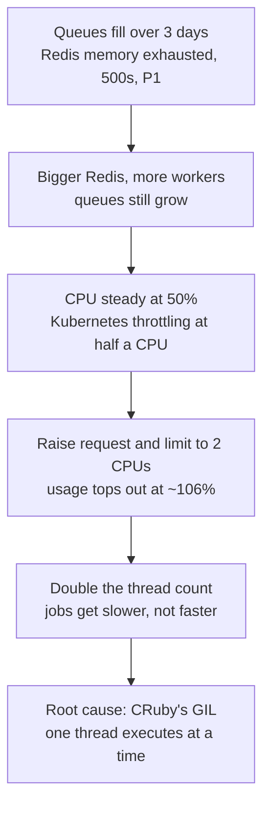
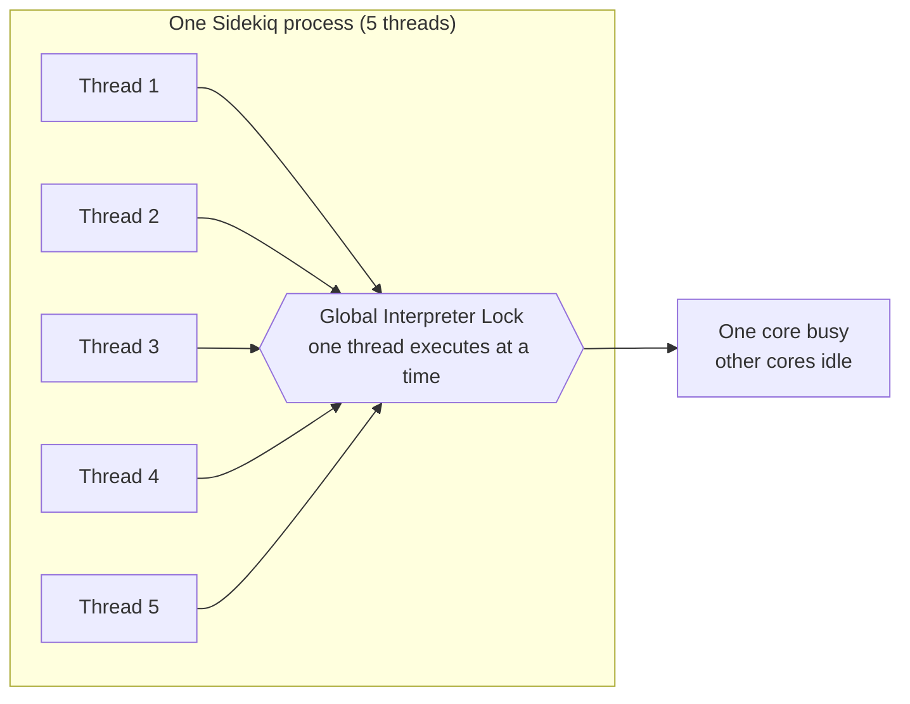

A couple of weeks ago I was pulled into an incident relating to the processing
of background jobs relating to Core Ruby's processing of audited Personally
Identifiable Information.

**TL;DR:** Encryption/Decryption, CPU throttling and Runtime Virtual Machine
Locks caused a 5x increase in processing time resulting in a backlog of jobs
which filled up the Redis instance hosting our asynchronous job queues.

Should it be that easy to write code without _Knowing thy runtime_ ?

## The Backstory

We had changed the way Audit Event data was being sent from using the deprecated
Nabu (Kafka proxy) to posting event data directly to a Kafka topic.
Historically, the data payload sent to Nabu was encrypted while in the new world
we were posting unencrypted payloads (obviously over a secure channel).

Our implementation to target the new endpoint made the smallest code change. As
the payload was embedded in our asynchronous job (persisted on a Redis queue) we
could just alter the job's code to

1. Decrypt the payload
2. Perform any transformations
3. Post the payload to the new endpoint

It was a bit more complex due to Protocol Buffer libraries but you get the gist.

- Functionally, it works job done, or so we thought...
- Q/E passed in all lower environments _Yay_ !
- Deployment went without a hitch _Boo Yah_ !

Queues filled up over a 3 day period until all Redis memory was used resulting in
write failures, which caused user facing requests to fail (lots of 500's and a
**P1 incident**), which is not so good for a Friday afternoon when the beers are
just about to start flowing.

Anyway, our SRE and Production engineers mitigated the issue quickly by
increasing the size of our Redis instance. As we had a huge backlog of jobs we
increased the number of workers assuming this would start reducing the job
backlog. It did not.

On closer inspection we could see the queues were still increasing (albeit at
a slower rate). Pod CPU utilisation was only hitting 50%, hmm but it was a
constant 50% (1/2 a CPU), ah we were being throttled by Kubernetes (another
runtime). So, we upped our request and limit settings to ensure we got 2 CPUs
(4x more per pod).

After 20 minutes of waiting for K8s to spin-up new nodes to place these pods
we were off to the races; we should be burning through this backlog of jobs & we
were, but we were only using 1 CPU (i.e. `top` and even inspecting `/proc/stat`
the most we could squeeze out of this was ~106%).

So our job processing solution was only running 5 threads so could this be a
concurrency issue, we decided to up the thread count to see if we could get more
throughput and exercise the additional CPU resources.

We doubled the thread count but to no avail (to be honest I should have known
better than this would not work), and what's worse job duration increased so we
were actually processing fewer jobs over the same time period.

The reason for this is pure thread overhead, too much thread contention leading
to thread scheduling overheads exacerbated by the levels of workload
abstraction; our code has to be scheduled by:

- Application virtual machine (or runtime if truly compiled code)
- Container runtime
- OS Hosting the Container runtime
- Cloud provider abstraction layer (i.e. hypervisor)

All these levels perform accounting and throttling, and control a thread's ability to run.

How I long for the good old days of assembly code run directly on the CPU from
EPROM.



OK that's all well and good, but why can't we use more than 1 CPU I hear you ask?
_Know thy runtime_ is my response (MRI/CRuby is limited to 1 core/process due
to its Global Interpreter Lock).

We currently run our Ruby stack on the original C Based virtual machine
(MRI/CRuby).

### Quick overview of MRI/CRuby Virtual Machine (VM)

CRuby since version 1.9.x has 3 concurrency patterns (only 1 parallelism
pattern):

1. Fibers/Green threads - lightweight units of work which are scheduled within
   the Virtual Machine via the interpreter (generally leveraged by Actor patterns
   in particular Ruby 3.x Ruby Actor/Ractor).
2. True threads - OS backed (1 to 1) threads which are scheduled by the OS
   (although the level of concurrency is limited by the code interpreter and its
   associated GIL)
3. Process - ideally through the `fork` system call as this takes advantage of
   copy-on-write memory optimisations

To keep everything safe and consistent within the VM there needs to be a way to
control concurrent access to key data structures which led to the need for a
Global Interpreter Lock which is a mechanism used in computer language
interpreters to synchronise the execution of threads so that only one thread can
execute at a time.

An interpreter which uses GIL will always allow exactly one thread and one
thread only to execute at a time, even if run on a multi-core processor.

Thus the GIL explains why we did not see CPU utilisation hit above 100% even
when we explicitly increased the number of threads. While the threads were
scheduled across multiple cores the VMs interpreter would only allow 1 thread to
execute at a time. Therefore only 1 core (for the CRuby process) was active each
time we sampled using top.



With hindsight something like the following command would have helped:

```bash
watch -tdn0.5 ps -T -o pid,tid,cpuid,cmd -p $PROCESS_ID
```

#### Extract from dev-uk\_

```bash
Defaulted container "core-ruby-sidekiq" out of: core-ruby-sidekiq,
kafka-tls-proxy-sidecar, istio-proxy, kafka-msk-cert-helper (init), istio-init (init)
root@:/opt/babylon/core-ruby/rails# ps -ef
UID        PID  PPID  C STIME TTY          TIME CMD
root         1     0  0 09:16 ?        00:00:00 /bin/bash ./config/start-sidekiq.sh
root        22     1  8 09:17 ?        00:06:35 sidekiq 6.4.1 rails [0 of 5 busy]
root       266     0  3 10:34 pts/0    00:00:00 /bin/bash
root       272   266  0 10:34 pts/0    00:00:00 ps -ef
root@:/opt/babylon/core-ruby/rails# watch -tdn0.5 ps -T -o pid,tid,cpuid,cmd -p 22
  PID   TID CPUID CMD
   22    22     5 sidekiq 6.4.1 rails [0 of 5 busy]
   22    23     4 sidekiq 6.4.1 rails [0 of 5 busy]
   22    24     3 sidekiq 6.4.1 rails [0 of 5 busy]
   22    26     5 sidekiq 6.4.1 rails [0 of 5 busy]
   22    27     6 sidekiq 6.4.1 rails [0 of 5 busy]
   22    28     5 sidekiq 6.4.1 rails [0 of 5 busy]
   22    29     4 sidekiq 6.4.1 rails [0 of 5 busy]
   22    31     7 sidekiq 6.4.1 rails [0 of 5 busy]
   22    32     2 sidekiq 6.4.1 rails [0 of 5 busy]
   22   105     4 sidekiq 6.4.1 rails [0 of 5 busy]
   22   238     3 sidekiq 6.4.1 rails [0 of 5 busy]
   22   242     1 sidekiq 6.4.1 rails [0 of 5 busy]
   22   243     6 sidekiq 6.4.1 rails [0 of 5 busy]
   22   259     5 sidekiq 6.4.1 rails [0 of 5 busy]
   22   263     6 sidekiq 6.4.1 rails [0 of 5 busy]
   22   265     6 sidekiq 6.4.1 rails [0 of 5 busy]
   22   273     0 sidekiq 6.4.1 rails [0 of 5 busy]
```

This shows how thread ids (TID) are being run against cores (CPUID). Although
this is only an approximation as we do not know what core a thread is
executing on until it has been scheduled.

Regardless, we know CRuby is limited in its approach to concurrency particularly
when CPU intensive tasks are required such as

- encryption/decryption
- calling external libraries which leverage native C calls
- tight processing and nested loops
- marshaling data (generally due to the previous reason)
- regular expression processing

Yet for web workloads, a good proportion of time is waiting for external
resources (Non/Blocking I/O). In these instances the OS can schedule runnable
threads effectively.

For our incident, decryption of the Job payload was to blame. We use a symmetric
block-based cipher (AES CBC) which cannot be realised using a parallel algorithm
as the key input for the next data block is reliant on the output of the
previous block.

## Summary

So to summarise, a 4-line code change introduced a CPU intensive change which
resulted in the need to increase the processing capacity of our Job workloads
by:

- 5x the number of Kubernetes pods
- Each pod has double the CPU allocation.

## Reflection

OK I know you're tired, but just a little further....

### Could we have identified the issue in production sooner?

100% yes, we were missing key alerts on queue sizes (now in place) which would
have notified us that something was wrong. While this would not have prevented
the code from hitting production it would have prevented the incident and that
should be our primary focus.

### Could we have pre-empted this during development?

I would like to say yes and retort with _Know thy runtime_ but, we have so many
levels of abstraction (VM, OS, Hypervisor) the engineer is isolated/de-sensitised from knowing how the code they write will be executed.

But at the very least our engineers should know how their code will be executed
by the immediate language runtime. Furthermore, they need to be aware of the
trade-offs and limitations of their chosen tool along with understanding the
basics of modern processor multitasking.

For Ruby Engineers some key implementation cases to be mindful of:

- encryption/decryption
- calling external libraries which leverage native C calls
- tight processing and nested loops
- marshaling data (generally due to the previous reason)
- regular expression processing
- third-party gems (please review gem code)

## Useful Reading

- [Ruby under the Microscope](https://www.amazon.co.uk/Ruby-Under-Microscope-Illustrated-Internals/dp/1593275277)
- [Scheduling in GoLang (3 part series)](https://www.ardanlabs.com/blog/2018/08/scheduling-in-go-part1.html)
- [Node.js Event loop](https://nodejs.org/en/docs/guides/event-loop-timers-and-nexttick/)
- [Process Scheduling](https://www.guru99.com/process-scheduling.html)
- [Containerd Process Scheduling](https://engineering.squarespace.com/blog/2017/understanding-linux-container-scheduling)
- [Linux cgroup](https://www.kernel.org/doc/html/latest/admin-guide/cgroup-v1/index.html)
- [Amazon EKS AMI](https://github.com/awslabs/amazon-eks-ami)
