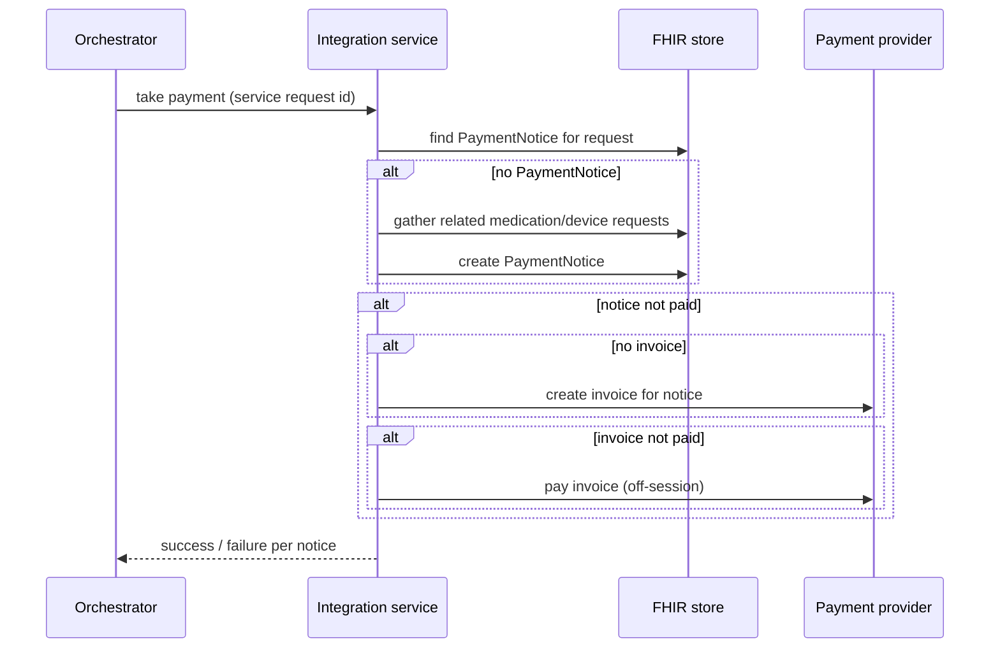

Every new product on a healthcare platform seems to arrive with its own bespoke purchase flow. Medication, blood-test kits, devices, consultations: each team takes payment slightly differently, at a slightly different moment, and fulfils in a slightly different way. By the third product you have three payment paths, three sets of edge cases, and customers charged for things that haven't shipped.

At the start of the year I wrote up a set of reusable patterns to stop that. They set out to solve four problems:

1. Standardise how we **initiate and orchestrate fulfilment** of products and services.
2. Standardise how we **take payment** for them.
3. **Take payment as close to shipment as possible.**
4. Fulfil for **direct-to-consumer and business customers the same way**, where "payment" might be replaced by some other eligibility check, such as an employer covering the cost.

## Two stages: request, then fulfil

Every product or service we deliver goes through two distinct stages.

**1. Request:** collect everything fulfilment needs:

- customer details;
- what's being ordered (a medication request, a device or kit request);
- clinical or operational approvals;
- **approval to charge**, but not the charge itself.

In FHIR terms, a `ServiceRequest` groups the order and belongs to the patient's `CarePlan`. The specific `MedicationRequest` and `DeviceRequest` resources hang off it, and a `PaymentNotice` records the payment state for that request.

**2. Dispense or shipment:** actually deliver:

- confirm we *can* take payment (or that another eligibility gate is satisfied);
- submit to the fulfilment partner;
- **capture payment at shipment**, if it hasn't been captured already. How close you can get depends on the partner's API.

Keeping these stages apart means the "what" (the request) is stable and auditable, and the "when" (fulfilment) can be driven by clinical approval, stock, courier cut-offs or a patient's schedule without re-collecting anything.

## Payment is an eligibility gate

The key idea is to stop treating payment as a special step and treat it as **one kind of precondition for fulfilment**. It has two milestones:

1. **Authorisation:** the customer has agreed to pay for this.
2. **Capture:** we've actually taken the money.

If we track both in our own records, **independently of the payment provider**, then "can we ship?" becomes a simple question: is the gate satisfied? For a direct-to-consumer customer the gate is payment. For an employer-funded member it's eligibility with their employer. For a clinical re-order it might be a clinician's approval. Fulfilment code doesn't care which.

That independence matters. Provider-specific state leaking into fulfilment logic is exactly what makes switching or adding payment providers painful later.

## Just-in-time capture

Capturing close to shipment means you need *permission* to capture later. There are two ways to get it:

1. **On-session authorise-and-capture:** authorise when the customer checks out and capture within the provider's hold window (typically about seven days for cards).
2. **Off-session payments** against a saved, pre-authorised payment method, for anything that might ship later than the hold window, such as refills.

The capture step itself is idempotent and driven by the request:

Every branch checks existing state before acting. Calling it twice is safe, which matters when a workflow engine retries.

## A free extra: re-orders

With request and fulfilment separated, and payment as a gate, some features become almost free. A **clinician-initiated re-order** (another blood-test kit, say) is just a new `ServiceRequest` with the same fulfilment path and a gate that's satisfied by clinical approval, or by payment where that applies. Nothing new needs building.

## The general lesson

Separate *what was asked for* from *when it's delivered*, record payment state in your own model rather than the provider's, and treat payment as one eligibility gate among several. You'll take money closer to the moment you deliver value, which means fewer refunds and fewer "charged but not shipped" tickets, and the next product type will reuse the same path instead of inventing its own.
