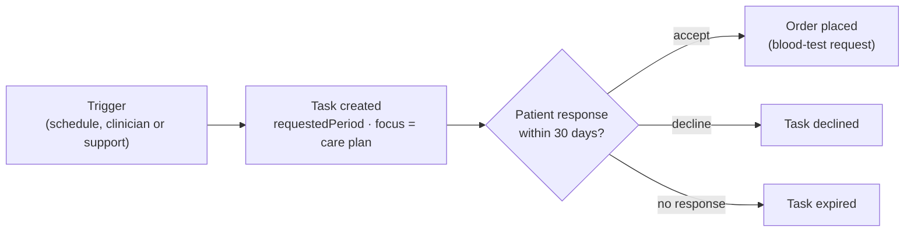

Most web software assumes a request is answered in milliseconds. Chronic-care programmes run on a different clock. A patient orders a blood-test kit, it ships, they take the sample when they can, the lab processes it, a clinician reviews it. Or a clinical team asks for more information and waits for the patient to reply. The *normal* latency of these interactions is **hours, days or weeks**, especially when anything physical has to be shipped.

This summer we designed a feature that made the implications concrete, and I wrote up an approach that has shaped how we build these journeys since.

## The feature: a blood test offered after six months

The requirement was simple to state:

- **180 days after a patient's first injection** on a weight-management programme, offer them a blood test.
- The offer stays open until they **accept or decline**, or it **expires after 30 days**.
- The offer can also be raised by a clinician or by customer support, not just by the schedule.

The trap is in the first bullet. If you hope demand spreads naturally over time, it won't. Patients who started in the same month hit the milestone in the same week. At platform scale the offer goes to a large **cohort at once**, and demand outstrips expected peak capacity: kit fulfilment, courier collections, lab throughput and support calls all spike together. Failure at that scale means frustrated patients, missed steps in their care plan and a flood of support requests.

## Model the interaction as a task

The asynchronous alternative is to represent each system-to-patient interaction as a **task** with its own lifecycle, instead of a synchronous flow triggered by an event.

FHIR provides the pieces:

- An **`ActivityDefinition`** describes *the kind of thing* we offer: its code, description, kind and timing.
- A **`Task`** instantiates it for a specific patient: `for` the patient, `focus` on the relevant care plan, a **`requestedPeriod`** (when we want it done), a requester (a clinician or the system), the patient as the requested performer, and typed **inputs and outputs**.
- The task's **status** tracks the conversation: offered, accepted, declined, expired, completed.
- The accepted task leads to the actual order, here a blood-test service request.

The trigger can be event-driven (a completed refill questionnaire generates a change event, and the task is created from it), clinician-initiated or support-initiated. The same task model covers all three.

## What that buys you

- **Rate control.** Because the offer is data with a requested period, the system decides *when* it's released. You can meter offers to match what fulfilment and lab partners can sustain, instead of releasing a whole cohort at once.
- **Honest expectations.** The task can carry the promise we can actually keep, for example a delivery window rather than "right away". A partner's delay then becomes a *met expectation* rather than a failure the patient has to chase.
- **Resilience to external delays.** Retries, partner outages and slow responses are absorbed by the task's lifecycle, not by a user waiting on a spinner.
- **One pattern for many journeys.** Information requests from clinicians, check-ins and re-orders all fit the same shape.

## Not everything should be asynchronous

Some interactions genuinely need an immediate answer, and forcing them into tasks just adds delay. The aim is to push **as much as reasonably possible** into a task-based model, so the platform is predictable under load and the patient gets a better experience, because the system stops promising things it doesn't control.

## The general lesson

When humans and physical goods are in the loop, latency isn't a defect to hide; it's a feature to design for. Make the interaction a first-class task, control the rate it's offered at, and set the expectation up front. Your partners, your support team and your patients will all notice the difference on the day a cohort hits its milestone.
