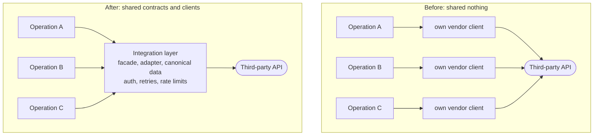

Our integration service grew around a sound idea: each **business operation** (onboard a patient, issue a prescription, order a test kit) is self-contained. It gets its own controller, services and strategies, wired together with dependency injection, and it **shares nothing** with other operations. You can change one without fear of breaking another.

As the number of integrations grew, a review of the codebase found two problems growing out of that very idea.

## The symptoms

**Client duplication.** Several operations talked to the same third-party systems, and each had its own client for them: its own authentication, retries, error mapping and rate-limit handling. When a vendor changed an API, we changed it in several places, and usually missed one.

**Inconsistent interpretation of data.** Because each operation mapped external responses itself before persisting them, the *same* external fact could be stored slightly differently depending on which operation saw it first. Downstream consumers then had to cope with several dialects of the same record.

## The diagnosis

The foundations were good. Inversion of control, controllers delegating to services, and strategies and adapters selected by context are all solid *internal* design. But those patterns keep a component modular; they don't define **system boundaries** or govern **data across components**.

The problem was an **overly strict reading of "shared nothing"**. Isolation had been applied to *everything*, including the things that should be shared: how we talk to a given external system, and what a given piece of data means. The pursuit of isolation had produced uncontrolled redundancy.

## The recommendations

1. **A dedicated integration layer per external system.** One internal module is the *sole* point of contact for each third party. Inside it, an **adapter** makes the vendor's API conform to our internal interfaces, and a **facade** gives business operations a small, business-shaped API. Authentication, retries, rate limiting and error mapping live there once. Duplication doesn't vanish; it becomes one explicit, managed dependency.
2. **Data contracts and a single source of truth.** Map external data **once**, at the integration boundary, into a canonical internal shape with explicit validation. Business operations consume the canonical shape and never raw vendor payloads.
3. **Sharper service boundaries with DDD.** Use aggregates as consistency boundaries, and events for eventual consistency *between* them, instead of letting operations reach into each other's data.
4. **Share deliberately.** Shared libraries are appropriate for stable, non-business concerns (utilities, DTOs and interfaces, cross-cutting concerns such as security and observability). They're not appropriate for business logic that should evolve independently.
5. **Refactor gradually with the strangler fig.** Introduce the integration layer for one external system at a time, route new code through it, migrate existing operations as they're touched, and delete the old clients when the last caller has gone.
6. **Observe the seams.** Once integrations are centralised, instrument them: per-vendor latency, error rates and rate-limit headroom become visible in one place.

## What to keep

The recommendation isn't to abandon the principle. **Business behaviour** stays isolated per operation, with its own strategies and its own tests, so teams can still move independently. What changes is the line between *behaviour* (isolated) and *contracts and clients* (shared and owned).

## The general lesson

"Shared nothing" is a heuristic, not a law. Share the things whose *divergence* causes bugs: how you talk to an external system, and what your data means. Isolate the things whose *coupling* causes bugs: business behaviour. And when you find the line in the wrong place, move it gradually. The strangler fig works just as well inside a service as it does across a monolith.
