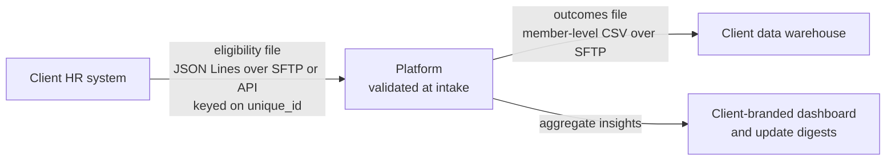

When an employer offers a health programme as a benefit, two data flows decide whether the partnership goes well:

- **In:** who is eligible, which the employer knows from its HR system.
- **Out:** what happened: enrolment, engagement and outcomes, which the employer (or their benefits consultant) wants for their own reporting.

In practice both flows start as ad-hoc spreadsheets negotiated client by client. Onboarding each new employer turns into a mini integration project, and reporting becomes a bespoke export that nobody wants to own. Late this summer I drafted a **standard offering** covering both directions. The main lesson was to treat each file as a **contract**, not a courtesy.

## The inbound eligibility file

The input confirms who is currently eligible, delivered through **automated intake from the client's HR system** where possible (rather than a monthly email), as UTF-8 JSON Lines over SFTP or as an API payload.

| Field | Why it's there |
|---|---|
| `unique_id` | The client's own stable identifier, ideally the employee number. **This is the key; everything joins on it.** |
| `first_name`, `last_name`, `date_of_birth`, `email` | Identity matching at registration |
| `is_employee`, `relationship_to_employee` | Employees *and* dependants (self, spouse, child) |
| `employment_status` | Active, terminated, on leave |
| `eligibility_flag`, `eligibility_start_date`, `eligibility_end_date` | Eligibility is a *period*, not a boolean |
| `client_organization` | For clients with several legal entities or divisions |
| `department`, `job_title`, `location` | Optional, for segmentation and stratification |

A few design choices matter more than the field list:

- **The client owns the key.** Using their identifier means updates, terminations and outcome reports all reconcile without fuzzy matching on names.
- **Eligibility has dates.** Start and end dates let the file describe the future (new joiners) and the past (leavers) without separate "delta" semantics.
- **Dependants are first-class.** Retrofitting relationships later is painful.
- **Optional fields stay optional.** Segmentation data is useful, but it's also more personal data to hold. Collect it only when a client actually wants the insights it enables.

## The outbound outcomes file

The output is designed to feed the **client's own data warehouse**, at member level, as CSV over SFTP and downloadable from a dashboard. It covers:

- **Programme lifecycle:** application date, start and end dates, duration, attempts and completions, and an outcome status (ongoing, completed, withdrawn, lost to follow-up).
- **Engagement:** check-ins completed, refills.
- **Clinical outcomes:** weight and BMI change, reported side effects by category, and the latest values for relevant lab markers.
- **Risk, adherence and drop-off:** where in the journey people leave, and why.

Every row links back through the client's **`unique_id`**, so outcomes land in the client's own reporting without translation.

## Aggregates by default, detail by agreement

Alongside the files, each client gets a **client-branded interactive dashboard** of *aggregate* insights, plus regular update digests by email or Slack. Most stakeholders only ever need the aggregate view. Member-level clinical data flowing to an employer is a significant privacy decision, so it should rest on explicit legal and consent grounds, be minimised to what's actually needed, and often go to a benefits partner rather than the employer itself. The contract should say which fields flow, to whom, and on what basis.

## Why a standard beats bespoke

- **Onboarding** becomes configuration: map the client's HR export to the standard file once.
- **Validation** can be automated at intake, rejecting a malformed file before it silently removes eligible members.
- **Reporting** is a product feature rather than a project.
- **Sales** can promise something concrete.

## The general lesson

I treat every B2B data exchange as an API, whether or not anyone calls it one. Give it a schema, a stable key the client owns, dated semantics and an explicit privacy boundary, and version it like any other contract.
