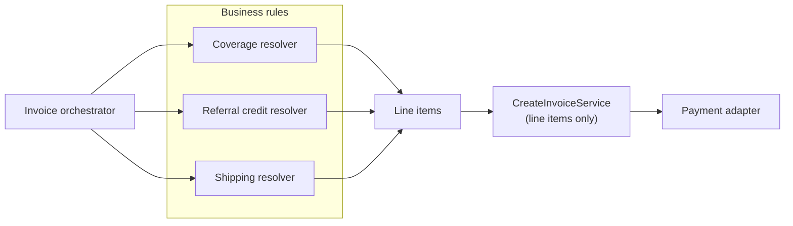

Most payment code starts small: take a list of prices, create an invoice, charge it. Then the business grows. Employers cover part of the cost. Referral credits arrive. Promotion codes. Shipping rates. Each feature adds a parameter and a branch to the one service that creates invoices, until it knows about *every* commercial idea the company has ever had.

This autumn I reviewed our invoice-creation service against the SOLID principles, with one practical question in mind: **how many files do we have to change to add a new kind of line item?**

## What the service did

It was responsible for all of the following:

- validating requested items and enriching them with price and product data;
- applying credits and employer coverage through a chain of "enricher" services;
- creating the base invoice with the payment adapter;
- adding every line item, both the requested ones and those added by the enrichers;
- applying promotion codes, with error handling;
- managing shipping rates.

Its interface reflected that: a patient ID, items, coverages, available and pending credits, a promotion code, a shipping rate and metadata. Most of them optional, and all of them the service's problem.

## The SOLID scorecard

- **Single responsibility: violated.** Invoice creation, price enrichment, credits and discounts, promotions, shipping and adapter orchestration all lived in one class.
- **Open/closed: partially violated.** The enricher pattern was a good start, since new enrichers could be written without touching the core. But the enricher chain was hard-coded in the constructor, the service knew about specific business concepts, and **a new line-item type still meant modifying the service**.
- **Liskov substitution: good.** Enrichers implemented a common interface consistently.

## Two ways forward

**Keep the "do everything" service** and keep extending it. Every new idea means another optional parameter, another branch, and another set of tests on the riskiest class in the payments domain.

**Make it a pure line-item service.** The core only knows about line items, one optional promotion code, metadata and which payment adapter to use:

```ts
interface CreateInvoiceService {
  call(params: {
    patientId: string;
    lineItems: InvoiceLineItem[];
    promotionCode?: string;
    metadata: Record<string, string>;
    paymentAdapter: PaymentAdapter;
  }): Promise<Invoice>;
}

// Business rules become resolvers that *produce* line items
interface ReferralCreditResolver {
  resolveToLineItems(patientId: string, credits: ReferralCredit[]): Promise<InvoiceLineItem[]>;
}
```

Referral credits, employer coverage, shipping, and eventually loyalty points, gift cards or taxes each become a **resolver** that turns a business concept into line items. An **orchestrator** composes them for each use case and hands the result to the core.



## Why the dumber service wins

1. **No core changes for new line items.** New commercial ideas are new resolvers.
2. **Composition over configuration.** Business logic is assembled in higher-level services, not threaded through one constructor.
3. **Testability.** Each resolver is tested on its own, and the core's tests stop growing.
4. **Cleaner dependencies.** The core depends only on payment concepts.
5. **Easier refactoring.** Business rules can move without touching the code that talks to the payment provider.

## The migration path

1. **Extract** the line-item resolution logic from the current service into separate resolvers, and simplify the core to line items only.
2. **Add an orchestrator** that composes the resolvers, move consumers to it, and keep backward compatibility while they migrate.
3. **Extend** by adding resolvers, never by editing the core.

## The general lesson

The closer code sits to money, the less it should know about marketing. Keep the component that talks to your payment provider **boring and closed for modification**, and let business rules compete, change and retire in the layer above it.
