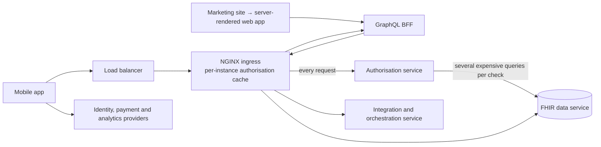
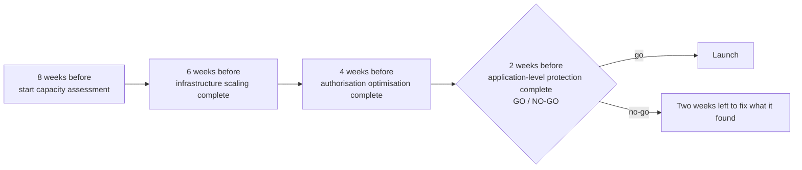

Marketing booked a TV campaign for the run-up to Christmas. That's great for the business and a very specific problem for engineering: a surge of new sign-ups during and just after each advert, at times we'd only partly know. Live slots can be scheduled, but **catch-up viewing** means the spikes keep coming at unpredictable times for days.

This month I wrote the scaling plan. Here's its shape, and why the order of work mattered as much as the work.

## Know the system you're scaling

The plan started by describing the request paths end to end:

- a **mobile app** calling the identity provider, the payment provider and analytics directly, and our APIs through a load balancer;
- a **marketing site** routing into a **server-rendered web app** on a hosting platform, which calls a **GraphQL backend-for-frontend**;
- **backend services on Kubernetes** (the BFF, an integration and orchestration service, and a FHIR data service), with *all* inter-service traffic going through the NGINX ingress, which calls an **authorisation service on every request**.

Writing this down surfaced the constraints that mattered:

1. **Authorisation was the hidden bottleneck.** Every API request triggered an authorisation check, and each check made several expensive queries to the data service.
2. **The ingress cached authorisation decisions per instance**, with a TTL too short for a spike. Scaling out the ingress would *lower* the hit rate, because every new instance starts with a cold cache.
3. **The cluster didn't yet support the Horizontal Pod Autoscaler.**
4. **All service-to-service calls went through the ingress**, making it a potential choke point.
5. **Callers made limited use of FHIR search features** (`_include`, `_revinclude`), so many screens needed several round trips.
6. **The mobile app's caching** didn't meaningfully reduce backend load.

## Principle: infrastructure first, code later

The core principle was to get a **5–10× capacity increase from infrastructure and configuration alone**, before deploying any application code, because:

- configuration rollbacks are simpler than code rollbacks;
- there's no CI/CD or testing delay between deciding and having the capacity;
- changes are isolated, so it's easier to tell which one helped (or hurt);
- it proves the platform's capacity before code complexity enters the picture.

## Principle: fix authorisation before scaling anything

The first change wasn't more pods. It was a **longer authorisation cache with warming** at the ingress: a configuration change, applied on day one. The reasoning:

- authorisation is on **every** request, so it affects all traffic;
- the existing TTL was too short for a spike;
- the checks were expensive;
- **scaling without fixing authorisation just spreads the bottleneck across more instances.**

It had a hard gate: *don't proceed to horizontal scaling until the cache is proven*, with a target hit rate, a p95 authorisation latency and a reduction in authorisation load on the data service.

## The phases

| Phase | Code changes? | Focus |
|---|---|---|
| **0: Assess** | No | Load-test each tier and establish baselines: requests per second, latency, cache hit rates, connection pools |
| **1: Infrastructure** | No | Authorisation cache first; then scale every service horizontally; then enable autoscaling, ingress rate limiting and load-balancer tuning |
| **2: Authorisation** | Targeted | A shared authorisation cache across instances; fewer, cheaper authorisation queries |
| **3: Protection** | Yes | Client-side rate limiting on the orchestration path, circuit breakers, graceful degradation |
| **4: Optimisation** | Optional | FHIR includes, batch operations and query caching to cut API calls; better caching in the mobile app |

Phase 3 addresses a specific amplification risk. A burst of workflows in the orchestration engine, **each making several calls to the data service**, turns one spike into a much bigger one downstream. A small in-process queue that limits concurrency to the data service turns that burst into a controlled stream.

## The calendar

The plan worked backwards from launch:

- **8 weeks before:** start capacity assessment.
- **6 weeks before:** infrastructure scaling complete.
- **4 weeks before:** authorisation optimisation complete.
- **2 weeks before:** application-level protection complete. **This is the go/no-go decision point**, leaving two weeks to fix anything it finds.

Phase 4 stays optional, depending on the headroom we actually observe.

## What success means

- Handle **5–10× baseline load** without degradation.
- **99.9% availability** through the campaign.
- **p95 under 500 ms** on critical paths.
- **Graceful degradation** rather than total failure when something does break.

## The general lesson

When you have a traffic event on the calendar, **order the work by risk**. Configuration before code; the call every request makes before anything else; and a go/no-go gate early enough to act on. Most importantly, measure before you scale: Phase 0 exists because assumptions about capacity are usually wrong, and the whole plan should bend to what it finds.
