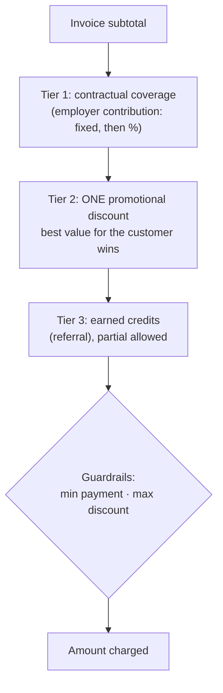

Two questions landed on the payments domain at the same time, and both were the kind that get answered badly under pressure:

1. **What happens when a customer has more than one discount?** Employer coverage, a promotion code, a win-back coupon and referral credit could all apply to the same invoice.
2. **How do we take payments into more than one account?** New programmes and partners needed their own payment accounts, but the platform supported one account per provider per deployment.

Each got an RFC before anyone had to improvise. Here's what they proposed.

## Part 1: a discount-stacking policy

### Where we were

The existing behaviour had grown up feature by feature. Provider coupons and promotion codes were applied first, *then* employer coverage (fixed contributions, then percentages), then referral credits (up to three per invoice, oldest first, each applied all-or-nothing). There was no written policy for combining them, so marketing couldn't predict the depth of a campaign's discount and support had nothing to point to. Applying promotions *before* contractual coverage also meant the employer's contribution was calculated on an already-discounted amount.

### Principles

The RFC started from five principles: **transparency** (customers understand what applied and why), **revenue protection** (minimum payment thresholds), **customer traction** (maximise perceived value), **flexibility** (configurable per campaign) and **simplicity** (easy to explain on a receipt).

### Three tiers, applied in order

1. **Contractual coverage first.** An employer's contribution is an obligation, not a promotion, so it isn't subject to promotional limits.
2. **One promotional discount: best value wins.** Calculate the value of each available coupon or code against the *post-coverage* subtotal and apply the best. **Keep the unused ones for future orders.** If two are equal, prefer the one the customer typed in, because they made the effort.
3. **Earned credits last.** Referral credit stacks with the chosen promotion (it's earned, not given) and can be **partially applied**.
4. **Guardrails.** A minimum payment of the higher of a percentage of the subtotal and an absolute floor, plus a cap on total discount.

### Why not let promotions stack?

- Stacked percentages and fixed amounts erode margin quickly.
- Multiple codes invite gaming.
- Marketing can't forecast discount depth.
- "Best discount wins" is easy to explain, and it removes the "I didn't get the better offer" complaint entirely.

And why let credits stack with the best promotion? Because blocking earned value punishes your most engaged customers, and the discount cap still protects revenue.

### Configurable, but with sane defaults

Stacking rules live in a per-campaign configuration (which combinations are allowed, the application order, revenue protection and credit rules), so marketing can run an exception on purpose without it becoming the default by accident.

## Part 2: several payment accounts, one deployment

### The problem

The payments architecture supported multiple payment *providers*, but not multiple *accounts* for the same provider in one deployment. New programme types, partners with their own commercial arrangements, and regional entities all needed separate accounts.

### The design

- **A single JSON configuration** (injected as a secret, never committed) lists every payment account, its provider-agnostic settings and the adapter class to instantiate.
- **Fail fast:** invalid or incomplete configuration stops the application at startup, because a payments misconfiguration should never wait until the first charge to surface.
- **Exactly one default** adapter, for predictable fallback.
- **Selection by identifier.** Adapters are registered against the platform's existing identifier format, so an organisation or a programme offering can each map to an account, or both.
- **Logical price and coupon keys.** Application code refers to logical keys, and each adapter resolves them to its own provider IDs at runtime. Code doesn't need to know which account it's charging.

### The hard part: customers don't move

Provider customers, saved cards, subscriptions and invoice history are **account-specific and non-transferable**. A patient moving from one programme to another, changing organisation, relocating, or graduating from a study to a commercial plan can't simply be re-pointed.

The rule for the first version is **adapter affinity**: a customer stays on the account they onboarded with, recorded on their care plan. Existing care plans without a record use the default (incumbent) account. Existing plans keep working through a reverse lookup from provider price IDs. Deliberate migrations between accounts are a separate, planned operation, never a side effect.

## The general lesson

Payments policy is product policy, and it's much cheaper to agree it in an RFC than to reverse-engineer it from incidents. Write the stacking rules before the campaign, and write the account-routing rules before the partnership. In both cases, **make the safe behaviour the default and the exception explicit.**
