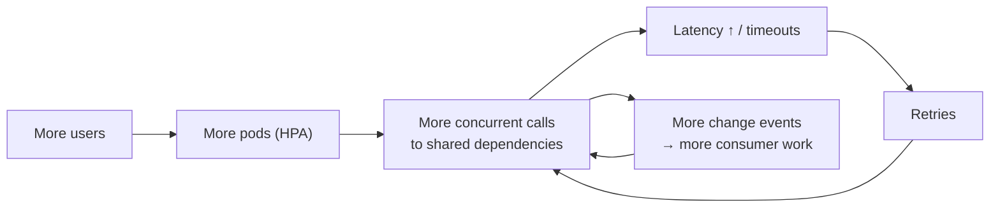

Before Christmas I wrote about [preparing the platform for a TV campaign](/architecture/2025/11/12/preparing-for-a-tv-campaign.html): infrastructure first, authorisation first, then application-level protection. Phase 0 of that plan was "measure before you scale", and the results have now changed the plan. The obvious next step was to turn on the Kubernetes Horizontal Pod Autoscaler and let the cluster absorb the load.

The load tests said not yet.

## What the load tests showed

We drove the onboarding journey with k6, stepping up the number of virtual users and varying replica counts for the ingress, the integration service and the core data service. The pattern was clear, and at first it was counter-intuitive:

- At low tens of concurrent users, the system was **mostly stable**, *once we had tuned Node's garbage collector and heap*.
- A modest step up in concurrency made error rates climb sharply, 502s appear, and pods restart.
- **Adding a lot more replicas didn't rescue it.** With several times the pods, the system saturated anyway: roughly half of requests failed and p95 latency approached a minute.

More pods meant more concurrent callers hammering the *same* downstream dependencies, more timeouts, more retries, and more load. Autoscaling would have scaled the amplifier.

## Why: fan-out and missing back-pressure

A distributed trace of a single slow onboarding request explained most of it. Its latency was dominated by a chain of **sequential calls** to the core data service inside one "finalise" step, because a transaction bundle was processed serially by default. One user action became a long line of dependent downstream calls, each also emitting change events that triggered *more* work in other consumers.

Put that under load and you get the classic failure shape:

Nothing in the system said "no". Every layer accepted every request and waited, so the queue lived in memory until it didn't.

## The plan: make load bounded before making it elastic

The goal was to make load **predictable, bounded and observable**, so that autoscaling decisions would be reliable. Three patterns did most of the work.

### 1. Admission control at every ingress

Put a bounded in-flight limit and a queue timeout at each HTTP entry point **and each queue consumer**. Over capacity, fail fast with `503` and `Retry-After`. It feels wrong to reject traffic deliberately, but a fast, honest rejection is far cheaper than a slow timeout that holds resources and triggers a retry. It also gives you a clean scaling signal.

### 2. Bulkheads and circuit breakers per dependency

Give each high-risk dependency (the core data service, the payment provider, pharmacy providers, the CRM) its own concurrency limit and a circuit breaker. A slow partner API should consume *its* slice of capacity, not all of it.

### 3. Fan-out budgets

Cap how many downstream calls and events a single request is allowed to trigger, and measure when the cap is hit. This keeps downstream throughput roughly **linear** in user load instead of multiplicative, and it turns "why is the queue backed up?" into a metric instead of an investigation.

### Then scale on the right signals

CPU is a poor proxy for pressure in I/O-bound Node services. We standardised scaling signals across services:

- **Ingress:** in-flight requests, admission queue depth, queue-wait p95, 5xx/503 rate.
- **Dependencies:** per-dependency queue depth and latency, circuit-breaker open rate.
- **Async:** backlog depth, age of the oldest message, fan-out-budget breaches.

The rollout order mattered: admission control everywhere with conservative limits, then bulkheads on the busiest dependencies, then fan-out budgets tuned against real traffic, and **only then** HPA on the standardised metrics.

## Unglamorous fixes that matter

- **Node memory.** Without explicit heap settings, pods spiked to their memory limit and were OOMKilled under load. Set the V8 heap relative to the container limit and watch GC time.
- **Graceful shutdown.** If rolling deploys and scale-downs kill in-flight requests, autoscaling turns every scale-down into a small outage. Handle `SIGTERM` properly (stop accepting, drain, then exit) *before* you let the cluster scale down on its own.

## Keep the load tests

The most valuable artefact from this exercise isn't a number; it's the **repeatable load test** for the onboarding journey. Treat it as a permanent fixture: rerun it whenever the architecture changes, and before every campaign.

## The general lesson

Autoscaling adds capacity; it doesn't add *stability*. If your system has no admission control, unbounded fan-out and retry loops, more replicas just means more participants in the pile-up. Bound the load first, measure real pressure, and then let the cluster scale on signals that mean something.
