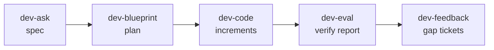

AI coding assistants are brilliant at the next hundred lines and unreliable over the next hundred decisions. Long sessions drift, context fills up, and "done" quietly becomes "the tests I wrote pass". Over the last few months I've built a structured workflow on Claude Code that takes a feature from a raw request to verified implementation, and it's now how I ship most changes.

The design rests on three ideas: **skills drive phases**, **agents do one job each**, and **the spec is the source of truth**.

## Five skills, one pipeline

| Skill | Purpose | Output |
|---|---|---|
| `/dev-ask` | Requirements interview and spec authoring | A spec document |
| `/dev-blueprint` | Implementation plan from the spec | A plan document |
| `/dev-code` | Incremental implementation with verification gates | Commits per increment |
| `/dev-eval` | Verification against the spec's acceptance criteria | A verification report |
| `/dev-feedback` | Follow-up tickets for every gap | Tickets linked to the original |

Supporting skills handle pull requests, codebase-wide renames and structured commits.

## Enrich before you interview

Before asking a single question, `/dev-ask` launches three enrichment agents **in parallel**: one reads the ticket, its epic, subtasks and linked issues; one searches Slack for design decisions, rejected alternatives and open questions; one searches shared documents for recent specs, RFCs and ADRs. Everything found is folded into the interview.

If what's in Slack or a document **contradicts** the ticket or the developer's description, it becomes an explicit interview question rather than being silently resolved. The interview then covers acceptance criteria, scope, the verification plan, API contracts, blast radius, constraints, deployment and edge cases (auth, multi-tenancy, error states, concurrency, backwards compatibility), and slices the work into three to six vertical increments.

## Thirteen agents, one job each

Skills spawn specialised agents at specific points, in parallel where possible. Each runs in its own context and returns structured findings:

- **Enrichment:** ticket, chat and document search.
- **Verification:** spec self-consistency, and plan against spec (acceptance-criteria coverage, TDD ordering).
- **Architecture:** a staff-engineer-style review of the plan.
- **Test-driven development:** design failing test skeletons *before* implementation, then check that assertions actually cover the criteria.
- **Quality gates:** build, typecheck, lint and test; drift from the plan; project conventions; unnecessary complexity; review.

Models are matched to the job: a fast, cheap model for structured extraction and mechanical gates, a mid-tier model for analytical work, and the strongest model only for architectural judgement. **Almost every agent is read-only.** Only the build and test gates run commands, and none of them edits source. Findings go back to the skill, which decides what to act on.

## Fresh context, persistent artefacts

Each skill is designed to run in a **fresh context window**. The workflow stays coherent through documents on disk, not conversation history: `dev-ask` writes the spec, you clear the session, `dev-blueprint` reads it and writes the plan, and so on. Implementation clears after every increment.

The spec has a lifecycle (*interview → slicing → draft → reviewed → final*), saved at every transition. If a session ends mid-interview, the next one reads the phase, loads what's already there, and resumes without repeating questions. Downstream skills check the phase and warn if they're about to build on a spec that isn't final.

The spec is **committed with the code**, so it appears in the pull request history next to the implementation it describes, and the verification report sits beside it.

## The spec is the definition of done

Acceptance criteria (with MUST, SHOULD or MAY levels), test cases that map to them, and the verification commands together form the definition of done. Every phase reports against the same list:

- The test-design agent writes a failing skeleton **per criterion**.
- Implementation continues until those tests pass, behind five parallel gates: build, test coverage of the criteria, drift from the plan, conventions and simplicity.
- `/dev-eval` gives a **per-criterion verdict with evidence** (a test name or a file and line), and an overall verdict: **PASS** if every MUST passes, **CONDITIONAL PASS** if a SHOULD fails, otherwise **FAIL**.
- `/dev-feedback` turns every gap into a ticket, carrying the spec's rationale so context survives long after the session has gone.

The workflow also tracks token usage and estimated cost per phase, which turned out to be the best way to decide which agent deserves which model.

## What I've learned so far

- **Most of the value is in the spec interview.** Enrichment plus a structured interview catches ambiguities that would otherwise surface in code review.
- **Separating writing from reviewing matters.** An agent that designs tests without seeing the implementation writes better tests.
- **Fresh contexts beat long ones.** Clearing between phases costs almost nothing when the state is on disk.
- **Evidence beats assertions.** "AC-3: pass (test X, file Y line Z)" is reviewable in seconds; "all good" isn't.

The rough edges are real, too. Each skill carries its own resume and retry logic, state lives in document front matter, and a long implementation session still accumulates context. Those are the next problems to solve.
