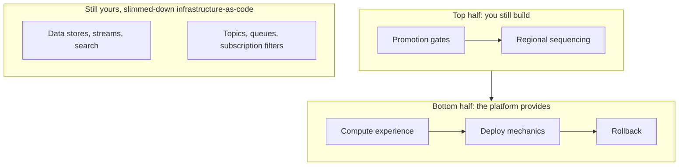

Running your own Kubernetes is a commitment: cluster upgrades, ingress controllers, Helm charts, and engineers writing Terraform to ship an API. We wanted to know whether a managed platform could give our developers a **Heroku-like experience** while we **stayed on AWS** and kept the managed data services we already relied on.

This is how we ran the evaluation, and the lessons that generalise.

## Start with requirements, not vendors

We wrote the requirements down before looking at a single product page:

| # | Requirement |
|---|---|
| 1 | Stay on AWS |
| 2 | AWS-native bias: run *on* AWS compute (ECS Fargate, App Runner), not install Kubernetes in our account |
| 3 | **Buy, not build**: no internal developer platform project |
| 4 | Drop EKS and Terraform *for compute and deploy*; infrastructure-as-code stays for data and messaging |
| 5 | Deploy pre-built container images, not just buildpacks |
| 6 | Coexist with S3, DynamoDB, ElastiCache, OpenSearch, SNS, SQS and Kinesis |
| 7 | Environment promotion (dev → staging → prod) with gates |
| 8 | **Region-by-region production rollout** |
| 9 | Fast, safe releases: blue-green or canary, rollback on failure |
| 10 | **Forward-auth at ingress** to our authorisation service, with header forwarding |
| 11 | IP allow-listing per route, for partner webhooks |
| 12 | Per-region configuration (different SaaS endpoints, prices, flags) |
| 13 | Lambda functions deployed alongside the service |
| 14 | Multiple workloads per image (API and worker, with different scaling) |
| 15 | Configuration from SSM Parameter Store (dozens of variables per service) |
| 16 | **A hotfix escape hatch:** deploy any branch straight to any environment, bypassing the normal pipeline |

Two more pieces of context shaped everything. First, **we can't run the whole system on a laptop**: the runtime depends on AWS messaging and data services *and* third-party SaaS (payments, CRM, workflow orchestration, messaging, pharmacy and lab partners), so shared development environments are where real integration testing happens. Second, we're **trunk-based**: `main` is always deployable and is the only thing promoted through environments and regions.

Writing the requirements down removed several vendors immediately, and one had shut down entirely during the evaluation. That's a useful reminder to check a vendor's pulse, not just its feature matrix.

## Two gaps every vendor shared

### Gap 1: messaging isn't first-class

None of the remaining platform-as-a-service vendors treated SNS, SQS or Kinesis as first-class resources. You define topics and queues elsewhere and inject their ARNs as environment variables. Runtime access works; lifecycle management doesn't.

That leaves a **Terraform-shaped hole**. No pure PaaS will own your tables, streams, search domains, topics, queues and subscription filter policies. The realistic options are:

1. **Accept a split.** The platform owns compute, CI/CD and developer experience; slimmed-down infrastructure-as-code owns data and messaging. That can still remove most of your compute Terraform.
2. **Vendor-orchestrated IaC.** Some platforms run your Terraform as part of an environment's lifecycle, so developers don't touch it, but you still write it.

### Gap 2: promotion and regional rollout

None of the vendors had first-class environment promotion or regional rollout. Most rebuild each environment independently from a branch, and multi-region means "separate environments you deploy yourself". Approval gates were missing or undocumented, and canary support ranged from built-in to "on the roadmap". If you run separate regional stacks for data residency, that's the capability you need most and will find least.

That changes what you're buying: **the bottom half of a release pipeline** (compute experience, deploy mechanics, rollback), while you still build the top half (promotion gates and regional sequencing). That's still a significant reduction in toil, but it isn't the whole pipeline.

## Questions to ask before a pilot

- **Can you keep your security edge?** If every service relies on forward-auth at ingress (NGINX `auth_request` or similar), a platform built on a load balancer without an equivalent needs a workaround such as an edge function, a Lambda target or a sidecar. That's a blocker to prove out first, not a detail.
- **Does its delivery model fit yours?** Branch-to-environment platforms (push to branch X, deploy to environment X) fight trunk-based teams that deploy one build from `main` to every environment through API-triggered promotion.
- **What's the exit story?** A small vendor is less risky if everything it creates is standard managed infrastructure in *your* account.
- **Are preview environments as valuable as they look?** Single-service previews that point at a shared development data plane can only validate surface-level behaviour when your system depends on real queues and SaaS sandboxes.
- **Where's the hotfix path?** Every platform demos the happy path. Ask how you'd push an urgent fix to one environment in one region.
- **Is the product still shipping?** Check the changelog, and ask for reference customers at your scale.

## Where we landed

Two pilots, deliberately different: one **ECS-native platform with no Kubernetes at all**, which met the most requirements and deploys into our own VPC with native IAM task roles, and one **Kubernetes-based platform with full escape hatches**, from a larger vendor, in case we find we need Kubernetes-level flexibility after all. Both pilots focus on the *persistent* environments (dev, staging, production) rather than preview environments, and the first question for each is the auth edge.

## The general lesson

Evaluate platforms against **your** hardest requirements (security edge, delivery model, regional rollout), not their best demos. And accept early that "no more Terraform" really means "much less Terraform": data and messaging will stay yours to manage.
