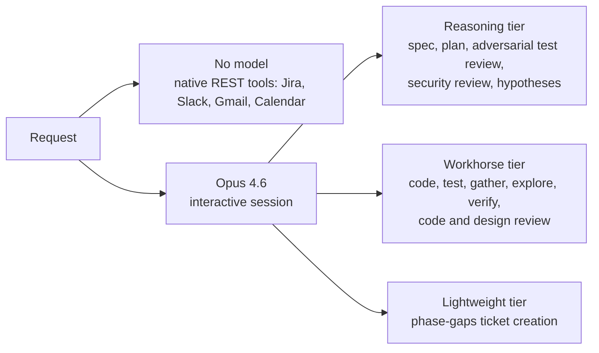
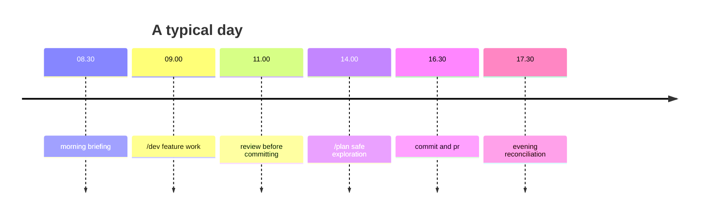

Most developers bolt an AI assistant onto their existing toolchain, a chat sidebar here, a copilot tab-completion there. I went the other way. Over the past few months I've rebuilt my entire development workflow *inside* [pi.dev](https://pi.dev), a terminal-first coding agent, turning it into a unified system that handles everything from morning standup prep to evening journal reconciliation, with a full agentic SDLC pipeline in between.

This post walks through my setup: 11 custom extensions, 6 skills, 18+ specialised agents, 4 MCP servers, and a token economy that keeps the whole thing affordable. Everything lives in `~/.config/pi/agent/`: version-controlled, portable, and composable.

## The stack at a glance

| Setting | Value |
|---|---|
| **Provider** | GitHub Copilot |
| **Model (interactive)** | Claude Opus 4.6 (high thinking) |
| **Model (agents)** | Configurable via `subagent-config.json` — 3 tiers |
| **Model (none)** | Native REST tools bypass the LLM entirely |
| **Thinking level** | High |
| **Theme** | Dracula (custom JSON) |
| **Output compression** | Ultra (token-pruner) |
| **Editor** | Vi-mode (custom modal editor) |
| **MCP servers** | GitHub, Filesystem, Atlassian (remote), Google Workspace (local) |
| **Packages** | `pi-mcp-adapter` |

The core philosophy: **right-size every token**. Five tiers:

1. **Opus 4.6** (interactive session), where I'm reasoning through problems, making architectural decisions, and orchestrating the pipeline. High thinking budget. Worth every token.
2. **Reasoning tier** (5 agents: spec, plan, adversarial test review, security review, hypothesis generation), tasks that need deep analysis, multi-step reasoning, and creative problem-solving. Sonnet 4.6 with high thinking by default.
3. **Workhorse tier** (12 agents: code, test, gather, explore, verify, code review, design review, etc.), standard execution. Sonnet 4.6 with medium thinking.
4. **Lightweight tier** (1 agent: `phase-gaps` for ticket creation), mechanical, structured output. Haiku 4.5 with low thinking. ~25× cheaper than Opus.
5. **No model at all**: the `tools/` extension makes native REST calls to Jira, Slack, Gmail, and Calendar directly. `defineTool()` wires API calls with auth gating and MCP fallback, returning structured data without spending a single LLM token. When the morning skill fetches 3 JQL queries, 3 Gmail searches, calendar events, and Slack history in parallel, that's ~15 API calls that never touch a model.

Tiers are abstracted via `subagent-config.json`, a single config file that maps logical tier names to concrete models and thinking levels:

```json
{
  "tiers": {
    "reasoning":   { "model": "github-copilot/claude-sonnet-4.6", "thinking": "high" },
    "workhorse":   { "model": "github-copilot/claude-sonnet-4.6", "thinking": "medium" },
    "lightweight": { "model": "github-copilot/claude-haiku-4.5",  "thinking": "low" }
  }
}
```

Agents declare a tier instead of a hardcoded model:

```yaml
# Before (hardcoded)
model: github-copilot/claude-sonnet-4.6

# After (tier-based)
tier: reasoning
```

Change one line in `subagent-config.json` and every reasoning agent switches to a different model or thinking level. Individual agents can override the tier's thinking level with an explicit `thinking:` field in their frontmatter, useful for agents that need more or less thinking than their tier default.



Then compress aggressively on both sides: input tokens truncated at source, output compressed to terse fragments, old turns stubbed to one-liners. Maximum intelligence where it counts, zero waste everywhere else.

## Extensions, skills and agents at a glance

The detail lives in three follow-up posts. Here is the map.

- **[The dev harness and safety nets](/ai/2026/10/05/transparent-hooks-beat-explicit-orchestration.html):** the dangerous-command gate, the dev harness that runs a full agentic SDLC through event hooks, plan mode and git worktrees.
- **[Skills, agents and MCP servers](/ai/2026/10/05/skills-are-commands-agents-are-specialists.html):** the six skills (`/dev`, `morning`, `evening`, `commit`, `pr`, `review`), the phase and review agents, and the MCP servers behind them.
- **[Tokens and terminal comfort](/ai/2026/10/05/right-size-every-token.html):** the token pruner, native tool integrations, journal, subagent, vi mode, statusline, notify and the theme.

## A day in the life

Here's what a typical workday looks like with this setup.



### 08.30: Morning briefing

```
> morning
```

The skill fires four parallel API queries (Jira, Gmail, Calendar, Slack), computes carry-over from the previous weekday, writes a structured journal entry with sections for GDPR, Needs Response, Active Work, Meetings, Docs to Review, and Backlog. Commits and pushes. Total time: ~15 seconds. I scan the terminal output, mentally prioritise, and start.

### 09.00: Feature work

```
> /dev PROJ-1234 add refresh token rotation
```

The harness classifies this as `implement/standard`, creates a work item, and launches `phase-gather` to collect context from the codebase, Jira ticket, linked Confluence docs, and relevant Slack threads. Then `phase-spec` runs a multi-turn interview, asking about edge cases, failure modes, backwards compatibility. I answer 3-4 rounds of questions, the spec is finalised as JSON with acceptance criteria.

`phase-plan` breaks the spec into ordered tasks with file-level guidance. Then for each task, `phase-test` writes tests in a clean context, working purely from the spec's acceptance criteria, with no knowledge of how the implementation will work. The adversarial `review-test` then tries to devise wrong implementations that would pass those tests, if it finds one, `phase-test` is respawned to strengthen the assertions. Then `phase-code` receives the spec and plan guidance (but not the test source code), reads the tests from disk in its own clean context, and implements production code to make them pass. The extension runs `type_check` (hard gate) and `test` (advisory) automatically after each code phase.

After all tasks complete, `phase-verify-acceptance` checks each AC against the implementation. Gaps become follow-up tickets via `phase-gaps`.

### 11.00: Code review

```
> review
```

Before committing a quick fix, I run the standalone review skill. It spawns `review-code` and `review-test` in parallel against my staged diff, then synthesises a single report with Critical/Warnings/Suggestions sections. Quick, focused, spec-free.

### 14.00: Safe exploration

```
/plan
> How is authentication handled in the order service?
```

Plan mode restricts tools to read-only. The agent explores the codebase, traces auth middleware, and produces a numbered plan for how I might refactor it. I review the plan, toggle `/plan` off, and decide whether to execute.

Meanwhile, the dangerous-command gate has already caught two `rm -rf` attempts from the agent during the morning's code phase: both safely gated behind interactive prompts.

### 16.30: Commit and PR

```
> commit
```

The commit skill gathers diff, status, branch, ticket ID, and any dev-harness artefacts. It drafts a structured message with Context (why), Decisions (trade-offs), and Test Areas (what could break). I confirm, it commits.

```
> pr
```

The PR skill pushes, detects no existing PR, and drafts one with Summary, Acceptance Criteria (copied from the spec), Test Plan, and Verification Evidence (extracted from the verify report). One command, full PR.

### 17.30: Evening reconciliation

```
> evening
```

The skill reads my journal entry, queries all five activity sources for what happened since the last reconciliation, and updates checkboxes: meetings attended → `[x]`, emails replied to → `[x]`, Jira issues completed → `[x]`. Adds items I worked on that weren't in the morning briefing. Appends concise notes to items with partial progress. Updates `reconciled_at` so tomorrow's run only queries the delta.

## How it all fits together

```
┌─────────────────────────────────────────────────────────────────────┐
│                        ~/.config/pi/agent/                          │
│                                                                     │
│  settings.json ─── provider, model, thinking, theme, packages       │
│                                                                     │
│  extensions/ (auto-loaded on startup)                               │
│  ├── dangerous-command-gate/  ── bash hook ── risk classify ── gate │
│  ├── dev-harness/  ── 6 event hooks ── validation, verification,   │
│  │                    usage tracking, config guard, brief injection  │
│  ├── plan-mode/  ── tool restriction ── progress tracking           │
│  ├── token-pruner/  ── tool_result hook ── context hook ── syspr.   │
│  ├── worktree/  ── git worktree tools ── parallel execution         │
│  ├── tools/  ── Jira, Slack, Gmail, Calendar ── defineTool()        │
│  ├── journal/  ── read, write, carry-over ── PARA journal           │
│  ├── subagent/  ── process spawning ── agent discovery              │
│  ├── git-tools/  ── commit, diff, PR tools                         │
│  ├── vi-mode.ts  ── modal editing (NORMAL/INSERT)                   │
│  ├── statusline.ts  ── 3-line p10k footer                          │
│  └── notify.ts  ── OSC 9 terminal bell                             │
│                                                                     │
│  skills/ (dispatched by intent)                                     │
│  ├── dev/  ── agentic SDLC orchestrator                            │
│  ├── morning/  ── daily briefing → journal                         │
│  ├── evening/  ── journal reconciliation                           │
│  ├── commit/  ── structured commits                                │
│  ├── pr/  ── push + PR open/update                                 │
│  └── review/  ── standalone diff review                            │
│                                                                     │
│  agents/ (spawned as isolated subprocesses)                         │
│  ├── phase-{gather,spec,plan,test,code,verify-*,explore,...}.md      │
│  ├── review-{code,test,design,security,spec,plan,deviation,...}.md │
│  └── providers/ ── tracker + enrichment source agents               │
│                                                                     │
│  mcp.json ─── GitHub, Filesystem, Atlassian, Google Workspace       │
│  subagent-config.json ─── reasoning/workhorse/lightweight → models │
│  themes/dracula.json ─── full semantic Dracula theme                │
│  token-pruner.json ─── per-tool limits, output level, stubs         │
└─────────────────────────────────────────────────────────────────────┘

Data flow:
  User → skill (intent match) → orchestrator (subcommand dispatch)
    → subagent (isolated process) → agent prompt + tools
      → native API tools (Jira, Slack, Gmail, Calendar)
        → MCP fallback if native unavailable
      → dev-harness hooks fire on every tool_result + tool_call
        → schema validation, verification gates, usage tracking
    → return packet → orchestrator promotes events, transitions phase
  → statusline updates (tokens, cost, context %, extension statuses)
```

## The general lessons

**Pi's extension system is composable enough to build an entire workflow.** What started as "add vi-mode" became a full SDLC pipeline, a daily productivity system, and a cost management layer: all from the same `ExtensionAPI` surface.

**Right-size every token.** Opus for orchestration, three configurable agent tiers (reasoning/workhorse/lightweight), native REST for data fetching, all tunable from a single `subagent-config.json`. Layer on input truncation, turn stubbing, and output compression, and the whole fleet runs for a few dollars a day.

**Transparent hooks beat explicit orchestration.** The dev-harness doesn't ask the LLM to run tests, it runs them automatically at phase boundaries and injects results. The dangerous-command gate doesn't ask the LLM to be careful, it intercepts dangerous commands before they execute. The best guardrails are the ones the agent doesn't know about.

**State on disk enables `/clear` without fear.** Every piece of harness state lives in `.tasks/` and `docs/`. I can `/clear` the context, close the terminal, come back tomorrow, and `/dev resume PROJ-1234` picks up exactly where I left off. The orchestrator's working context is just the work item JSON (~1KB) plus agent summaries.

**The terminal is the IDE.** With vi-mode, a p10k statusline, Dracula theme, native tool integrations, and tmux notifications, pi isn't a chat assistant bolted onto my workflow. It *is* my workflow.

---

*Everything described here is in `~/.config/pi/agent/`, version-controlled as part of my [dotfiles](https://github.com/cshirley/.config). The extensions are TypeScript, the agents are markdown, and the whole thing reloads with `/reload`.*
