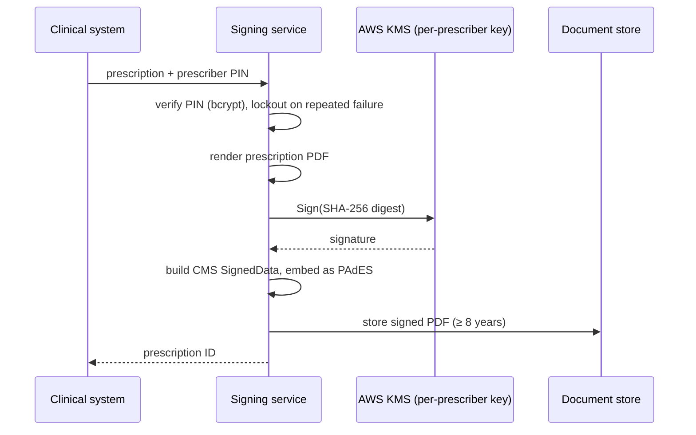

Some third-party services are priced per call, and that's fine until volume makes the unit price the dominant fact. Prescription signing is one of them for us. At roughly 35,000 prescriptions a month and a per-signature fee, the bill is around **£310,000 a year**, and it grows linearly with the business.

Cost isn't the only problem:

- **Opacity:** signing is a black box we can't observe or debug.
- **Availability:** a provider outage stops prescriptions being issued.
- **Data flow:** patient details go through a third party for every signature.

So we're bringing signing in-house. This post covers the design, and why the part that matters most is making sure prescribers don't notice anything has changed.

## What "signing a prescription" actually involves

The requirement was an **Advanced Electronic Signature** (AES) on each prescription PDF, which in practice means:

1. **Authenticate the prescriber**: they enter a PIN with each signing request.
2. **Generate the prescription PDF** in the required format.
3. **Sign it** with a key uniquely linked to that prescriber.
4. **Embed the signature** in the PDF as a PAdES signature (the PDF profile of CMS/PKCS#7), so any standard validator can check it.
5. **Store it** for at least eight years and make it verifiable for all of that time.

## The pipeline

The whole flow lives inside an existing integration service, behind the same API contract the upstream clinical system already uses. From the caller's point of view nothing changes.

A few design choices are worth calling out.

**One KMS key per prescriber.** The private key never leaves the hardware security module, and each prescriber's key is only usable after their PIN is verified. Keys are **disabled, never deleted**, when a prescriber leaves, because signatures have to remain verifiable for the full retention period.

**We built the CMS structure by hand.** Popular Node signing libraries assume they hold the private key. With KMS they don't: you send a digest and get a signature back. So the service builds the CMS `SignedData` structure itself and embeds it. It's more code than calling a library, but it's the only honest way to keep keys in the HSM.

**Our own certificate authority, with an upgrade path.** A self-managed CA gives a full certificate chain for almost nothing, with a documented route to a managed private CA if auditors or relying parties require it. If you go this way, work out *before* go-live **what a CA compromise would mean** for documents already signed. The difference between "revoke and re-issue certificates" and "every signature from the last N years is now suspect" is exactly what timestamps and long-term validation data are for.

**Aim for long-term validation, not just "signed".** The baseline PAdES profile proves the signature was valid when it was made. For documents that must verify years later, you want the long-term profile, with timestamps and revocation data embedded. Pure-JavaScript PAdES stacks vary in how completely they implement this, so the plan was to check every generated PDF against the EU's reference validator (DSS) using a "golden PDF" test set, and not to trust the library's word for it.

**Performance shouldn't be an issue.** A KMS `Sign` call typically takes 10–50 ms. bcrypt at a sensible cost factor adds about 250 ms, which is deliberate. Together with PDF rendering, the p95 target of 500 ms is comfortable, and we'll confirm it in staging before the flag flips.

## The part that matters: a migration nobody notices

Replacing a signing provider for practising clinicians has one overriding constraint: **don't make hundreds of prescribers do anything**. Asking them to re-enrol or pick new PINs would cost more goodwill than the project saves in money.

**Dual PIN sync.** Prescribers keep their existing PINs. When a prescriber signs through the old provider, the service captures a bcrypt hash of the PIN they've just successfully used, so the local store fills up as people work normally. PIN resets continue through the old provider's one-time-code flow and are written to both systems. If the local write fails during a reset, the prescriber is still fine: the hash is captured on their next signature, and an alert fires.

**Dual provisioning.** New prescribers are set up in both systems during the transition, with a per-prescriber signing mechanism recording which one is live.

**One feature flag, lazily wired.** A single flag gates every new code path. With it off, the new service's dependencies and AWS clients aren't even constructed, so deploying the code carries no risk. Another route that relies on the old provider for dispensing is left completely alone.

**Visual parity before the flip.** The generated PDFs have to look the same to pharmacies as the old ones: snapshot tests during development, then side-by-side comparison, with clinical operations signing off before the flag changes.

**Honest about accepted risks.** The failed-PIN counter isn't strictly atomic. At under one request per second, the race window is negligible, and the failure mode is locking out *earlier*, not later. We've written that down as an accepted risk rather than over-engineering it.

## Regulatory homework (engineers aren't lawyers)

Two questions deserve early answers from legal and regulatory specialists, not engineers:

- **"Sole control."** An AES requires that the signing key is under the signatory's sole control. If keys live in the organisation's HSM and the prescriber supplies only a PIN, you need a clear, documented argument for why that satisfies the requirement.
- **Which artefact does the recipient actually expect?** A signed PDF isn't the same as a national electronic-prescription message. Confirm what pharmacies and national systems require before you build.

We also wrote up the alternatives: software keys per prescriber with envelope encryption, a central signing service over a vault's transit engine, and a single organisation-level key with prescriber attributes, all with their trade-offs. That made the chosen design a decision rather than a default.

## The general lesson

Build-vs-buy decisions made at low volume deserve a revisit once the unit economics flip. When they do, the technical build is often the smaller half of the work. The bigger half is a **migration that the users never see**: keep their credentials, keep the API contract, gate everything behind a flag, and prove parity before you switch.
