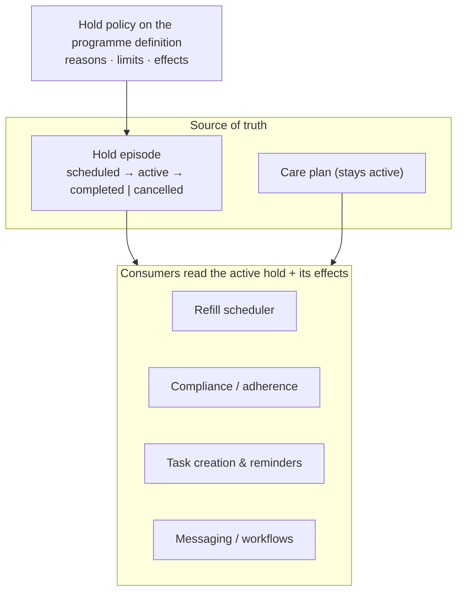

Chronic-care programmes have an unusual property for software: the *normal* latency of an interaction is days or weeks. A patient orders a blood-test kit, it ships, they take the sample, the lab processes it, a clinician reviews it. Or a patient goes on holiday and asks to pause their programme for a month.

Last year I wrote about [designing for human latency](/architecture/2025/07/02/designing-for-human-latency.html) by modelling patient interactions as tasks. This spring a related question came up: *how do you pause something?* It has a tempting wrong answer.

A business requirement arrived: members of employer-sponsored programmes must be able to pause for a period, then resume automatically. The obvious implementation is to set the care plan's status to `on-hold` (FHIR even has that value) and set it back afterwards.

We explored that and several variants, and discounted all of them.

## Why a status flip is wrong

- **Semantic collision.** The platform already used care-plan status for the *enrolment lifecycle*: active, revoked, completed. To reporting, integrations and employer member counts, `on-hold` reads as churn. The requirement said explicitly that a pause must never look like termination.
- **Scheduled pauses need state anyway.** A pause booked for next month needs a "scheduled" state before `on-hold` applies, so you're building a state machine regardless. It's just in the wrong place.
- **People misread it.** Support staff and clinicians may interpret `on-hold` as a clinical suspension.

## Why an extension on the care plan is wrong too

Storing pause periods as an extension on the care plan is better, but it still overloads a resource that already carries programme identifiers, pricing, preferred pharmacy and *terminal* status reasons (cancellation, clinical ineligibility). Mixing reversible holds with irreversible reasons blurs both. Frequent pause edits also contend with other updates to the same resource. And questions like "when did their last pause end?" (for cooldown rules) or "show me their pause history" become awkward extension parsing instead of queries.

## Pause is four behaviours, not one boolean

The real insight was in the requirements. "Pause" actually meant **four independent behaviours**, and merging any two of them produces bugs:

| Concern | Behaviour while paused | Wrong if merged |
|---|---|---|
| Refill clock | Freeze the countdown to the next medication | Treating the member as "not enrolled" |
| Adherence window | Exclude paused days; extend the measurement window | Treating it as the same thing as a refill freeze |
| Compliance and escalation | Freeze status and the "off track → action needed" timer | Inventing a new compliance state called "Paused" |
| Workflows and comms | Suppress reminders; resume automatically | Cancelling only one reminder task |

## The model: a hold is an overlay with declarative effects

- The **hold** is its own resource: care plan, patient, type, planned and actual period, reason, initiator, and the policy version applied. It has a small state machine for the *episode* only.
- The **care plan stays active**. The hold is an overlay, not an enrolment change.
- A **hold policy**, configured per programme, declares the reasons allowed, the limits (maximum duration, cooldown) and the **effects**: freeze the refill clock or not; exclude days from adherence or not; freeze compliance and escalation or not; which task types, workflows and messages to suppress.
- Each **consumer** asks "is there an active hold, and what are its effects for me?" and behaves accordingly. Nobody checks a magic flag.

## The payoff: one mechanism, many kinds of hold

Once the model existed, other "delays" turned out to be holds with different policies. A patient-initiated **refill delay** in another market had been implemented as "cancel the refill task and create a new one". It became a hold type with a subset of the effects, migrated in phases without regression: first record the episode alongside the old behaviour, then centralise the checks, and finally replace cancel-and-recreate with a single orchestration path. Clinical holds and study holds slot in the same way.

Adding a new hold type is now a checklist: add a policy to the programme definition, register validators, register the consumers that care, and add entry points. **No change to care-plan status or medication semantics.**

## The general lessons

1. **Don't encode temporary conditions in lifecycle state.** Overlay them as time-bounded episodes, and let each consumer read *declared effects* rather than infer meaning from a flag.
2. **When requirements say "pause", ask how many behaviours that really is.** It's rarely one.
