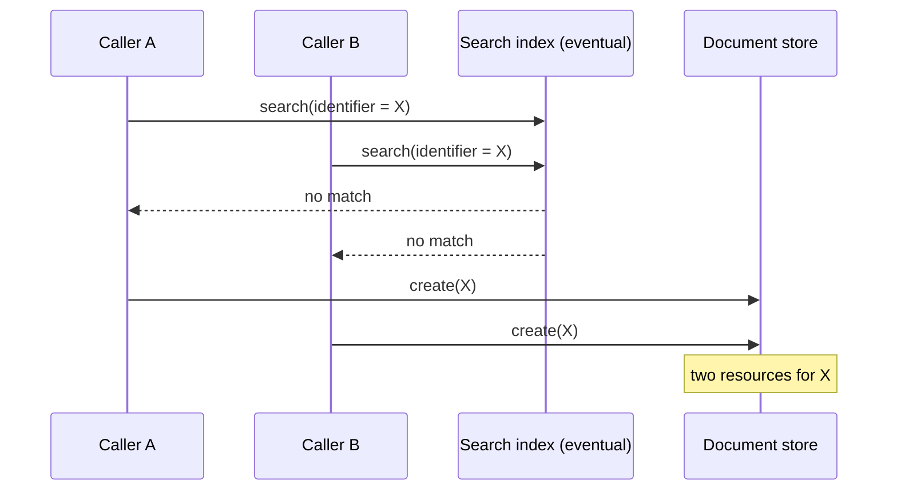
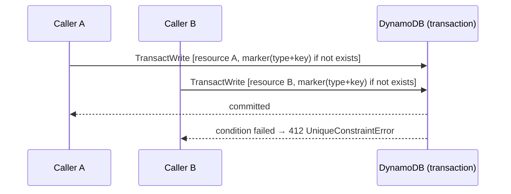

"Create this record unless one already exists" sounds atomic. It almost never is.

HL7 FHIR even standardises it: `POST /CarePlan` with an `If-None-Exist` header, or a conditional `PUT`, means "search for a match; if there isn't one, create it". Plenty of non-FHIR systems do the same thing by hand. The problem is that *search* and *create* are two operations, and in a healthcare platform I work on, the search side reads from an **eventually consistent** index.

This post covers how we closed that race, and why the interesting decision turned out to be the key rather than the lock.

## How duplicates happen

Two requests arrive close together: a webhook retry and a scheduled job, say, or two pods processing the same event. Both search, both miss, both create.

With a strongly consistent database you'd at least have a narrow window. With a search index that's refreshed asynchronously, the window is as wide as the indexing lag, which is typically seconds and sometimes much longer under load. Resource-level optimistic locking (version IDs, `If-Match`) doesn't help either, because it protects *updates* to one resource, not the *creation* of a logically unique one.

The symptoms are familiar: two active care plans for one patient, a downstream consumer that processes both, and an on-call engineer writing a de-duplication script at 2am.

## The fix: a write barrier on a strongly consistent store

We added an optional, caller-supplied **uniqueness key** to resources. When it's present, the platform writes a small marker item to DynamoDB **in the same transaction** as the resource itself, conditioned on the marker not already existing.

- The marker's key is scoped per resource type (resource type + uniqueness key), so a `CarePlan` and a `Task` can share a key without colliding.
- One transaction commits. The loser fails fast with `412 Precondition Failed` and a typed `UniqueConstraintError`.
- The marker holds a back-pointer to the resource, so it's removed when the resource is deleted and the key can be reused.
- The constraint is defined once in shared resource metadata and generated into every resource table, so every type gets it without its own schema change.
- The value is opaque to the platform. Callers supply a deterministic hash of whatever should be unique, and it's compared case-insensitively.

Strongly consistent conditional writes are exactly what DynamoDB is good at, and the search index is no longer on the critical path for correctness. It goes back to doing what it's good at: search.

## Choosing the key is the real design work

The barrier is mechanical. The **key** encodes a domain decision: *what does "the same thing" mean?*

The change that prompted all this was a care plan for a blood test. The code already did a conditional create, keyed on an idempotency hash, and it *still* produced duplicate active plans. There were two reasons. Concurrent requests both missed in the index, as above. And the "exists?" search also filtered on **status**, so an earlier plan that had moved to `completed` was invisible and a new one was created alongside it. The search was answering "is there a matching plan *in these statuses*?" when the question that mattered was "have we already created a plan for this request?".

The fix was to write **two identifiers** on create: the domain identifier (still used for everyday lookups), and the same idempotency hash as the uniqueness key. The loser of any race gets a `412`, looks up the winner by the uniqueness key, and returns it. From the caller's point of view the operation is simply idempotent.

Some things are only unique **for a period**. Take a monthly statement for an account: there should be exactly one per month, but the same account gets a new one every month. For those, the key can include a validity period, and uniqueness is enforced on the exact `value | start | end` tuple. The same value is allowed again in a different period. Note that it's the *exact* tuple, not interval overlap: two overlapping periods are different keys. That's simple and predictable, but callers need to generate their periods consistently, for example with calendar-month buckets.

All of this generalises into a checklist we now apply to every new use:

1. **What is the natural unit of uniqueness?** One per patient? Per order? Per shipment? Per billing period?
2. **Does it recur?** If yes, the period (or sequence number) belongs in the key.
3. **Who generates the key?** It must be deterministic from the request, so that *retries produce the same key*. A random UUID per attempt defeats the purpose.
4. **What should the loser do?** Usually treat `412 UniqueConstraintError` as success: fetch the winner and carry on. Surfacing it as an error just moves the race to the caller.
5. **What happens on delete or cancel?** Decide whether the key becomes reusable or stays burnt, and make it explicit.

## Why not just use `If-None-Exist`?

We still use it. It's the right *API shape*, because callers express intent declaratively. But on its own it's only as consistent as the search behind it. Use the standard conditional-create header for expressiveness, and pair it with the uniqueness key for correctness wherever duplicates would cause real harm.

We're making this the default idempotency pattern for new domains, not because it's clever but because it's boring. Two small writes in one transaction, a typed error, and a checklist.

## The general lesson

If your "exists?" check reads from anything eventually consistent (a search index, a read replica, a cache, a CDC-fed projection), you don't have a uniqueness constraint. You have a hope. I put a strongly consistent, conditional write on the path, and spend my design time on what "the same" means for your domain.
