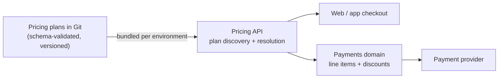

Pricing is one of those domains where every individual decision looks harmless. Marketing wants a first-month offer, so someone creates a new Stripe price. A partner wants a discount for their employees: another price. A commitment plan needs cheaper refills: a price per dose, per month. A year later you have hundreds of `price_…` IDs, half of them aliases for each other, and nobody can say with confidence what a given customer *should* be charged.

This post describes the pricing standard we adopted on a multi-market subscription health platform to stop that happening. It isn't specific to healthcare, or even to Stripe, but Stripe's model makes the trade-off particularly visible.

## The golden rule: default to a coupon

Every pricing change forces one decision: **do I add a new price, or a coupon?** The answer should almost always be a coupon.

| You want to… | New **price**? | **Coupon**? |
|---|:---:|:---:|
| Sell a genuinely new SKU (new product, new pack size) | ✅ | |
| Support a new currency for an existing SKU | ✅ | |
| Permanently change a SKU's list price | ✅ (version it, retire the old one) | |
| Run an intro / first-month / first-N-orders offer | | ✅ capped per customer |
| Give a commitment discount (e.g. £25 off refills on a 12-month plan) | | ✅ |
| Give a time-windowed discount (e.g. 10% off in months 6 and 12) | | ✅ coupon bundle with month windows |
| Give an employer, partner or referral discount | | ✅ scoped by conditions |
| Show "was £X, now £Y" | | display field + coupon for the real reduction |

**Why:** prices multiply combinatorially. Dose × promotion × cohort × month × payment account quickly becomes hundreds of IDs to create in Stripe, mirror in configuration and keep in sync. A coupon is a single, reusable, condition-bounded, auditable adjustment layered on top of one stable list price. Reconciliation, refunds and reporting all get simpler when every charge is *list price + named adjustments*, not a forest of bespoke prices.

We had a live example of the alternative. One legacy plan modelled its onboarding bundle as a parallel ladder of per-dose prices (eight or so of them), plus alias entries that pointed at the *same* Stripe IDs under different names, and no coupon layer at all. A study cohort had its discount baked into a flat price. Every change to the offer meant new prices, and the front end couldn't render consistent "was/now" pricing because there was nothing to compare against.

## Pricing plans are documents, not dashboard state

The second half of the standard is *where* pricing lives. A **pricing plan** is a versioned document in a Git repository, validated against a JSON Schema and bundled to each environment. It's never edited at runtime. A plan declares:

- **Identity and lifecycle:** a stable, versioned ID (`-v1`, `-v2`) and an `enabled` flag. *Deprecation is `enabled: false` plus a new version, never deletion*, because live subscriptions reference old plans.
- **Discovery filters:** which organisation, registration code or programme a plan applies to.
- **Payment routing:** which payment account the charge goes to (more on that below).
- **Products and prices:** each price carries the provider's price ID, the amount in minor units for display and validation, a lookup key (such as a medication code) to select the right price for the chosen option, and a selection group, so that six per-dose prices appear to the customer as a single option.
- **Coupons and coupon bundles:** discounts with explicit conditions such as usage caps, validity periods and scoping, plus month-windowed bundles for rolling offers.

Consumers never see the raw document. A pricing API resolves the right plan for a customer and phase and returns the chargeable products and applicable coupons. The payments domain turns them into invoice line items and discounts. The front end renders what the API returns: *no environment-variable price IDs, no feature-flag payloads carrying prices.*

## Stacking and payment accounts

Two companion decisions were made last winter and still hold: [one promotional discount, best value wins, on top of contractual coverage, with earned credits last and revenue guardrails underneath; and adapter affinity for multiple payment accounts](/payments/2025/12/10/discount-stacking-and-payment-accounts.html). The standard builds on both. Each plan names its payment account, and application code refers to logical price and coupon keys that are resolved for that account at runtime.

## Keeping configuration and Stripe in lock-step

A document-based standard only works if the documents match reality. Three small scripts close the loop:

- **Reconcile:** a CI guard that checks every price ID and product mapping in the catalogue against the live provider. It reads only.
- **Create:** for new catalogue rows with an empty price ID, create the price in the provider and write the new ID back.
- **Backfill:** populate product mappings from existing price IDs.

## The review checklist

The standard is enforced where it matters: in pull-request review of plan changes.

- [ ] Every discount is a coupon or coupon bundle, not a new price.
- [ ] No two prices share a provider ID (no aliases).
- [ ] Per-option prices share a selection group.
- [ ] Coupons have deliberate conditions: period, scope and usage caps.
- [ ] Time-windowed discounts use month-windowed bundles.
- [ ] The payment account is the intended one.
- [ ] Environment-specific IDs are in overrides, not the base file.
- [ ] Superseded plans and prices are versioned and disabled, never deleted.
- [ ] Schema validation passes for every environment.

## The general lesson

A price list is a **catalogue**; a promotion is a **policy**. Mixing them turns every marketing idea into a data-migration problem. I keep list prices few and stable, express everything else as named, conditioned adjustments, keep both in version control, and write the stacking rules down before I need them.
