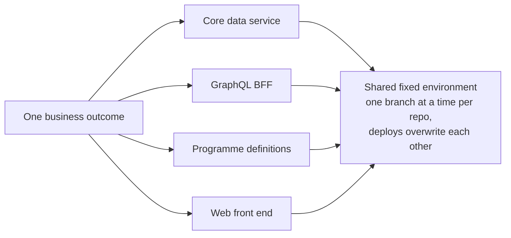
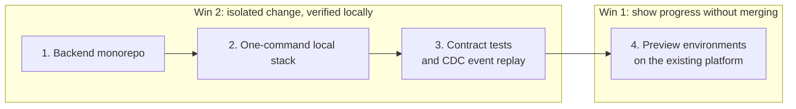

Two conversations were running in parallel on our team. One was about **developer experience**: "It takes too long to ship a feature, and we can't show the business anything until it's merged." The other was about the **runtime**: "Kubernetes is a lot to operate. Could a managed platform give us a Heroku-style experience on AWS?"

It's tempting to treat the second as the answer to the first. Our evidence said otherwise.

## Diagnose the bottleneck from evidence

Before proposing anything, we looked at the repositories and the backlog.

**Features are decomposed per repository.** In the issue tracker, a single business outcome (accepting a new patient cohort, for example) routinely became three or four tickets titled by the repo they touched: the core data service, the GraphQL backend-for-frontend, the programme definitions, the web front end. One outcome meant several PRs, merged in the right order and verified together.

**Deployment is shared-environment by construction.** Every service deployed through shared workflows into a *fixed* environment (development, staging, production) in a single namespace. The "feature deploy" workflow ran one branch at a time per repo and **overwrote** shared development. Two engineers couldn't have independent backend states. The only per-change preview anywhere was on the front end, and it wasn't connected to a matching backend.

**Local isolation stopped at the repo boundary.** The core data service had an excellent local setup: emulated AWS services and full in-memory functional tests. The integration service had a local workflow engine. The backend-for-frontend ran locally but resolved data against shared dev. **No single command brought up the whole system with seeded data.**

**Releases were per-service and frequent.** One service cut around a dozen releases in a day. That's great for flow, and a coordination tax for any feature spanning several services.

**Conclusion:** the bottleneck was the lack of an **isolated, end-to-end, multi-repo target**, for engineers, QA, business demos *and* AI agents. None of that depends on which runtime runs production.

## Optimise for two wins

We framed the goal as two outcomes:

1. **Show progress to the business and get feedback without merging to trunk.**
2. **Let a developer, or an AI agent, make a cross-functional change and verify it locally, in isolation.**

## The options (complementary, not competing)

| Option | What it is | Unlocks | Watch out for |
|---|---|---|---|
| **Backend monorepo** | Tightly coupled TypeScript services and shared libraries in one repo, keeping per-service deploy config and affected-only releases | Atomic cross-service PRs; one checkout for engineers and agents | Tooling migration; CI must stay affected-only |
| **One-command local stack** | A dev container that runs *the real deployment chart* on a local Kubernetes (k3d/kind) with AWS emulators, a local workflow engine and seeded fixtures | True isolation; deterministic end-to-end tests for agents; the fastest loop | Emulator fidelity gaps; the AWS-emulator licensing decision |
| **Contract and event-replay tests** | Consumer-driven API contracts on the key seams; versioned CDC event schemas with a recorded-event replay harness | Cross-service breakage caught in each repo's own pipeline; single-repo changes merge with confidence | Discipline to keep contracts current |
| **Per-feature preview environments** | A namespace and URL per PR or feature on the *existing* cluster, using off-the-shelf tooling (vCluster or Argo CD ApplicationSets), single-region, with a TTL, scaled to zero | A clickable URL for the business; an isolated QA target; a stable endpoint for agent verification | Highest infrastructure effort; cost controls; data seeding; secrets scoping |
| **Feature trains** | A small manifest grouping related branches across repos, deployed together into one preview | Validate a *whole* feature before any merge | Needs preview environments first |

One constraint turned out to be a forcing function: a legacy SaaS workflow engine that couldn't run meaningfully on a laptop. That was one more reason to move actively changing workflows to an engine with a local dev server.

## The recommendation: sequence low-risk first

**Win 2 first, because it's cheap and compounding:**

1. Consolidate the tightly coupled backend services into a **monorepo**.
2. Give everyone a **one-command local stack** that runs the real chart.
3. Add **contract tests** on the busiest seams, plus CDC event replay.

**Then Win 1:**

4. Stand up **preview environments on the platform you already run**, with off-the-shelf tooling rather than bespoke glue.

The end state, for engineers and agents alike, is `make up` for the inner loop, a preview URL per feature for the outer loop, and contracts as the guard-rail.

## So what about the runtime?

Earlier this year we [evaluated managed platforms that run in our own AWS account](/engineering/2026/04/22/evaluating-a-paas-on-aws.html). A serverless-container platform remains a credible option for *runtime maintenance*, since our unified Node stack fits it well. But the evaluation's lessons still apply: messaging stays in infrastructure-as-code, the security edge must be proven first, and **multi-region, the gnarliest part of our setup, is exactly what managed platforms automate least**.

Our pragmatic path was to **rebuild the authorisation edge in a runtime-portable way first** (we had to anyway, with the widely used community ingress controller being retired), using a standard external-authorisation filter and a shared auth library. Then decide between managed Kubernetes and a serverless container platform on **cost and operational evidence**, rather than having the architecture force the choice.

Re-platforming production wasn't a prerequisite for either developer-experience win.

## The general lesson

Developer-experience pain usually lives in the **seams**: between repos, between environments, between "works on my machine" and "works with everyone else's changes". A new runtime changes where production runs; it doesn't change the seams. Fix the inner loop and the preview loop first, keep the runtime decision portable, and make it on evidence.
