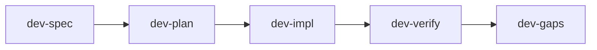
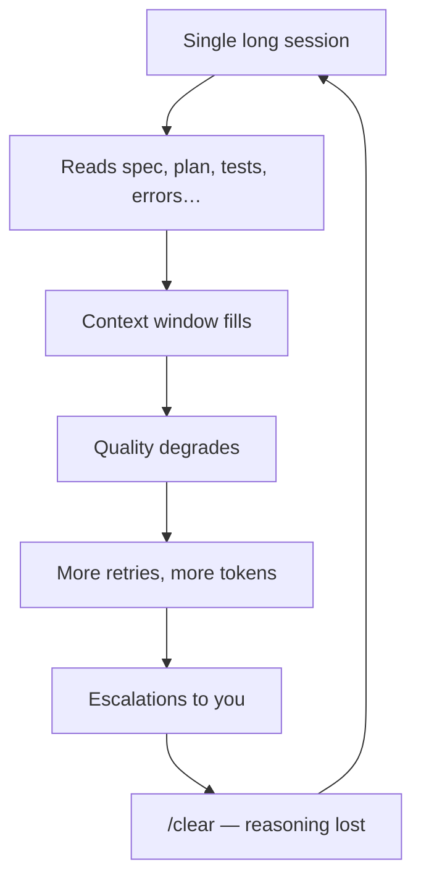
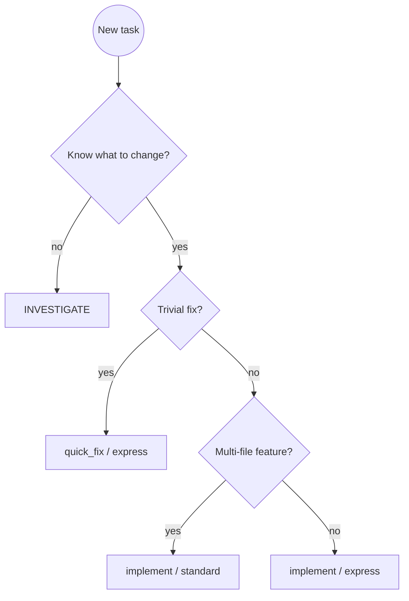
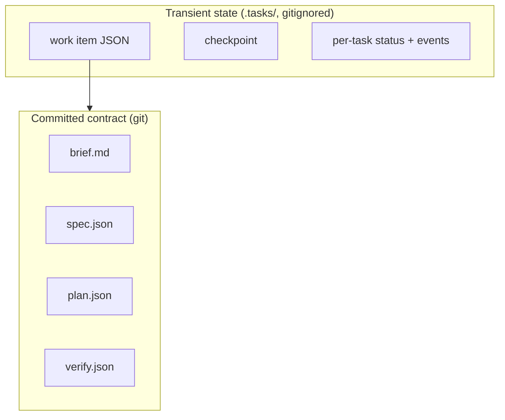
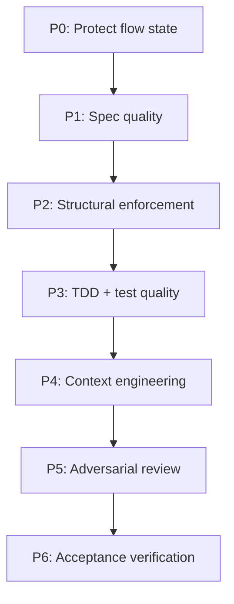

It takes an average of **23 minutes and 15 seconds** to regain full focus after an interruption. Gloria Mark measured that years ago; it still matters more than context window size, model benchmarks, or how many sub-agents you can spawn.

I'm a platform engineer. My week isn't "one repo, one feature, one PR." It's payments integrations in one service, an OAuth hardening change in another, an infra preview in a third, a compliance doc in Confluence, and three Slack threads asking whether the incident is fixed. Agents help on roughly half of that work. The other half needs investigation, analysis, or a five-minute fix that doesn't deserve a spec interview.

The failure mode I kept hitting wasn't "the model isn't smart enough." It was:

- An agent pausing with a vague question → me context-switching → flow gone for the rest of the morning
- Three concurrent agent sessions → a stream of micro-interruptions → nothing deep getting done
- Review fatigue → rubber-stamping PRs because the harness had consumed my attention budget

**The harness's success metric isn't how many quality gates it has. It's how little of my attention it consumes.**

That framing led to **ACCORD**, **A**gentic **C**ontract for **C**ollaborative **O**bjectives, **R**equirements, and **R**igorous **D**elivery. A Pi extension with a single entry point, `/dev`, that routes work through schema-driven artifacts, isolated phase agents, and two intentional human gates. Everything else is designed to run while you do something else.

*Reach ACCORD before you build.*

---

## What worked first: the dev-* skill chain

Before ACCORD, I had a working pipeline on Claude Code ([I wrote it up in March](/ai/2026/03/31/spec-driven-agentic-workflow.html)): five skills in sequence:

It proved the shape was right.

**Parallel enrichment** pulled Jira, Slack, and Google Drive context before the requirements interview. **Three Explore agents** scanned services, types, and test infrastructure so the planner didn't miss reuse candidates. **TDD was enforced**: test design before implementation. **Writer and reviewer were separated**, not by running both reviews on the same diff at once, but by staging them: test review before code, code review after, each in a fresh process so neither rationalised the other's blind spots.

Verification was guided by acceptance criteria, not by "tests pass, ship it."

I shipped real work with this. I'll use one feature as a thread through the rest of this post (OAuth2 refresh token support) because it shows why typed acceptance criteria matter more than a green test suite.

A spec for that work might define:

- **AC-1:** expired JWT → 401 with `token_expired`
- **AC-2:** valid refresh token → new access token, old refresh invalidated
- **AC-3:** TTL configurable via `AUTH_REFRESH_TOKEN_TTL`
- **AC-4:** refresh flow must go through `AuthService`, enforced by an ESLint rule, not a unit test

Notice AC-4. Some constraints aren't unit-testable in a meaningful way. They're architectural: "don't bypass the service layer." The old pipeline already knew how to express that, typed criteria, plan tasks that `covers_ac`, verification that maps evidence back to IDs. What it didn't know how to do was **remember** those IDs three hours later in the same chat session without the context window turning to soup.

The prototype earned the rebuild. The workflow shape was sound. The substrate underneath it wasn't.

---

## What broke: three problems skill polish couldn't fix

### 1. Skills accumulate context

Every phase ran in the same conversation. By `dev-verify`, the model was carrying the spec interview, exploration notes, increment retries, and review findings. `/clear` recovered tokens and threw away reasoning.

I didn't need a smarter model. I needed the model to **forget on purpose**.

### 2. State lived in YAML frontmatter

`phase: final` in a markdown file. Increment status in plan frontmatter. Hand-edited, unvalidated, silently wrong. Document state and reality could diverge without anyone noticing until verification failed in a confusing way.

Concrete example: the plan says increment 2 is `done`, but the work item JSON still says `in_progress` because resume logic in `dev-impl` and `dev-verify` disagreed on when to flip the flag. The agent reads the plan, skips work you thought was pending, and verification reports gaps on AC-3 that nobody can explain without archaeology in the transcript.

### 3. Every skill re-implemented orchestration

Resume logic (~30 lines per skill). Retry loops. Sub-agent dispatch. Recovery procedures. Drift between skills was inevitable.

I counted it once: 10 monolithic skills in total (the five-phase `dev-*` chain plus commit, PR, review, and setup companions) each 200 to 400 lines, each with its own copy of "if checkpoint exists, read phase, spawn the right agent, handle malformed return, retry twice, escalate." Fix a bug in resume handling in `dev-impl` and `dev-plan` still had the old behaviour until you remembered to patch it there too.

The fix wasn't another skill. It was splitting **artifacts** (what humans read and commit) from **orchestration state** (what the machine reads to know where it is).

---

## V2: the JSON task layer (and why it still wasn't enough)

The second rebuild introduced a thin orchestrator and JSON work items under `.tasks/`. Phase agents still ran in isolated processes, that part worked. Spec and plan moved toward structured JSON instead of prose with frontmatter. Resume became one code path instead of ten.

What V2 fixed:

- Machine-readable state the harness could validate
- Checkpoints for multi-turn spec and plan interviews without polluting the artifact
- A single place to ask "what phase are we in?" without parsing markdown

What V2 didn't fix:

- Orchestration logic still lived largely in markdown skills: editable, but duplicated with extension hooks
- No schema enforcement on artifact writes; bad JSON could still land on disk
- Routing rules drifted between the skill chain and whatever the extension thought should happen next

That gap is what pushed the third rebuild: **move routing into TypeScript**, keep the Pi adapter thin, treat skills as companions for commit/PR/review, not as the orchestrator itself. The intermediate blueprint literally called this "skill-as-orchestrator." Shipping code inverted it. The bundled accord orchestrator skill is gone. Core resolve handlers route `/dev` today.

---

## Research: seven patterns, one bet

I'm a platform engineer across many repos, payments, integrations, infra, security, compliance docs. I mapped where my time went: hundreds of commits and project documents over a year. Agents help on roughly half of that work. The rest needs different shapes.

I defined seven interaction patterns that cover ~100% of senior engineering work. Then I refused to build all seven at once.

| Pattern | ~% of work | ACCORD today |
| --- | --- | --- |
| **IMPLEMENT** | ~50% | **Fully wired** — `implement/standard` and `quick_fix` |
| **ANALYSE** | ~15% | Partial — agents exist; free-text "write an ADR" doesn't auto-bootstrap yet |
| **RESPOND** | ~12% | Cut as a pattern — use `quick_fix`; the diff *is* the spec |
| **INVESTIGATE** | ~9% | Partial — bootstrap and coarse resume |
| **INFRASTRUCTURE** | ~4% | Partial — preview-only verification, never auto-apply |
| **MIGRATE** | ~4% | Cut — codemods beat agents for bulk transforms |
| **THINKING PARTNER** | ~6% | Cut — the conversation is the right surface |

**The bet:** build IMPLEMENT rigorously enough that subagent isolation, JSON state, schema validation, and evidence-based review transfer to the other patterns later. One pattern, done properly.

That taxonomy wasn't armchair theory. I grounded it in a year of platform work: **472 commits across 15 repos**, roughly a hundred project documents, features, incidents, ADRs, infra changes, compliance write-ups. Agents help on about half of that work. The rest needs different shapes, and pretending one pipeline fits all of it is how you end up with ceremony on a typo and no contract on a multi-file feature.

Intent classification routes new work deterministically: no LLM guessing the pattern:

Stripe's Minions and one-shot "ship the whole feature" agents are a valid bet for bounded tasks. I chose the opposite: contract-first, human-in-the-loop, batched decisions. Not because agents can't one-shot, because my job isn't one feature at a time.

---

## The pivot: artifacts vs orchestration

### `brief.md`: shared understanding before the contract

Not every artifact is a machine-verifiable contract. **`brief.md` is the human one**: the shared understanding between you and the agents about *what we are building and why*, before anyone writes typed acceptance criteria.

`phase-align` produces it through a reflect→probe→check cycle. The agent synthesises what it knows from your description, Jira, Slack, Confluence, and codebase exploration, then surfaces explicit claims as **alignment markers** for you to confirm, correct, or contest. The tone is "I think the core problem is X because Y, am I missing something?" not "please fill in field seven of the template."

For OAuth refresh, the brief might capture narrative the spec later formalises: the SPA currently forces re-login when access tokens expire; `AuthService` handles login but has no refresh path; the product owner needs rotation for SOC2; approach direction is to extend `AuthService` rather than to bolt logic into middleware. It can include a small Mermaid sequence diagram of today's auth flow, compression for downstream agents, not a substitute for ACs.

That distinction matters:

| Artifact | Role | Audience |
| --- | --- | --- |
| **`brief.md`** | Grounding — problem, stakeholders, current state, constraints, approach direction | Engineer + every downstream agent (via `brief_path`) |
| **`spec.json`** | Contract — typed ACs, test cases, verification commands | Review agents, verification, PR evidence |
| **`plan.json`** | Execution — tasks, TDD ordering, `covers_ac` | Implement loop |

The brief is committed under `docs/dev/<ID>/brief.md` and **blocks spec** until `phase-align` returns done with a complete file on disk. `phase-spec` treats it as primary framing input, open questions in the brief become prioritised interview topics. `phase-plan` reads approach direction when decomposing tasks. `phase-test` and `phase-code` pull it when an AC is terse and they need the *why*, edge-case assertions, choosing between equally valid designs. `phase-verify-acceptance` reads it to check the implementation addresses the actual problem, not just the letter of the ACs.

You skim and correct the brief in a short alignment window. You don't re-read it on every task, the agents do, in fresh processes, without dragging the align transcript along. The brief is how intent survives context isolation.

**Artifacts** (the formal contract layer) are typed acceptance criteria with stable IDs (`AC-1`, `AC-2`, …), plan tasks that map back via `covers_ac`, and a verification report that maps each AC to evidence or a gap.

For the OAuth example, `spec.json` might carry AC-1 as a `scenario` with `requirement: MUST`, AC-3 as a `constraint` on configuration, AC-4 as `architectural` with an ESLint rule named in the criterion text. `plan.json` splits work into tasks (refresh endpoint, token rotation, config wiring) each listing which ACs it covers. Nothing fuzzy. No "implement OAuth" bullet that an agent interprets differently every run.

We didn't pick Gherkin instead of a formal spec language. The formal layer is **`spec.json` itself**, schema-validated JSON with stable `AC-N` ids, MUST/SHOULD/MAY levels, and typed criteria that flow through plan tasks (`covers_ac`) into `verify.json`. **Scenario** criteria use Given/When/Then strings because engineers and models already read that shape; `phase-test` turns them into real tests in your framework, Gherkin isn't executed directly. **Constraint**, **architectural**, and **property** criteria stay plain text (architectural adds an `enforcement` field for lint or CI). A single notation wouldn't cover AC-4-style ESLint rules and AC-3-style config constraints without forcing everything into scenarios or excluding half the acceptance criteria we actually ship. Narrative lives in `brief.md`; the spec is the graded contract.

**Task JSON** is orchestration state: pattern, phase, pending decisions, deviations, cost. The engineer batches decisions in `/dev review`; the harness doesn't expect you to re-read the whole transcript.

Committed artifacts live under `docs/dev/<ID>/` (brief, spec, plan, verify) so PR reviewers see the contract beside the code. Runtime state lives in gitignored `.tasks/`: work item file, per-task events, checkpoint for multi-turn spec/plan drafts. When Pi reloads or you switch machines, artifacts survive; orchestration state is reconstructable from them plus the work item file.

Spec and plan are treated as **immutable after approval**, verification checks the spec, not whatever the agent remembered. There's a controlled escape hatch: `/dev amend-spec` when reality genuinely changes mid-flight. Without that valve, immutability becomes rigidity; with it, the contract stays authoritative and changes are explicit.

After `phase-test` writes failing tests, **`review-test` must complete before `phase-code` runs**. That's enforced in the orchestrator (`pre_impl_gates`), not left to the agent's honour. It's a simplified version of the old three-gate prototype: one pre-impl gate, but it's real.

The principles stack underneath that split reads like a priority order, not a wish list:

P6 in one line: tests can pass while a MUST acceptance criterion goes unimplemented. Verification maps each AC to evidence or a gap, which is why AC-3 in the OAuth example matters even when the happy-path refresh test is green.

## The general lesson

**Measure a harness by the attention it costs you, not by how many gates it has.** The pipeline I had worked, but it spent my focus on questions the spec should have answered, and its state lived in a chat window that couldn't be trusted. Moving the contract into typed artifacts and giving each phase a fresh context fixed the substrate, not the prompts.

The rest of the story is in two follow-ups. [Write the Tests Before the Code, Then Review Them Like an Adversary](/ai/2026/10/05/adversarial-tests-before-code.html) covers the shift-left chain and what `/dev` does in a day. [The Author Is Compromised](/ai/2026/10/05/the-author-is-compromised.html) covers independent review, decision packets and an honest list of what is still partial.
