It takes an average of **23 minutes and 15 seconds** to regain full focus after an interruption. Gloria Mark measured that years ago; it still matters more than context window size, model benchmarks, or how many sub-agents you can spawn.

I'm a platform engineer. My week isn't "one repo, one feature, one PR." It's payments integrations in one service, an OAuth hardening change in another, an infra preview in a third, a compliance doc in Confluence, and three Slack threads asking whether the incident is actually fixed. Agents help on roughly half of that work. The other half needs investigation, analysis, or a five-minute fix that doesn't deserve a spec interview.

The failure mode I kept hitting wasn't "the model isn't smart enough." It was:

- An agent pausing with a vague question → me context-switching → flow gone for the rest of the morning
- Three concurrent agent sessions → a stream of micro-interruptions → nothing deep getting done
- Review fatigue → rubber-stamping PRs because the harness had consumed my attention budget

**The harness's success metric isn't how many quality gates it has. It's how little of my attention it consumes.**

That framing led to **ACCORD** — **A**gentic **C**ontract for **C**ollaborative **O**bjectives, **R**equirements, and **R**igorous **D**elivery. A Pi extension with a single entry point, `/dev`, that routes work through schema-driven artifacts, isolated phase agents, and two intentional human gates. Everything else is designed to run while you do something else.

*Reach ACCORD before you build.*

---

## What worked first: the dev-* skill chain

Before ACCORD, I had a working pipeline on Claude Code ([I wrote it up in March](/ai/2026/03/31/spec-driven-agentic-workflow.html)) — five skills in sequence:

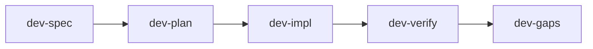

It proved the shape was right.

**Parallel enrichment** pulled Jira, Slack, and Google Drive context before the requirements interview. **Three Explore agents** scanned services, types, and test infrastructure so the planner didn't miss reuse candidates. **TDD was enforced**: test design before implementation. **Writer and reviewer were separated** — not by running both reviews on the same diff at once, but by staging them: test review before code, code review after, each in a fresh process so neither rationalised the other's blind spots.

Verification was guided by acceptance criteria, not by "tests pass, ship it."

I shipped real work with this. I'll use one feature as a thread through the rest of this post — OAuth2 refresh token support — because it shows why typed acceptance criteria matter more than a green test suite.

A spec for that work might define:

- **AC-1:** expired JWT → 401 with `token_expired`
- **AC-2:** valid refresh token → new access token, old refresh invalidated
- **AC-3:** TTL configurable via `AUTH_REFRESH_TOKEN_TTL`
- **AC-4:** refresh flow must go through `AuthService` — enforced by an ESLint rule, not a unit test

Notice AC-4. Some constraints aren't unit-testable in a meaningful way. They're architectural: "don't bypass the service layer." The old pipeline already knew how to express that — typed criteria, plan tasks that `covers_ac`, verification that maps evidence back to IDs. What it didn't know how to do was **remember** those IDs three hours later in the same chat session without the context window turning to soup.

The prototype earned the rebuild. The workflow shape was sound. The substrate underneath it wasn't.

---

## What broke: three problems skill polish couldn't fix

### 1. Skills accumulate context

Every phase ran in the same conversation. By `dev-verify`, the model was carrying the spec interview, exploration notes, increment retries, and review findings. `/clear` recovered tokens and threw away reasoning.

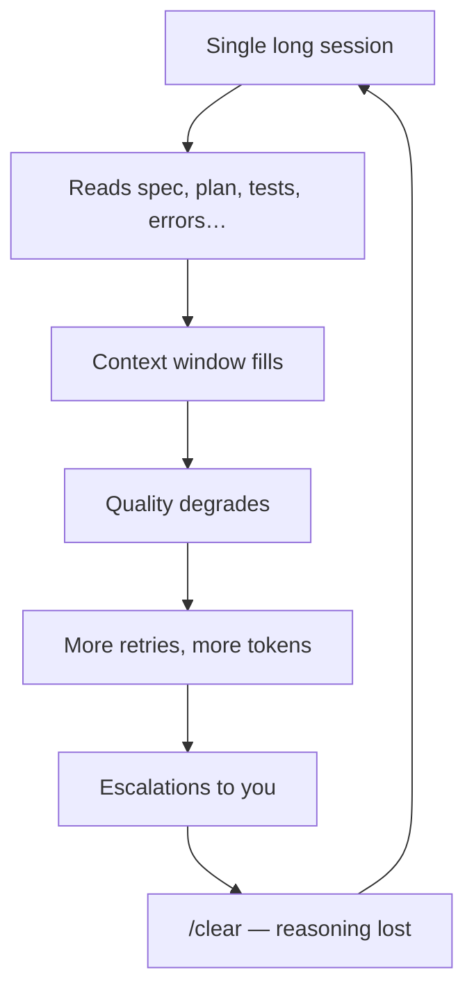

I didn't need a smarter model. I needed the model to **forget on purpose**.

### 2. State lived in YAML frontmatter

`phase: final` in a markdown file. Increment status in plan frontmatter. Hand-edited, unvalidated, silently wrong. Document state and reality could diverge without anyone noticing until verification failed in a confusing way.

Concrete example: the plan says increment 2 is `done`, but the work item JSON still says `in_progress` because resume logic in `dev-impl` and `dev-verify` disagreed on when to flip the flag. The agent reads the plan, skips work you thought was pending, and verification reports gaps on AC-3 that nobody can explain without archaeology in the transcript.

### 3. Every skill re-implemented orchestration

Resume logic (~30 lines per skill). Retry loops. Sub-agent dispatch. Recovery procedures. Drift between skills was inevitable.

I counted it once: 10 monolithic skills in total — the five-phase `dev-*` chain plus commit, PR, review, and setup companions — each 200 to 400 lines, each with its own copy of "if checkpoint exists, read phase, spawn the right agent, handle malformed return, retry twice, escalate." Fix a bug in resume handling in `dev-impl` and `dev-plan` still had the old behaviour until you remembered to patch it there too.

The fix wasn't another skill. It was splitting **artifacts** (what humans read and commit) from **orchestration state** (what the machine reads to know where it is).

---

## V2: the JSON task layer (and why it still wasn't enough)

The second rebuild introduced a thin orchestrator and JSON work items under `.tasks/`. Phase agents still ran in isolated processes — that part worked. Spec and plan moved toward structured JSON instead of prose with frontmatter. Resume became one code path instead of ten.

What V2 fixed:

- Machine-readable state the harness could validate
- Checkpoints for multi-turn spec and plan interviews without polluting the artifact
- A single place to ask "what phase are we in?" without parsing markdown

What V2 didn't fix:

- Orchestration logic still lived largely in markdown skills — editable, but duplicated with extension hooks
- No schema enforcement on artifact writes; bad JSON could still land on disk
- Routing rules drifted between the skill chain and whatever the extension thought should happen next

That gap is what pushed the third rebuild: **move routing into TypeScript**, keep the Pi adapter thin, treat skills as companions for commit/PR/review — not as the orchestrator itself. The intermediate blueprint literally called this "skill-as-orchestrator." Shipping code inverted it. The bundled accord orchestrator skill is gone. Core resolve handlers route `/dev` today.

---

## Research: seven patterns, one bet

I'm a platform engineer across many repos — payments, integrations, infra, security, compliance docs. I mapped where my time actually went: hundreds of commits and project documents over a year. Agents help on roughly half of that work. The rest needs different shapes.

I defined seven interaction patterns that cover ~100% of senior engineering work. Then I refused to build all seven at once.

| Pattern | ~% of work | ACCORD today |
| --- | --- | --- |
| **IMPLEMENT** | ~50% | **Fully wired** — `implement/standard` and `quick_fix` |
| **ANALYSE** | ~15% | Partial — agents exist; free-text "write an ADR" doesn't auto-bootstrap yet |
| **RESPOND** | ~12% | Cut as a pattern — use `quick_fix`; the diff *is* the spec |
| **INVESTIGATE** | ~9% | Partial — bootstrap and coarse resume |
| **INFRASTRUCTURE** | ~4% | Partial — preview-only verification, never auto-apply |
| **MIGRATE** | ~4% | Cut — codemods beat agents for bulk transforms |
| **THINKING PARTNER** | ~6% | Cut — the conversation is the right surface |

**The bet:** build IMPLEMENT rigorously enough that subagent isolation, JSON state, schema validation, and evidence-based review transfer to the other patterns later. One pattern, done properly.

That taxonomy wasn't armchair theory. I grounded it in a year of platform work: **472 commits across 15 repos**, roughly a hundred project documents — features, incidents, ADRs, infra changes, compliance write-ups. Agents help on about half of that work. The rest needs different shapes, and pretending one pipeline fits all of it is how you end up with ceremony on a typo and no contract on a multi-file feature.

Intent classification routes new work deterministically — no LLM guessing the pattern:

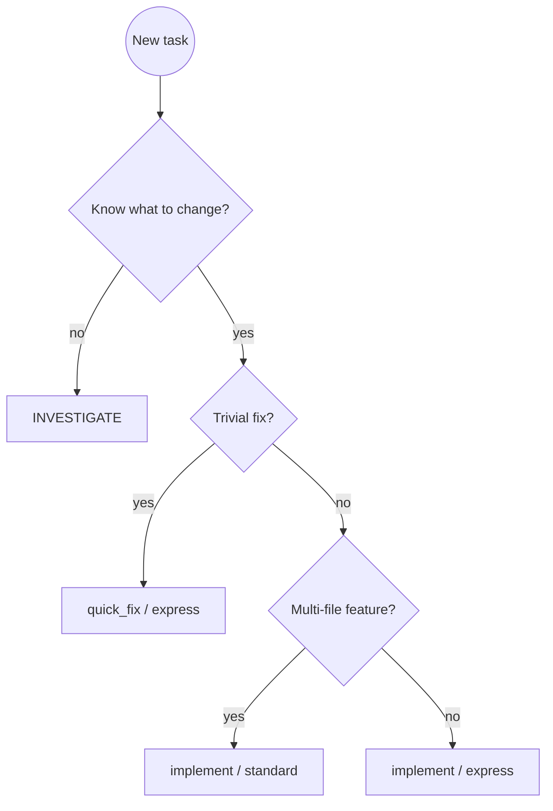

Stripe's Minions and one-shot "ship the whole feature" agents are a valid bet for bounded tasks. I chose the opposite: contract-first, human-in-the-loop, batched decisions. Not because agents can't one-shot — because my job isn't one feature at a time.

---

## The pivot: artifacts vs orchestration

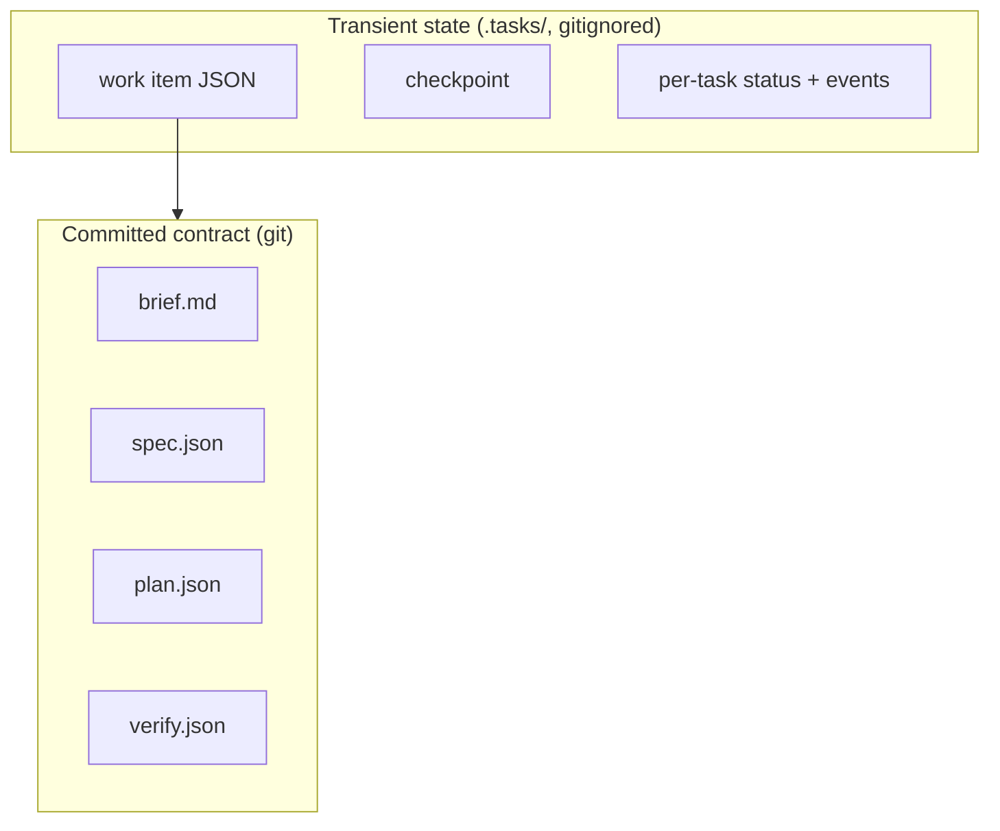

### `brief.md`: shared understanding before the contract

Not every artifact is a machine-verifiable contract. **`brief.md` is the human one** — the shared understanding between you and the agents about *what we are building and why*, before anyone writes typed acceptance criteria.

`phase-align` produces it through a reflect→probe→check cycle. The agent synthesises what it knows from your description, Jira, Slack, Confluence, and codebase exploration, then surfaces explicit claims as **alignment markers** for you to confirm, correct, or contest. The tone is "I think the core problem is X because Y — am I missing something?" not "please fill in field seven of the template."

For OAuth refresh, the brief might capture narrative the spec later formalises: the SPA currently forces re-login when access tokens expire; `AuthService` handles login but has no refresh path; the product owner needs rotation for SOC2; approach direction is to extend `AuthService` rather than to bolt logic into middleware. It can include a small Mermaid sequence diagram of today's auth flow — compression for downstream agents, not a substitute for ACs.

That distinction matters:

| Artifact | Role | Audience |
| --- | --- | --- |
| **`brief.md`** | Grounding — problem, stakeholders, current state, constraints, approach direction | Engineer + every downstream agent (via `brief_path`) |
| **`spec.json`** | Contract — typed ACs, test cases, verification commands | Review agents, verification, PR evidence |
| **`plan.json`** | Execution — tasks, TDD ordering, `covers_ac` | Implement loop |

The brief is committed under `docs/dev/<ID>/brief.md` and **blocks spec** until `phase-align` returns done with a complete file on disk. `phase-spec` treats it as primary framing input — open questions in the brief become prioritised interview topics. `phase-plan` reads approach direction when decomposing tasks. `phase-test` and `phase-code` pull it when an AC is terse and they need the *why* — edge-case assertions, choosing between equally valid designs. `phase-verify-acceptance` reads it to check the implementation addresses the actual problem, not just the letter of the ACs.

You skim and correct the brief in a short alignment window. You don't re-read it on every task — the agents do, in fresh processes, without dragging the align transcript along. The brief is how intent survives context isolation.

**Artifacts** (the formal contract layer) are typed acceptance criteria with stable IDs (`AC-1`, `AC-2`, …), plan tasks that map back via `covers_ac`, and a verification report that maps each AC to evidence or a gap.

For the OAuth example, `spec.json` might carry AC-1 as a `scenario` with `requirement: MUST`, AC-3 as a `constraint` on configuration, AC-4 as `architectural` with an ESLint rule named in the criterion text. `plan.json` splits work into tasks — refresh endpoint, token rotation, config wiring — each listing which ACs it covers. Nothing fuzzy. No "implement OAuth" bullet that an agent interprets differently every run.

We didn't pick Gherkin instead of a formal spec language. The formal layer is **`spec.json` itself** — schema-validated JSON with stable `AC-N` ids, MUST/SHOULD/MAY levels, and typed criteria that flow through plan tasks (`covers_ac`) into `verify.json`. **Scenario** criteria use Given/When/Then strings because engineers and models already read that shape; `phase-test` turns them into real tests in your framework — Gherkin isn't executed directly. **Constraint**, **architectural**, and **property** criteria stay plain text (architectural adds an `enforcement` field for lint or CI). A single notation wouldn't cover AC-4-style ESLint rules and AC-3-style config constraints without forcing everything into scenarios or excluding half the acceptance criteria we actually ship. Narrative lives in `brief.md`; the spec is the graded contract.

**Task JSON** is orchestration state: pattern, phase, pending decisions, deviations, cost. The engineer batches decisions in `/dev review`; the harness doesn't expect you to re-read the whole transcript.

Committed artifacts live under `docs/dev/<ID>/` — brief, spec, plan, verify — so PR reviewers see the contract beside the code. Runtime state lives in gitignored `.tasks/` — work item file, per-task events, checkpoint for multi-turn spec/plan drafts. When Pi reloads or you switch machines, artifacts survive; orchestration state is reconstructable from them plus the work item file.

Spec and plan are treated as **immutable after approval** — verification checks the spec, not whatever the agent remembered. There's a controlled escape hatch: `/dev amend-spec` when reality genuinely changes mid-flight. Without that valve, immutability becomes rigidity; with it, the contract stays authoritative and changes are explicit.

After `phase-test` writes failing tests, **`review-test` must complete before `phase-code` runs**. That's enforced in the orchestrator (`pre_impl_gates`), not left to the agent's honour. It's a simplified version of the old three-gate prototype — one pre-impl gate, but it's real.

The principles stack underneath that split reads like a priority order, not a wish list:

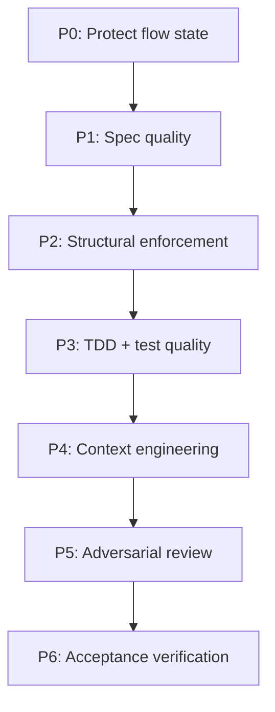

P6 in one line: tests can pass while a MUST acceptance criterion goes unimplemented. Verification maps each AC to evidence or a gap — which is why AC-3 in the OAuth example matters even when the happy-path refresh test is green.

---

## Shift left: adversarial tests before code

The cheapest place to fix a misunderstanding is before implementation. The second-cheapest is before the tests green. ACCORD tries to push decisions left along a chain — **brief → spec → plan → tests → code → verify** — so "that's not what I meant" surfaces early, when fixing it costs minutes instead of a re-read of the whole PR.

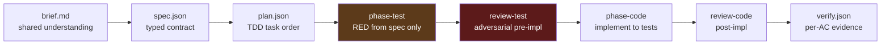

### Tests written without implementation bias

`phase-test` runs in a **clean context**. It sees the spec slice for one plan task — `covers_ac`, filtered test cases, constraints — and optionally `brief.md` for narrative grounding. It does not see production code and must not write any. Tests encode observable behaviour from the contract, confirm **RED** (behaviour failing, not just import errors), and tag assertions with AC ids for traceability.

For OAuth task one, that might mean: assert expired JWT returns 401 with `token_expired` (AC-1); assert a valid refresh issues a new access token and invalidates the old refresh (AC-2). The test author cannot cheat by reading how `AuthService` is already structured — they test the public contract the spec describes.

That isolation is deliberate. The moment the test writer has seen the implementation, weak assertions become likely: testing call order instead of behaviour, over-mocking internals, snapshotting wrong output. TDD only works as a feedback loop if the loop is **spec → failing test → code**, not "write code, then write tests that match whatever we built."

### Adversarial review before a line of production code

`review-test` is not a lint pass on test style. It is an **adversary**. Its job is to devise wrong implementations — hardcoded return values, happy-path-only shortcuts, vacuous assertions (`toBeDefined()` on everything), over-mocked I/O that never exercises real wiring — that would make every test green while violating the spec.

If it can construct such an adversarial implementation, the tests are insufficient. That finding lands **before** `phase-code` runs, while fixing the test file is cheap and no production code exists to unwind.

The orchestrator enforces this with `pre_impl_gates`: **`review-test` must complete before `phase-code` is allowed to spawn.** Not advisory. Not "run review if you have time." Blocked until the pre-impl review pass finishes.

When critical findings exceed the repo's severity gate, the harness **respawns `phase-test`** with the adversarial feedback appended to the task brief — bounded retries, findings persisted on the per-task JSON. The loop stays inside Layer 2: you batch-review if the cap is hit, not on every advisory nit. Lower-severity issues may be advisory-only; the orchestrator still advances to code when policy says the gate is clear.

`review-code` runs later, in a **separate process** that never saw the test review. Independence again: a code reviewer who already watched the test critique will rationalise weak coverage; a test reviewer who saw the implementation will write tests that match the code instead of the spec.

### Why this improves spec match (not just test pass rate)

Three failure modes this chain catches early:

1. **Brief/spec drift** — The brief says "extend AuthService"; the spec accidentally scopes middleware-only changes. `review-spec` and `review-plan` catch AC and coverage gaps before tests exist.

2. **Spec/test drift** — AC-3 requires configurable TTL via `AUTH_REFRESH_TOKEN_TTL`, but `phase-test` only asserts the default. `review-test` adversarially asks: "Could I hardcode `86400` and pass?" If yes, critical finding → retry test authoring before code.

3. **Test/code drift** — Implementation satisfies assertions but violates architectural intent (AC-4: no direct JWT decode outside `AuthService`). Post-code hooks catch structural violations; `review-code` and acceptance verification map back to the spec, not just the test file.

The end state we want is not "tests pass." It is **`verify.json` showing each MUST AC with evidence** — test name, file:line, or lint rule — and gaps explicitly flagged for your decision. Shifting adversarial pressure left means most of that alignment work happens while the cost of change is still a test file edit, not a revert of three commits.

Mutation testing and coverage thresholds stay in CI — too slow between agent gates — but the pre-impl adversarial pass is the harness's answer to "would a lazy developer pass these tests?"

---

## Three layers of protection (and where your brain goes)

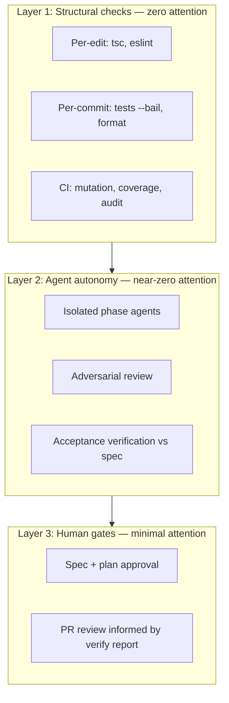

Layer 1 catches mistakes at zero cognitive cost. Layer 2 runs autonomously — each phase in its own subagent process, fresh context, structured return packet. Layer 3 is the only part that needs your judgment: approve the contract once, review the PR once (informed by a per-AC verify report).

The ordering is deliberate. Most harnesses I see invert it: ask the human first, then run linters, then hope the agent self-corrects. That burns the 23 minutes on questions the spec should have answered. ACCORD front-loads spec quality and structural gates so Layer 3 decisions are small: "approve this plan," "accept this deviation," "ship with AC-3 deferred or fix the gap."

If a check can be structural, make it structural. If it must be an agent, make it async. Reserve synchronous human judgment for decisions no tool has context for.

---

## ACCORD: what `/dev` actually does

ACCORD is a [Pi extension](https://github.com/cshirley/accord). You install it, run `/dev init` once to detect your stack and write a `## Dev Harness` block to `AGENTS.md`, then:

```text
/dev PROJ-1234 add OAuth2 refresh token support
```

Deterministic intent classification picks a pattern — `implement`, `quick_fix`, `investigate`, `infra`, `analyse` — and optionally a variant. For a multi-file feature with a ticket, you get **`implement/standard`**.

### A day with the OAuth ticket

Morning: I run `/dev PROJ-1234 add OAuth2 refresh token support`. `phase-align` starts a short reflect→probe→check loop; when it needs ticket context it chains to `phase-gather` (linked issues, enrichment summaries), then resumes and writes **`brief.md`** — the shared understanding document. I read that, not the gather transcript: problem framing, current auth flow, approach direction ("extend AuthService, not middleware"), alignment markers I've confirmed. If I disagree with the framing, I correct it here — cheaply, before spec formalisation.

`phase-spec` drafts `spec.json` with AC-1 through AC-4, using the brief as primary framing input. `review-spec` pressure-tests consistency — are the MUST criteria testable or enforceable? Are there orphan test cases? Issues land in the decision queue; I batch them in `/dev review` and approve when clean.

`phase-plan` breaks work into tasks with TDD ordering: tests for expiry and rotation before handler implementation, ESLint rule task for AC-4. `review-plan` checks `covers_ac` — every MUST AC appears on at least one task. Another approval gate. Then I walk away.

Afternoon: per-task loop runs without me. `phase-test` writes failing tests mapped to AC-1 and AC-2 — spec-driven, no production code read. `review-test` adversarially asks whether a hardcoded or shortcut implementation could pass **before any production code exists**; if AC-3's TTL configurability isn't actually asserted, it sends `phase-test` back with findings. Only when pre-impl gates clear does `phase-code` run. Post-code verify runs typecheck and tests via hooks — the agent can't claim `done` if structural gates disagree. `review-code` runs on the diff in a fresh process that never saw the test review.

Late afternoon: `/dev finish` runs acceptance verification. `verify.json` maps each AC to pass/fail with evidence. If AC-3 is open — no test for configurable TTL — the decision packet says so in four lines. I fix the gap or accept scope reduction. Commit and PR skills help ship; merge is still my call.

That's the attention budget story: two approval windows, one verify-driven PR review, not six "what should I do next?" pings scattered across the day.

The canonical pipeline looks like this:

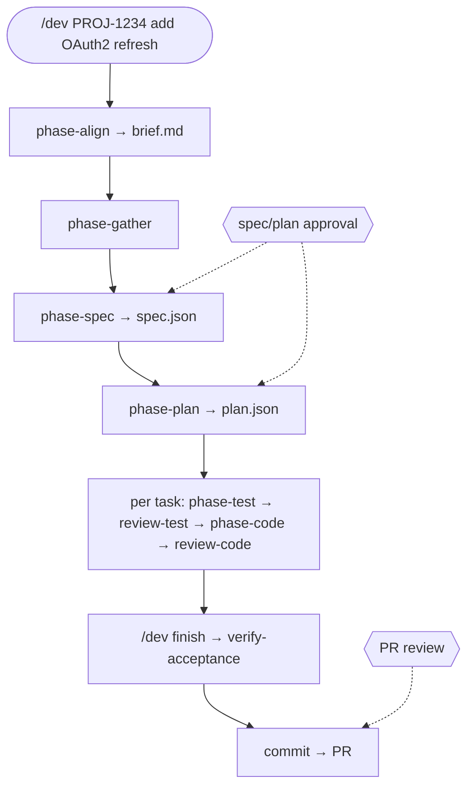

**Two intentional gates.** Spec and plan approval happen via checkpoints and `/dev review`. PR review is your process — the harness produces a verify report and companion skills (`commit`, `pr`) help ship, but nobody replaces your judgment on merge.

Escalations, deviations, and verify gaps land in the decision queue. You batch them in focused review windows — morning spec work, agents run while you do yours, periodic `/dev review` passes — not constant pings.

Notifications are intentionally narrow, not fully silent: pending decisions surface when an agent ends; spawn events log at info level; asset bootstrap warns when a Pi restart is needed after linking new agents. The goal isn't zero notifications — it's **no notification that requires reading a transcript to understand what to do**.

Hooks run without the agent thinking about them: schema validation on artifact writes, gather preflight before `phase-gather`, post-code verification after `phase-code`, usage accounting on the status bar. Gather preflight checks that configured trackers and enrichment sources actually work — Jira MCP, Slack, Confluence — before an agent burns tokens discovering they're misconfigured. Return values from phase agents validate against per-agent schemas; malformed output retries inside the subagent's own window instead of polluting yours.

Each phase agent spawns in a **separate Pi subagent process**. The orchestrator holds roughly a kilobyte of work-item JSON plus structured return packets — not file contents, not test output, not the spec interview. It can orchestrate a multi-task feature without filling its own context window.

Routing lives in TypeScript — not in a markdown skill. The bundled accord orchestrator skill is **gone**; the core orchestrator is on by default. Companion skills remain for post-implementation workflows: commit, PR, standalone review.

The architecture is deliberately thin at the Pi boundary and thick in core TypeScript:

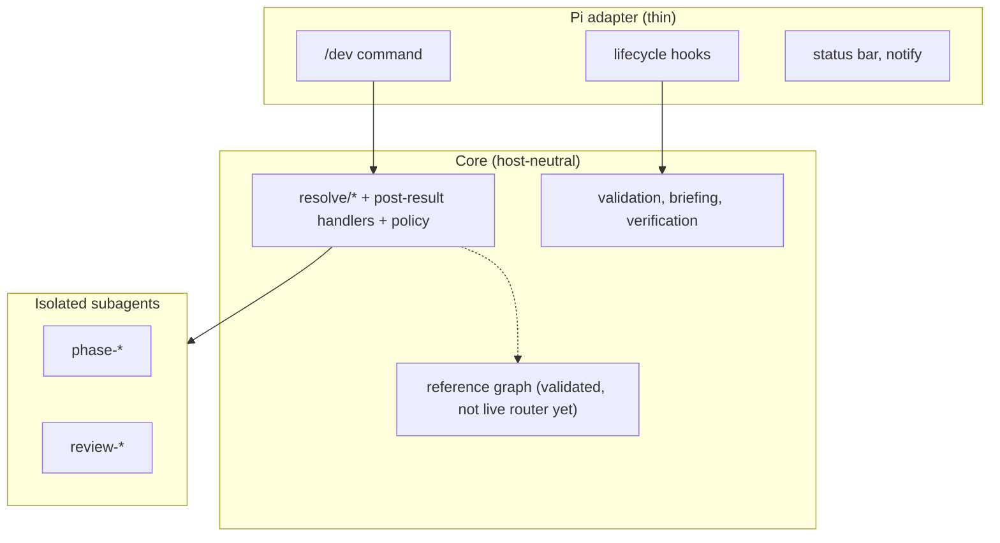

Live routing is `src/core/orchestration/resolve/` plus post-result handlers — not the reference FSM in `graph.ts`, which validates today but isn't wired to live `/dev` routes yet. Providers ship as JSON sidecars under `assets/providers/`, overridable via `accord.json`. Schema validation rejects bad artifact JSON before it hits disk. Post-code verify after `phase-code` makes typecheck failure an explicit hard gate; test output is appended for review even when CI is the real enforcement layer.

Honesty matters when you're asking people to trust a harness.

---

## Crucible: the author is compromised

The adversarial spec/plan/test pressure subsystem is named **Crucible** — *where intent is stress-tested into evidence.* (Product language; the verification logic lives in ordinary modules, not a separate package named Crucible. Names matter for talking about the system; the code stays boring.)

Eight read-only review agents ship with ACCORD. On the implement path, the important property is **sequential independence**:

| Agent | When | Why it's separate |
| --- | --- | --- |
| `review-spec` | After spec draft | AC consistency before you approve |
| `review-plan` | After plan draft | Coverage, TDD ordering, reuse |
| `review-test` | **Before** `phase-code` | Adversarial pre-impl — hasn't seen production code; may retry `phase-test` |
| `review-code` | **After every** `phase-code` | Post-impl — hasn't seen test-review findings |
| `review-security` | On review requests | Auth/payment/API paths |
| `review-deviation` | On plan drift | Accept, revert, or refine |
| `review-design` | Analyse pattern | Reasoning and citations |
| `review-investigation` | Investigate pattern | Hypothesis quality |

**Every implementation task runs review-test before code and review-code after code.** That's enforced today — not gated on a plan `challenge` flag. The `challenge` flag still shapes how hard reviewers push in prompts and plan review; config exists to make review-code conditional again, but it isn't wired into the orchestrator yet. I'd rather say that plainly than pretend the docs are ahead of the code.

On the test path specifically, Crucible's shift-left bet is **`review-test` in pre-impl mode**: read the RED test output, read the spec slice, mentally construct implementations that cheat, and file findings with file:line citations. Hardcoded tokens, shallow error assertions (`toThrow()` without checking `token_expired`), tests that mock away the database entirely when AC-2 requires rotation persistence — each is a way to green the suite while missing the spec. Catching those before `phase-code` is the whole point of moving adversarial review left of implementation.

Findings without a `file` and `line` citation auto-downgrade to suggestion. There is no path to ship a critical finding without evidence.

When a code agent diverges from the plan — renames a helper, extracts a function the plan didn't mention — it emits a **deviation** event. `review-deviation` evaluates whether to accept, revert, or refine. That surfaces as another batched decision, not a surprise in the PR diff. For OAuth, a deviation might be "implemented refresh rotation in middleware instead of AuthService" — exactly the kind of thing AC-4 exists to catch, but deviations handle the grey area before ESLint fails.

`review-security` promotes when touched files match auth, payment, or API path heuristics. Refresh tokens are squarely in that lane; you get an extra read-only pass without asking for it in the plan.

Independence isn't pedantry. A test reviewer that already saw the code review will rationalise weak assertions. The whole point is separation.

---

## Decision packets: designed for 30 seconds

When the harness needs you, it doesn't dump a transcript. It emits a **decision packet**:

```text
VERIFICATION COMPLETE
  Verdict: gaps (3/4 pass)
  AC-1: pass (test: expired token returns 401, auth.test.ts:42)
  AC-3: fail — no test for configurable TTL
  AC-4: pass (enforced: eslint no-direct-jwt)
  Ready for: fix gaps or accept scope reduction
```

Line 1: verdict (~5 seconds). Lines 2–5: summary and bounded question (~30 seconds). Detail on demand — full diff, logs — only if you need it.

| Level | Content | Time |
| --- | --- | --- |
| Line 1 | Verdict | ~5 sec |
| Lines 2–5 | Summary + bounded question | ~30 sec |
| Detail | Full diff, logs, artifact JSON | If needed |

**Bad:** "Review this PR."  
**Good:** "PR adds OAuth2 refresh. 3/4 ACs verified. AC-3 gap: no test for configurable TTL. Fix or accept scope reduction?"

The packet format is render-time, not a second document to maintain. Gaps filter from `verify.json` criteria where status is `fail` or `partial`. Pending decisions filter from the work item's `decisions[]`. One source of truth, multiple views — status bar, `/dev review`, PR body.

The **grab-a-coffee test**: if you can't walk away for 15 minutes after launching an agent, the spec wasn't complete enough. Specify fully, then walk away. Execution is the agent's job.

My actual rhythm looks more like batching than babysitting:

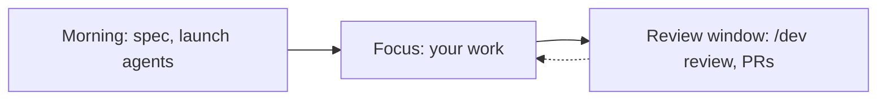

---

## Quick fixes without ceremony

Not everything needs a spec interview. **`quick_fix`** is for bounded edits — typo, obvious bug, target path clear. It skips align, spec, and plan agents, bootstraps a minimal task file, and can still run `phase-test` → `review-test` → `phase-code` → `review-code` when the test strategy calls for it.

For bug bursts, the diff *is* the spec. That's what the old RESPOND pattern would have been; I folded it into `quick_fix` instead of inventing another pipeline.

Example: typo in an error message, off-by-one in a TTL default, missing export — `/dev fix auth refresh TTL default` classifies as `quick_fix`, bootstraps a minimal task via `dev_quick_fix_brief`, and can still run the full test-review-code loop when the change touches behaviour. Ceremony scales with risk, not with ticket presence.

---

## Honest build notes

Shipping a harness means defending what's solid and naming what's not.

**Defended:**

1. Core owns orchestration; the Pi adapter is wiring, hooks, status, telemetry
2. Schema validation on harness JSON writes — malformed spec/plan/verify rejected before disk
3. Providers as JSON sidecars under `assets/providers/`, overridable via `accord.json` — add Linear or an internal tracker without forking
4. Post-code verify on every `phase-code` — typecheck failure is a hard gate; test output appended for review
5. Gaps derived from `verify.json` criteria — no parallel gaps array that can drift

**Shipped but easy to misdescribe:**

- `/dev gaps --tickets` is opt-in. The `phase-gaps` agent proposes Jira follow-ups in two rounds; you approve before anything is created. Not silent auto-ticketing on every finish.
- MCP `dev_orchestrate` exposes the same routing plan Pi uses, but stdio clients don't get programmatic subagent spawn. Headless integration is decision support today, not a remote worker farm.
- Asset bootstrap at session start compares bundled manifest checksums and re-links on drift — mundane, but it removes most manual "did you copy the agents?" setup.

**Still open:**

- `review-deviation` aggressiveness vs review fatigue — how noisy should plan drift be?
- Wire `code_review_on_challenge` or delete the dead config — today review-code is always mandatory for implement and quick_fix
- `implement/express` and `implement/orchestrated` classified but not fully automated (see below)
- Declarative FSM graph validates in CI but doesn't drive live `/dev` routes yet
- Free-text "write an ADR" classifies as analyse/explain and doesn't auto-bootstrap — you still start those manually

I'd rather list that in a blog post than have you discover it in issue #47.

---

## What's partial (and why I'm saying so)

Shipping software means knowing what's real:

| Variant / pattern | Status |
| --- | --- |
| `implement/standard` | Fully orchestrated end-to-end |
| `quick_fix` | Fully orchestrated |
| `implement/express` | Classified and stored; runner still expects spec + plan on disk for implement spawns |
| `implement/orchestrated` | Classified; **no automatic parallel worktree fan-out** in core — worktree tools exist, manual subagent `cwd` for now |
| `investigate`, `infra`, `analyse` | Agents + coarse resume; not parity with implement |

**Gaps and Jira:** `/dev finish` produces `verify.json`. `/dev gaps` lists open criteria. Add `--tickets` when you want the `phase-gaps` agent to propose Jira follow-ups — two rounds, you approve before anything is created. Not silent auto-ticketing on every finish.

**MCP clients** can call `dev_orchestrate` for the same routing plan Pi uses, but they don't get programmatic subagent spawn from stdio. Headless integration is planned; today it's decision support, not a remote worker.

---

## What got cut

| Cut | Why |
| --- | --- |
| RESPOND as its own pattern | `quick_fix` covers it |
| Inline mutation testing between gates | Too slow; lives in CI |
| Multi-repo orchestration | One work item per repo for now |
| Planner/challenger debate | Research stage; single-pass review ships |
| Skill-as-orchestrator | Inverted — TypeScript routes, skills are companions |

---

## ACCORD vs one-shot agents

Both approaches are valid. They optimise for different constraints:

| Dimension | One-shot agents | ACCORD |
| --- | --- | --- |
| Human gates | Minimal | Spec/plan approval + PR review |
| State | Session memory | JSON artifacts + gitignored work item |
| Verification | Implicit ("tests pass") | Per-AC evidence in `verify.json` |
| Best for | Bounded, well-scoped tasks | Multi-file, AC-driven work (`implement/standard`, `quick_fix`) |
| Attention model | You watch the run | You approve the contract, batch decisions, review the PR |

I didn't build ACCORD because one-shot agents are useless. I built it because most of my work doesn't look like a bounded demo — and because I couldn't afford another afternoon of "almost done" interruptions.

---

## The journey in one picture

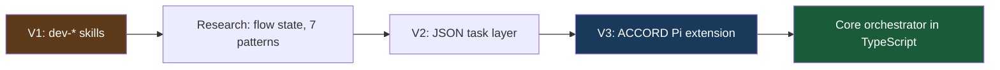

| When | Milestone |
| --- | --- |
| Early 2026 | Five `dev-*` skills shipping on Claude Code |
| Apr 2026 | North-star research — flow state, seven patterns |
| Apr 2026 | Simplified architecture — JSON task layer draft |
| Build | ACCORD Pi extension — schemas, hooks, bundled assets |
| Now | Core orchestrator default on; bundled accord skill removed — routing in TypeScript |

10 monolithic skills, each 200–400 lines, each with its own resume logic, became: one `/dev` entry, phase and review agents, JSON state, schema validation, and a core resolve layer that survives extension reloads.

The story isn't "I invented agents." It's: **I had something working, measured where it hurt, and rebuilt the substrate until the pain moved to the right layer.**

---

## If you take nothing else from ACCORD

You don't need my extension to apply the lessons. Most of the ROI is structural enforcement and separation of concerns — things you can adopt this month without adopting my JSON schemas.

1. **Week 1:** Pre-commit hooks — tsc, eslint, tests with `--bail`. Highest ROI immediately. If agents touch your repo, this is the fence that costs zero attention per run.
2. **Week 2:** CI adds coverage thresholds, dead-code detection (knip or equivalent), dependency audit. Mutation testing lives here, not between agent gates — Stryker is valuable; it's also slow enough to kill flow if you run it inline.
3. **Week 3:** Custom ESLint rules for *your* architectural constraints. AC-4-style criteria become enforceable without debating them in every PR. "No direct JWT decode outside AuthService" is a rule, not a memory.
4. **Week 4:** Separate writer and reviewer on non-trivial changes. Even manually: implement in one session, review in a fresh one with read-only tools. You get eighty percent of Crucible's independence for free.
5. **When it hurts:** Split artifacts from orchestration state. Stop using chat history as source of truth. Commit the contract; gitignore the machine state; validate on write.

If you want the full harness: [github.com/cshirley/accord](https://github.com/cshirley/accord). Install the Pi package, run `/dev init` to detect your stack and write `## Dev Harness` into `AGENTS.md`, then `/dev "your ticket or description"`, approve spec and plan via `/dev review`, `/dev resume` through implementation, `/dev finish` for acceptance verification. Companion skills handle commit and PR when you're ready to ship.

Follow-up posts I'd write if this one lands: a Crucible deep dive on the eight review agents; why orchestration moved from skills to TypeScript; what 472 commits across 15 repos actually looked like. This post is the substrate story; those are the implementation stories.

---

## What I didn't build

A magic button that replaces engineering judgment.  
A single context window that holds a whole feature.  
Ceremony for a one-line fix.

I built **infrastructure for agreement** — machine-readable contracts, enforced boundaries, isolated phases, and a workflow that respects the 23-minute cost of a badly framed interruption.

If your harness optimises for gate count instead of attention cost, you're measuring the wrong thing.

The spec isn't documentation. It's the contract your agents are graded against.

**Reach ACCORD before you build.**

---

*ACCORD is MIT-licensed and runs inside [Pi](https://pi.dev/). Repository docs: [accord-workflow.md](https://github.com/cshirley/accord/blob/main/docs/accord-workflow.md) for the pipeline, [accord-research.md](https://github.com/cshirley/accord/blob/main/docs/accord-research.md) for design rationale.*
