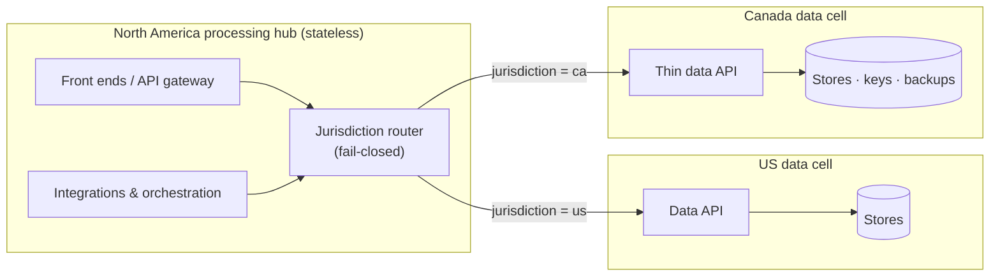

When a regulated product enters a new country, the first residency conversation usually goes like this: "Patient data has to stay in-country, so we need a full in-country stack." That means ten or so repositories, their pipelines, their on-call rotas and their upgrade cycles, all duplicated for a market that might start with a few thousand users.

While planning a Canadian launch for a healthcare platform already running in the UK and US, we worked through what residency *actually* requires. The answer was a much smaller footprint and a reusable pattern, with two preconditions that are easy to miss.

## Start from the requirement, not the architecture

"Data at rest in Canada" means that **every persistent medium holding a Canadian patient's personal or health data physically resides in Canada**. It says nothing about where stateless compute runs.

So the job is to list every place data comes to rest. The obvious ones are easy: the primary database, the search index, object storage for attachments, encryption keys, and the backups and point-in-time recovery snapshots everyone forgets. The subtle ones are components that *look* like processing but quietly become storage:

- **Queues** retain messages, for up to 14 days on some services.
- **Workflow engines** persist process variables.
- **Analytics pipelines** land raw events in a warehouse.
- **Logs and traces** capture request bodies and identifiers.
- **Third-party SaaS** stores whatever you send it.

Once you think in terms of *at-rest surfaces*, the design falls out.

## The pattern: data cells and processing hubs

Split the platform into two layers:

- A **data cell** per jurisdiction that needs one: the in-country stores, the region-bound functions and pipelines that AWS forces to sit next to them (stream triggers, index ingestion), and a **thin data-access API** that guards them.
- A **processing hub** per macro-region: shared, stateless compute (front ends, integrations, orchestration, event fan-out, auth) serving several jurisdictions over the network.

For Canada, the in-country footprint becomes **the data core plus its guardians**, not the whole application stack. The same model extends globally: a North America hub, an EU/Africa hub and an APAC hub, each serving per-country cells wherever the law demands at-rest isolation.

### Why a thin in-country API rather than cross-region access

We considered letting the hub's data service reach Canadian stores directly across regions. On paper it's the thinnest footprint, but in practice:

- The search cluster is VPC-bound, so you'd need cross-region peering or a transit gateway.
- Every call to a chatty single-table database pays cross-region round-trip time (about 15–20 ms per call).
- The data service would have to become *per-request* jurisdiction-aware, which is a significant refactor of something that currently validates a single jurisdiction at boot.

A small data API deployed next to the stores avoids all three. The boundary stays crisp: **data and its guardian in-country; everything else in the hub.**

### Routing: one endpoint, a fail-closed router

Callers shouldn't need to know which cell a patient lives in. A jurisdiction-aware router in front of the stateful services reads the caller's token, routes to the right cell, **fails closed** if it can't decide, and never logs payloads. Existing clients keep a single static endpoint.

## Precondition A: events carry references, not data

This is the one that makes hub processing compliant, and it's easy to get wrong because the event bus usually "just works".

If your change-data-capture stream publishes **full resource bodies** to topics and queues, then a hub-side consumer in the US will park Canadian patient data at rest in US queues, US workflow state and the US warehouse. The fix is the **claim-check** pattern:

1. Put a `jurisdiction` attribute on **every** event. Without it, commingling is silent and consumers can't defensively assert where data belongs.
2. Publish `{ resourceType, id, jurisdiction, partition, subject }`, **not the body**. Hub consumers fetch what they need, on demand, from the cell's API.
3. Apply the same filtering to *every* sink. It's common for the event-bus branch to be filtered while the analytics branch exports everything.

Workflow engines follow the same rule: process state holds identifiers, not business data. (This matches good workflow hygiene anyway: payloads in process variables are a versioning headache.)

## Precondition B: SaaS and analytics are at-rest surfaces too

Serving a jurisdiction from another region doesn't exempt your vendors. If you send them Canadian patient data, **they** become an at-rest surface. Walk the list category by category:

| Category | Typical treatment |
|---|---|
| CRM / customer engagement | In-country tenant plus a data processing agreement; minimise fields |
| Identity | Per-region tenant (often already in place) |
| KYC / identity verification | Confirm data region and retention; biometrics are highly sensitive |
| Payments | Confirm in-country handling of payment data |
| Workflow SaaS | Reference-only process state, or an in-country cluster |
| Internal ops consoles | Confirm the hosting region; disable query-result caching; point at the router |
| Region-locked services (labs, couriers, prescribing) | Delivered via an in-country clinical partner under their agreement |

**Analytics** deserves its own review. Per-region landing zones and warehouses are the right shape, so give the new jurisdiction its own. Then check the **cross-region shares**: a global reporting layer that unions regional warehouses can quietly pull patient-level data out of the cell. For the new jurisdiction, share only aggregated or de-identified marts, tokenise before export, or leave analytics disabled at launch.

## Observability: the quiet leak

Logs and traces routinely capture identifiers, and sometimes whole payloads. If the hub ships logs to a vendor tenant in another region, data leaves the country **regardless of where your databases sit**. Either route the cell's telemetry to an in-country tenant, or scrub at the emitter, and test the scrubbing.

## Availability: know your blast radius

A hub is shared, so a **hub outage is a macro-region incident**: if the North America hub is impaired, US *and* Canadian patients are affected. A **cell outage stays jurisdiction-scoped**. Plan for that explicitly:

- Per-jurisdiction and per-hub SLOs, so incident comms are honest.
- Circuit breakers and health-aware routing on hub-to-cell calls.
- A highly available router, because it's on every request.
- In-country disaster recovery per cell, since **failing a cell over to another hub isn't DR unless your lawyers say it is**.
- Game days per hub and per cell.

## When the pattern doesn't fit

The thin-API approach works when the at-rest data is *records*. It doesn't work when the data **is the product**, such as video consultations, recordings or scans. A residency-constrained market either gets a genuine in-country deployment of that capability or launches without it. "Data core plus guardians" is a platform story, not always a whole-offering story, so say so early.

## The general lesson

Residency is a **storage** requirement, so I architect for it by placing *state* deliberately and keeping compute shared. Then I assume data leaks through every queue, workflow, warehouse, log line and vendor until you've proved otherwise. The cheapest in-country stack is the one that only contains what the law actually requires.
