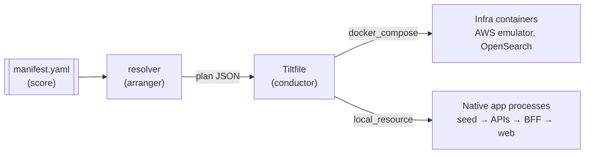
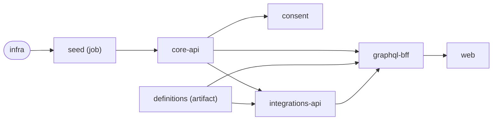

In [Fix Developer Experience Before You Re-Platform](/engineering/2026/08/05/fix-dx-before-replatforming.html) I argued that our bottleneck wasn't the runtime. It was the lack of an **isolated, end-to-end, multi-repo target**. Of the four fixes in that post, the **one-command local stack** was the cheapest and gave the most back. This post covers what we built: **Medley**.

## The problem, concretely

Running "the platform" on a laptop meant running a mix of very different things:

| Shape | Examples | Starts with | "Ready" means |
|---|---|---|---|
| Containerised infra | AWS emulator, OpenSearch | `docker compose up` | healthcheck passes |
| One-shot seed job | Core data service seed (FHIR data, Lambdas, credentials) | `npm run watch-fast` | a credential file appears |
| Build-time artifact | Programme definitions | `npm run build` | build exits 0 |
| Long-running services | Core API, integrations API, consent, GraphQL BFF, Next.js web app | `npm` / `yarn` / `bun run dev` | port open or health route returns 200 |

Each repo had its own README ritual. The order mattered: the BFF can't start until the core API, the integrations API, consent and the definitions build are ready. And every `.env.local` pointed its neighbours at **shared dev, or production**, so "running locally" often meant running one service locally against everyone else's cloud. Wiring the whole thing up by hand took a new starter most of a day, and still failed in ways nobody could explain.

The goal: `cd` into an empty directory, run one command, get the whole stack **in the right order, wired to each other**, with hot reload and real debuggers.

## The name

A *medley* is one piece of music made from many separate tunes, played back to back. That's the job: take independently developed services and play them as **one coherent stack**. The metaphor maps directly onto the architecture:

- `manifest.yaml` is the **score**: what plays, and in what order.
- The resolver is the **arranger**: it turns the score into concrete parts (commands, dependency edges, injected env).
- [Tilt](https://tilt.dev) is the **conductor**: it brings each part in on cue and holds the tempo with readiness gates, so nothing starts before its dependencies are ready.

## Architecture: a thin orchestration layer

Medley isn't application code. It's four small pieces:

| Piece | Role |
|---|---|
| **Registry** (`manifest.yaml` + JSON Schema) | Single source of truth: every participant, its repo, command, port, dependencies and env wiring |
| **Resolver** (pure JS, ~400 lines) | Turns the registry into a flat **plan**: commands, dependency edges, injected env, readiness probes. No I/O, no Tilt |
| **Tiltfile** (~160 lines of Starlark) | A shim: runs the resolver, decodes the JSON plan, maps each entry to a Tilt resource |
| **`medley` CLI** (Node) | Run the stack, clone repos, edit the registry, run health checks, drive cross-repo branches |



### Decision 1: apps run natively, only infra is containerised

We looked at plain Docker Compose, local Kubernetes running the real deployment chart, a bespoke orchestrator and Tilt. We chose **native host processes for apps** (each repo's own `dev` script) and **containers only for infra**.

- **No image builds for apps.** The inner loop is as fast as the repo's own dev server, with hot reload and a debugger attached to a real process.
- **Tilt handles the undifferentiated work**: process supervision, signal handling, dependency ordering, TCP/HTTP/exec readiness probes, file-watch rebuilds, log multiplexing and a dashboard. We didn't want to write any of that ourselves.

The earlier post pictured a dev container running the real chart on k3d. Once we'd measured it, we dropped that for the inner loop. Kubernetes stays reserved for a separate **release-validation** target. That's a different goal from making local dev fast.

### Decision 2: logic in JavaScript, not Starlark

Tiltfiles have to be Starlark. Our stack is almost entirely Node, and orchestration logic trapped in Starlark can't be unit-tested or reused. So **all resolution logic is a pure `registry → plan` function in JS**. The Tiltfile only asks for the plan and builds probes (which can't be serialised).

Two things follow from that:

- `medley resolve` prints the exact plan Tilt will run. Debugging "why did this start before that?" means reading JSON, not reading Tilt internals.
- The resolver's **input is an interface**. We intend to move to an Nx monorepo; then the registry can be *generated* from the Nx project graph without changing the Tiltfile.

### Decision 3: a four-kind service contract

Every participant declares one of four kinds (`infra`, `job`, `artifact`, `service`), each with a clear readiness rule. Wiring is declarative. A producer **provides** an output, a consumer **consumes** it, and the resolver **injects** the value as an env var *and* adds the dependency edge. Adding an app is one registry entry:

```yaml
graphql-bff:
  kind: service
  repo: git@github.com:example/graphql-bff.git
  dir: graphql-bff
  cmd: yarn dev
  port: 4000
  toolchain: node@24
  needs: [core-api, definitions, integrations-api, consent]
  env:
    # Every .env.local defaults these to shared environments; override them all.
    CORE_API_REST_ENDPOINT: http://localhost:3051/core/
    INTEGRATIONS_REST_ENDPOINT: http://localhost:3001/integrations/
    DEFINITIONS_FS_PATH: ${ROOT}/definitions/build
    # Read at launch, after the seed has minted it.
    PLATFORM_API_KEY: ${SEED_ENV:core/environments/.env.local-tests-credential:FUNCTIONAL_TEST_PLATFORM_JWT}
  readiness:
    port: 4000   # no REST health route, so gate on port-open
```

The `${SEED_ENV:file:KEY}` token solved our most common local failure. The seed mints a service JWT, and downstream services need it. Each service reads it **at launch, after the seed is ready**, instead of someone copying a token between `.env` files. Before that, the usual symptom was a 401 from the core API that nobody could explain.

The dependency graph the resolver builds from all this:



### Decision 4: the workspace is wherever you are

The manifest ships **with the CLI**. The **workspace root is your current directory**. Every entry has a required `repo` URL, so `medley up` in an empty directory clones whatever's missing (once per repo, even when several entries share one), installs dependencies, and starts the stack. There's no assumed sibling layout and no `../../`.

### Decision 5: don't break the standalone path

The core data service already had a good standalone local setup, and people relied on it. Every Medley hook into it is **additive and off by default**. For example, the seed only skips its own `compose up` when `PS_INFRA_EXTERNALLY_MANAGED=1`, and only Medley sets that. The rule: **with no env set, existing commands behave exactly as before.** A written acceptance checklist has to pass before any change to that repo merges.

## Using it

```bash
make install         # put the `medley` shim on PATH
cd ~/work            # repos get cloned here
medley bootstrap     # preflight tools, clone + install, doctor report (idempotent)
medley up            # infra → seed → artifacts → services, in dependency order
medley down          # stop and tear down infra
medley clean         # from-scratch reset, then `medley up`
```

Open the Tilt UI on `:10350` and watch the stack come up in order.

Beyond `up`, the CLI covers the day-2 gaps:

| Command | Why it exists |
|---|---|
| `medley doctor` / `preflight` | Read-only checks for tools, container engine, repos, deps, env and manifest, with actionable output |
| `medley sync` | Update every repo and reinstall only where the lockfile content hash changed |
| `medley validate` / `lint-env` | Schema-check the registry; reconcile env wiring against each repo's deployed config |
| `medley run <name> -- <args>` | Run a one-shot, often interactive tool **with Medley's env injected**, outside the dependency graph (for example our test-patient factory, pointed at the local stack instead of a cloud environment) |
| `medley branch` / `medley pr` | Treat a feature as **one named branch across a subset of repos**: branch from freshly fetched `origin/main`, refuse dirty trees, report ahead/behind and drift, open cross-linked PRs |

The branch-group tooling is deliberately minimal. It doesn't fake atomic cross-repo commits; it cross-links PRs in a managed section of each PR body. Once we're in a monorepo, one branch spans every project and this tooling goes away, so we **froze its scope** instead of hardening it.

## Keeping it lean

A local stack people won't run because it eats their laptop is no use. We measured before optimising:

| Profile | What runs | Idle RAM |
|---|---|---|
| `infra` | AWS emulator + OpenSearch only | ~0.75 GiB |
| `standard` (default) | Full app inner loop, no workflow engine | ~3.1 GiB |
| `full` | Everything, including the local Camunda 8 core and dashboards | ~5.3 GiB |

The measurements changed our priorities:

- **The Next.js dev server is the biggest single cost** (~1.3 GiB), more than all of infra together. Skipping it when you don't need it saves more than any container change could.
- **RAM is dominated by JVM heaps.** Merging infra into one container, or running it under k3s, doesn't shrink a heap, so we rejected both. What worked: **compose profiles** (optional UIs and the workflow engine are opt-in), **per-container memory caps**, a plugin-stripped OpenSearch image with a 384 MB heap (~750 MB down to ~550 MB), and a shorter warm TTL for the emulator's Lambda containers so idle ones are reclaimed after about 90 seconds instead of 15 minutes.
- **The workflow engine shares OpenSearch** instead of bringing its own Elasticsearch, which saves ~0.5 GiB.

## Choices that made it pluggable

- **AWS emulator.** LocalStack Community was retired, so we made the seed **emulator-neutral** and defaulted to MiniStack, validated end to end against the real seed.
- **Container engine.** Anything that speaks the Docker API works with no adapter: Rancher Desktop (our default), Docker Desktop, Colima, OrbStack. One constraint shapes this: the emulator runs Lambdas as **sibling containers through the Docker socket**. That rules out the `containerd` backend and, for now, Apple's `container`; a spike to bridge it with socktainer failed on exactly that.
- **One Node version.** The older `.nvmrc` pins turned out to be minimums, not exact versions, so we standardised on **Node 24** everywhere. If that's already your host Node, you don't need a version manager.

Each of these is a short ADR in the repo, fourteen so far. Every "why don't we just use k3s?" conversation now ends with a link.

## What it changed

- **Onboarding** went from a day of README archaeology to `medley bootstrap && medley up`.
- **Cross-service changes are testable before merge.** A feature touching the BFF, the integrations API and the web app runs as one branch group against a real local backend, not shared dev.
- **AI agents have a deterministic target.** An agent making a cross-repo change can bring up the stack, drive a request from the web app down to the core API, and check the result without touching a shared environment. That was half the point.
- **Running it found real bugs.** Stale vendored Yarn paths, prod-shaped API keys in local env files, a search endpoint the emulator didn't implement. Getting everything to run in one place surfaced problems that had been hidden by each repo running on its own.

## Known gaps

Medley is honest about what it doesn't do. Third-party vendor APIs (payments, labs, prescribing) aren't mocked yet, so journeys past onboarding need sandbox keys. Two services have no health route and gate on port-open. Region and brand switching is still manual per repo. All of these are tracked in the design doc rather than papered over.

## The general lesson

The hard part of a local platform isn't starting processes. It's **ordering, readiness and wiring**, plus knowing which ideas to skip. Keep the orchestration layer thin: **data in a registry, logic in a testable function, supervision in an existing tool**. Run apps natively so the inner loop stays fast, and containerise only what has to be. Measure before optimising. And classify your work as **durable** or **transitional**: the runtime layer will outlive the monorepo migration, and the multi-repo tooling shouldn't.
