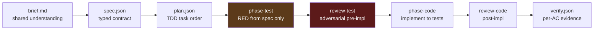
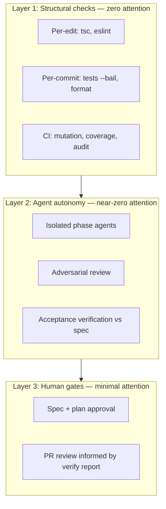
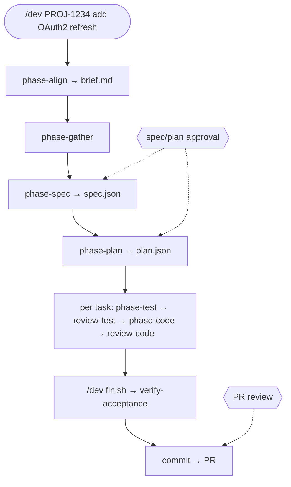
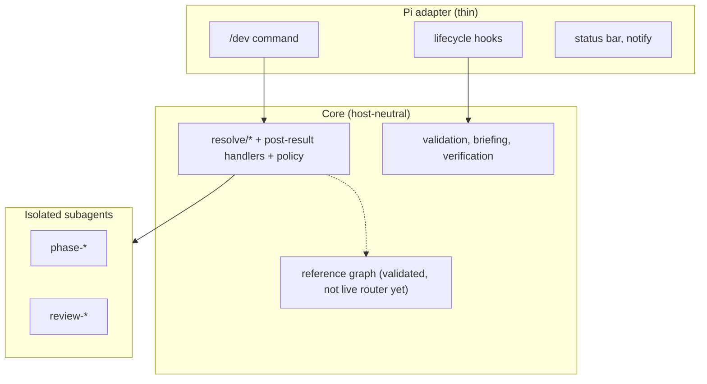

This is the second part of the ACCORD story. [Part one](/ai/2026/08/19/substrate-was-the-problem.html) covers why a chain of `dev-*` skills wasn't enough and why the contract moved into typed artifacts. This part covers what that buys you: decisions pushed as far left as they will go, three layers of protection, and what `/dev` actually does on a real ticket.

**The cheapest place to fix a misunderstanding is before the tests go green, and the cheapest place to catch a weak test is before any production code exists.**

## Shift left: adversarial tests before code

The cheapest place to fix a misunderstanding is before implementation. The second-cheapest is before the tests go green. ACCORD tries to push decisions left along a chain (**brief → spec → plan → tests → code → verify**) so "that's not what I meant" surfaces early, when fixing it costs minutes instead of a re-read of the whole PR.



### Tests written without implementation bias

`phase-test` runs in a **clean context**. It sees the spec slice for one plan task (`covers_ac`, filtered test cases, constraints) and optionally `brief.md` for narrative grounding. It does not see production code and must not write any. Tests encode observable behaviour from the contract, confirm **RED** (behaviour failing, not just import errors), and tag assertions with AC ids for traceability.

For OAuth task one, that might mean: assert expired JWT returns 401 with `token_expired` (AC-1); assert a valid refresh issues a new access token and invalidates the old refresh (AC-2). The test author cannot cheat by reading how `AuthService` is already structured, they test the public contract the spec describes.

That isolation is deliberate. The moment the test writer has seen the implementation, weak assertions become likely: testing call order instead of behaviour, over-mocking internals, snapshotting wrong output. TDD only works as a feedback loop if the loop is **spec → failing test → code**, not "write code, then write tests that match whatever we built."

### Adversarial review before a line of production code

`review-test` is not a lint pass on test style. It is an **adversary**. Its job is to devise wrong implementations, hardcoded return values, happy-path-only shortcuts, vacuous assertions (`toBeDefined()` on everything), over-mocked I/O that never exercises real wiring, that would make every test green while violating the spec.

If it can construct such an adversarial implementation, the tests are insufficient. That finding lands **before** `phase-code` runs, while fixing the test file is cheap and no production code exists to unwind.

The orchestrator enforces this with `pre_impl_gates`: **`review-test` must complete before `phase-code` is allowed to spawn.** Not advisory. Not "run review if you have time." Blocked until the pre-impl review pass finishes.

When critical findings exceed the repo's severity gate, the harness **respawns `phase-test`** with the adversarial feedback appended to the task brief, bounded retries, findings persisted on the per-task JSON. The loop stays inside Layer 2: you batch-review if the cap is hit, not on every advisory nit. Lower-severity issues may be advisory-only; the orchestrator still advances to code when policy says the gate is clear.

`review-code` runs later, in a **separate process** that never saw the test review. Independence again: a code reviewer who already watched the test critique will rationalise weak coverage; a test reviewer who saw the implementation will write tests that match the code instead of the spec.

### Why this improves spec match (not just test pass rate)

Three failure modes this chain catches early:

1. **Brief/spec drift**: The brief says "extend AuthService"; the spec accidentally scopes middleware-only changes. `review-spec` and `review-plan` catch AC and coverage gaps before tests exist.

2. **Spec/test drift**: AC-3 requires configurable TTL via `AUTH_REFRESH_TOKEN_TTL`, but `phase-test` only asserts the default. `review-test` adversarially asks: "Could I hardcode `86400` and pass?" If yes, critical finding → retry test authoring before code.

3. **Test/code drift**: Implementation satisfies assertions but violates architectural intent (AC-4: no direct JWT decode outside `AuthService`). Post-code hooks catch structural violations; `review-code` and acceptance verification map back to the spec, not just the test file.

The end state we want is not "tests pass." It is **`verify.json` showing each MUST AC with evidence** (test name, file:line, or lint rule) and gaps explicitly flagged for your decision. Shifting adversarial pressure left means most of that alignment work happens while the cost of change is still a test file edit, not a revert of three commits.

Mutation testing and coverage thresholds stay in CI (too slow between agent gates) but the pre-impl adversarial pass is the harness's answer to "would a lazy developer pass these tests?"

---

## Three layers of protection (and where your brain goes)



Layer 1 catches mistakes at zero cognitive cost. Layer 2 runs autonomously, each phase in its own subagent process, fresh context, structured return packet. Layer 3 is the only part that needs your judgment: approve the contract once, review the PR once (informed by a per-AC verify report).

The ordering is deliberate. Most harnesses I see invert it: ask the human first, then run linters, then hope the agent self-corrects. That burns the 23 minutes on questions the spec should have answered. ACCORD front-loads spec quality and structural gates so Layer 3 decisions are small: "approve this plan," "accept this deviation," "ship with AC-3 deferred or fix the gap."

If a check can be structural, make it structural. If it must be an agent, make it async. Reserve synchronous human judgment for decisions no tool has context for.

---

## ACCORD: what `/dev` actually does

ACCORD is a [Pi extension](https://github.com/cshirley/accord). You install it, run `/dev init` once to detect your stack and write a `## Dev Harness` block to `AGENTS.md`, then:

```text
/dev PROJ-1234 add OAuth2 refresh token support
```

Deterministic intent classification picks a pattern (`implement`, `quick_fix`, `investigate`, `infra`, `analyse`) and optionally a variant. For a multi-file feature with a ticket, you get **`implement/standard`**.

### A day with the OAuth ticket

Morning: I run `/dev PROJ-1234 add OAuth2 refresh token support`. `phase-align` starts a short reflect→probe→check loop; when it needs ticket context it chains to `phase-gather` (linked issues, enrichment summaries), then resumes and writes **`brief.md`**, the shared understanding document. I read that, not the gather transcript: problem framing, current auth flow, approach direction ("extend AuthService, not middleware"), alignment markers I've confirmed. If I disagree with the framing, I correct it here: cheaply, before spec formalisation.

`phase-spec` drafts `spec.json` with AC-1 through AC-4, using the brief as primary framing input. `review-spec` pressure-tests consistency, are the MUST criteria testable or enforceable? Are there orphan test cases? Issues land in the decision queue; I batch them in `/dev review` and approve when clean.

`phase-plan` breaks work into tasks with TDD ordering: tests for expiry and rotation before handler implementation, ESLint rule task for AC-4. `review-plan` checks `covers_ac`, every MUST AC appears on at least one task. Another approval gate. Then I walk away.

Afternoon: per-task loop runs without me. `phase-test` writes failing tests mapped to AC-1 and AC-2, spec-driven, no production code read. `review-test` adversarially asks whether a hardcoded or shortcut implementation could pass **before any production code exists**; if AC-3's TTL configurability isn't asserted, it sends `phase-test` back with findings. Only when pre-impl gates clear does `phase-code` run. Post-code verify runs typecheck and tests via hooks, the agent can't claim `done` if structural gates disagree. `review-code` runs on the diff in a fresh process that never saw the test review.

Late afternoon: `/dev finish` runs acceptance verification. `verify.json` maps each AC to pass/fail with evidence. If AC-3 is open (no test for configurable TTL) the decision packet says so in four lines. I fix the gap or accept scope reduction. Commit and PR skills help ship; merge is still my call.

That's the attention budget story: two approval windows, one verify-driven PR review, not six "what should I do next?" pings scattered across the day.

The canonical pipeline looks like this:



**Two intentional gates.** Spec and plan approval happen via checkpoints and `/dev review`. PR review is your process, the harness produces a verify report and companion skills (`commit`, `pr`) help ship, but nobody replaces your judgment on merge.

Escalations, deviations, and verify gaps land in the decision queue. You batch them in focused review windows (morning spec work, agents run while you do yours, periodic `/dev review` passes) not constant pings.

Notifications are intentionally narrow, not fully silent: pending decisions surface when an agent ends; spawn events log at info level; asset bootstrap warns when a Pi restart is needed after linking new agents. The goal isn't zero notifications; it's **no notification that requires reading a transcript to understand what to do**.

Hooks run without the agent thinking about them: schema validation on artifact writes, gather preflight before `phase-gather`, post-code verification after `phase-code`, usage accounting on the status bar. Gather preflight checks that configured trackers and enrichment sources actually work (Jira MCP, Slack, Confluence) before an agent burns tokens discovering they're misconfigured. Return values from phase agents validate against per-agent schemas; malformed output retries inside the subagent's own window instead of polluting yours.

Each phase agent spawns in a **separate Pi subagent process**. The orchestrator holds roughly a kilobyte of work-item JSON plus structured return packets, not file contents, not test output, not the spec interview. It can orchestrate a multi-task feature without filling its own context window.

Routing lives in TypeScript, not in a markdown skill. The bundled accord orchestrator skill is **gone**; the core orchestrator is on by default. Companion skills remain for post-implementation workflows: commit, PR, standalone review.

The architecture is deliberately thin at the Pi boundary and thick in core TypeScript:



Live routing is `src/core/orchestration/resolve/` plus post-result handlers, not the reference FSM in `graph.ts`, which validates today but isn't wired to live `/dev` routes yet. Providers ship as JSON sidecars under `assets/providers/`, overridable via `accord.json`. Schema validation rejects bad artifact JSON before it hits disk. Post-code verify after `phase-code` makes typecheck failure an explicit hard gate; test output is appended for review even when CI is the real enforcement layer.

Honesty matters when you're asking people to trust a harness.

## The general lesson

Push every decision left, to where changing it costs a test file edit rather than a revert. **If a check can be structural, make it structural; if it must be an agent, make it asynchronous; and reserve your own synchronous judgement for decisions no tool has context for.** Do that and the human gates shrink to approving a plan and accepting a deviation.
