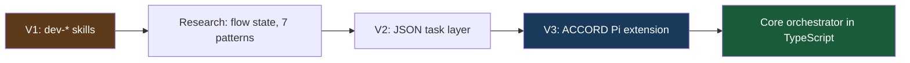

This is the third part of the ACCORD story. [Part one](/ai/2026/08/19/substrate-was-the-problem.html) covers why the pipeline had to be rebuilt, and [part two](/ai/2026/10/05/adversarial-tests-before-code.html) covers the shift-left chain and the `/dev` flow. This part covers the pieces that keep the author honest, and what I haven't finished.

**An agent that wrote the code is the wrong judge of the code, and a harness that hides its gaps is the wrong thing to trust.**

## Crucible: the author is compromised

The adversarial spec/plan/test pressure subsystem is named **Crucible**: *where intent is stress-tested into evidence.* (Product language; the verification logic lives in ordinary modules, not a separate package named Crucible. Names matter for talking about the system; the code stays boring.)

Eight read-only review agents ship with ACCORD. On the implement path, the important property is **sequential independence**:

| Agent | When | Why it's separate |
| --- | --- | --- |
| `review-spec` | After spec draft | AC consistency before you approve |
| `review-plan` | After plan draft | Coverage, TDD ordering, reuse |
| `review-test` | **Before** `phase-code` | Adversarial pre-impl — hasn't seen production code; may retry `phase-test` |
| `review-code` | **After every** `phase-code` | Post-impl — hasn't seen test-review findings |
| `review-security` | On review requests | Auth/payment/API paths |
| `review-deviation` | On plan drift | Accept, revert, or refine |
| `review-design` | Analyse pattern | Reasoning and citations |
| `review-investigation` | Investigate pattern | Hypothesis quality |

**Every implementation task runs review-test before code and review-code after code.** That's enforced today, not gated on a plan `challenge` flag. The `challenge` flag still shapes how hard reviewers push in prompts and plan review; config exists to make review-code conditional again, but it isn't wired into the orchestrator yet. I'd rather say that plainly than pretend the docs are ahead of the code.

On the test path specifically, Crucible's shift-left bet is **`review-test` in pre-impl mode**: read the RED test output, read the spec slice, mentally construct implementations that cheat, and file findings with file:line citations. Hardcoded tokens, shallow error assertions (`toThrow()` without checking `token_expired`), tests that mock away the database entirely when AC-2 requires rotation persistence, each is a way to green the suite while missing the spec. Catching those before `phase-code` is the whole point of moving adversarial review left of implementation.

Findings without a `file` and `line` citation auto-downgrade to suggestion. There is no path to ship a critical finding without evidence.

When a code agent diverges from the plan (renames a helper, extracts a function the plan didn't mention) it emits a **deviation** event. `review-deviation` evaluates whether to accept, revert, or refine. That surfaces as another batched decision, not a surprise in the PR diff. For OAuth, a deviation might be "implemented refresh rotation in middleware instead of AuthService", exactly the kind of thing AC-4 exists to catch, but deviations handle the grey area before ESLint fails.

`review-security` promotes when touched files match auth, payment, or API path heuristics. Refresh tokens are squarely in that lane; you get an extra read-only pass without asking for it in the plan.

Independence isn't pedantry. A test reviewer that already saw the code review will rationalise weak assertions. The whole point is separation.

---

## Decision packets: designed for 30 seconds

When the harness needs you, it doesn't dump a transcript. It emits a **decision packet**:

```text
VERIFICATION COMPLETE
  Verdict: gaps (3/4 pass)
  AC-1: pass (test: expired token returns 401, auth.test.ts:42)
  AC-3: fail — no test for configurable TTL
  AC-4: pass (enforced: eslint no-direct-jwt)
  Ready for: fix gaps or accept scope reduction
```

Line 1: verdict (~5 seconds). Lines 2–5: summary and bounded question (~30 seconds). Detail on demand (full diff, logs) only if you need it.

| Level | Content | Time |
| --- | --- | --- |
| Line 1 | Verdict | ~5 sec |
| Lines 2–5 | Summary + bounded question | ~30 sec |
| Detail | Full diff, logs, artifact JSON | If needed |

**Bad:** "Review this PR."  
**Good:** "PR adds OAuth2 refresh. 3/4 ACs verified. AC-3 gap: no test for configurable TTL. Fix or accept scope reduction?"

The packet format is render-time, not a second document to maintain. Gaps filter from `verify.json` criteria where status is `fail` or `partial`. Pending decisions filter from the work item's `decisions[]`. One source of truth, multiple views: status bar, `/dev review`, PR body.

The **grab-a-coffee test**: if you can't walk away for 15 minutes after launching an agent, the spec wasn't complete enough. Specify fully, then walk away. Execution is the agent's job.

My actual rhythm looks more like batching than babysitting:


---

## Quick fixes without ceremony

Not everything needs a spec interview. **`quick_fix`** is for bounded edits, typo, obvious bug, target path clear. It skips align, spec, and plan agents, bootstraps a minimal task file, and can still run `phase-test` → `review-test` → `phase-code` → `review-code` when the test strategy calls for it.

For bug bursts, the diff *is* the spec. That's what the old RESPOND pattern would have been; I folded it into `quick_fix` instead of inventing another pipeline.

Example: typo in an error message, off-by-one in a TTL default, missing export, `/dev fix auth refresh TTL default` classifies as `quick_fix`, bootstraps a minimal task via `dev_quick_fix_brief`, and can still run the full test-review-code loop when the change touches behaviour. Ceremony scales with risk, not with ticket presence.

---

## Honest build notes

Shipping a harness means defending what's solid and naming what's not.

**Defended:**

1. Core owns orchestration; the Pi adapter is wiring, hooks, status, telemetry
2. Schema validation on harness JSON writes: malformed spec/plan/verify rejected before disk
3. Providers as JSON sidecars under `assets/providers/`, overridable via `accord.json`, add Linear or an internal tracker without forking
4. Post-code verify on every `phase-code`, typecheck failure is a hard gate; test output appended for review
5. Gaps derived from `verify.json` criteria, no parallel gaps array that can drift

**Shipped but easy to misdescribe:**

- `/dev gaps --tickets` is opt-in. The `phase-gaps` agent proposes Jira follow-ups in two rounds; you approve before anything is created. Not silent auto-ticketing on every finish.
- MCP `dev_orchestrate` exposes the same routing plan Pi uses, but stdio clients don't get programmatic subagent spawn. Headless integration is decision support today, not a remote worker farm.
- Asset bootstrap at session start compares bundled manifest checksums and re-links on drift, mundane, but it removes most manual "did you copy the agents?" setup.

**Still open:**

- `review-deviation` aggressiveness vs review fatigue: how noisy should plan drift be?
- Wire `code_review_on_challenge` or delete the dead config, today review-code is always mandatory for implement and quick_fix
- `implement/express` and `implement/orchestrated` classified but not fully automated (see below)
- Declarative FSM graph validates in CI but doesn't drive live `/dev` routes yet
- Free-text "write an ADR" classifies as analyse/explain and doesn't auto-bootstrap: you still start those manually

I'd rather list that in a blog post than have you discover it in issue #47.

---

## What's partial (and why I'm saying so)

Shipping software means knowing what's real:

| Variant / pattern | Status |
| --- | --- |
| `implement/standard` | Fully orchestrated end-to-end |
| `quick_fix` | Fully orchestrated |
| `implement/express` | Classified and stored; runner still expects spec + plan on disk for implement spawns |
| `implement/orchestrated` | Classified; **no automatic parallel worktree fan-out** in core — worktree tools exist, manual subagent `cwd` for now |
| `investigate`, `infra`, `analyse` | Agents + coarse resume; not parity with implement |

**Gaps and Jira:** `/dev finish` produces `verify.json`. `/dev gaps` lists open criteria. Add `--tickets` when you want the `phase-gaps` agent to propose Jira follow-ups, two rounds, you approve before anything is created. Not silent auto-ticketing on every finish.

**MCP clients** can call `dev_orchestrate` for the same routing plan Pi uses, but they don't get programmatic subagent spawn from stdio. Headless integration is planned; today it's decision support, not a remote worker.

---

## What got cut

| Cut | Why |
| --- | --- |
| RESPOND as its own pattern | `quick_fix` covers it |
| Inline mutation testing between gates | Too slow; lives in CI |
| Multi-repo orchestration | One work item per repo for now |
| Planner/challenger debate | Research stage; single-pass review ships |
| Skill-as-orchestrator | Inverted — TypeScript routes, skills are companions |

---

## ACCORD vs one-shot agents

Both approaches are valid. They optimise for different constraints:

| Dimension | One-shot agents | ACCORD |
| --- | --- | --- |
| Human gates | Minimal | Spec/plan approval + PR review |
| State | Session memory | JSON artifacts + gitignored work item |
| Verification | Implicit ("tests pass") | Per-AC evidence in `verify.json` |
| Best for | Bounded, well-scoped tasks | Multi-file, AC-driven work (`implement/standard`, `quick_fix`) |
| Attention model | You watch the run | You approve the contract, batch decisions, review the PR |

I didn't build ACCORD because one-shot agents are useless. I built it because most of my work doesn't look like a bounded demo, and because I couldn't afford another afternoon of "almost done" interruptions.

---

## The journey in one picture



| When | Milestone |
| --- | --- |
| Early 2026 | Five `dev-*` skills shipping on Claude Code |
| Apr 2026 | North-star research — flow state, seven patterns |
| Apr 2026 | Simplified architecture — JSON task layer draft |
| Build | ACCORD Pi extension — schemas, hooks, bundled assets |
| Now | Core orchestrator default on; bundled accord skill removed — routing in TypeScript |

10 monolithic skills, each 200–400 lines, each with its own resume logic, became: one `/dev` entry, phase and review agents, JSON state, schema validation, and a core resolve layer that survives extension reloads.

The story isn't "I invented agents." It's: **I had something working, measured where it hurt, and rebuilt the substrate until the pain moved to the right layer.**

---

## What I didn't build

A magic button that replaces engineering judgment.  
A single context window that holds a whole feature.  
Ceremony for a one-line fix.

I built **infrastructure for agreement**, machine-readable contracts, enforced boundaries, isolated phases, and a workflow that respects the 23-minute cost of a badly framed interruption.

If your harness optimises for gate count instead of attention cost, you're measuring the wrong thing.

The spec isn't documentation. It's the contract your agents are graded against.

**Reach ACCORD before you build.**

---

---

## The general lessons

You don't need my extension to apply the lessons. Most of the ROI is structural enforcement and separation of concerns, things you can adopt this month without adopting my JSON schemas.

1. **Week 1:** Pre-commit hooks: tsc, eslint, tests with `--bail`. Highest ROI immediately. If agents touch your repo, this is the fence that costs zero attention per run.
2. **Week 2:** CI adds coverage thresholds, dead-code detection (knip or equivalent), dependency audit. Mutation testing lives here, not between agent gates, Stryker is valuable; it's also slow enough to kill flow if you run it inline.
3. **Week 3:** Custom ESLint rules for *your* architectural constraints. AC-4-style criteria become enforceable without debating them in every PR. "No direct JWT decode outside AuthService" is a rule, not a memory.
4. **Week 4:** Separate writer and reviewer on non-trivial changes. Even manually: implement in one session, review in a fresh one with read-only tools. You get eighty percent of Crucible's independence for free.
5. **When it hurts:** Split artifacts from orchestration state. Stop using chat history as source of truth. Commit the contract; gitignore the machine state; validate on write.

If you want the full harness: [github.com/cshirley/accord](https://github.com/cshirley/accord). Install the Pi package, run `/dev init` to detect your stack and write `## Dev Harness` into `AGENTS.md`, then `/dev "your ticket or description"`, approve spec and plan via `/dev review`, `/dev resume` through implementation, `/dev finish` for acceptance verification. Companion skills handle commit and PR when you're ready to ship.

Posts I'd write next: a deeper look at the eight review agents; why orchestration moved from skills to TypeScript; and what 472 commits across 15 repos actually looked like.

*ACCORD is MIT-licensed and runs inside [Pi](https://pi.dev/). Repository docs: [accord-workflow.md](https://github.com/cshirley/accord/blob/main/docs/accord-workflow.md) for the pipeline, [accord-research.md](https://github.com/cshirley/accord/blob/main/docs/accord-research.md) for design rationale.*
