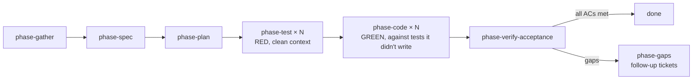

This post is part of my [Pi workflow series](/ai/2026/05/06/ai-native-workflow-with-pi.html), which starts with the overall picture of how I run my working day inside Pi. This part covers the extensions that make agent work safe and repeatable.

**The best guardrails are the ones the agent doesn't know about: the harness runs the checks, so the agent never has to remember to.**

## The dangerous command gate

Every `bash` tool call passes through a risk classifier before execution. Commands are matched against pattern rules and sorted into two tiers:

- **High risk** (🔴): `rm -rf`, `sudo`, `mkfs`, system control, always prompts, blocked entirely in non-interactive mode.
- **Medium risk** (🟡): `chmod`, `git push --force`, `docker rm`, package uninstalls: prompts interactively, allowed with warning otherwise.

When a dangerous command is caught, an interactive prompt lets me allow once, allow the whole category for the session, or block. The gate also injects system-prompt guidance nudging the LLM towards safer alternatives: `trash` over `rm -rf`, dry-run flags before destructive operations, narrow permission scopes over `chmod -R 777`.

Toggle with `Ctrl+Alt+G` or `/gate on|off`. It's the seatbelt I never knew I needed, especially when the agent is autonomously running shell commands during a code phase.

## The dev harness

This is the backbone. The dev-harness extension provides the runtime for a full agentic SDLC, from ticket to PR. It operates through transparent event hooks that fire at phase boundaries, so agents stay focused on their task while the extension handles validation, verification, cost tracking, and gating.

The design principle is **shift left**, catch every category of defect at the earliest possible stage, where it's cheapest to fix. A missing acceptance criterion caught during the spec interview costs one follow-up question. The same gap caught during code review costs a respawn. Caught in production, it costs an incident.

The standard pipeline:

```
/dev PROJ-1234 add refresh tokens
  → phase-gather (context collection + enrichment from Confluence, Slack, Figma, etc.)
  → phase-spec (multi-turn interview → spec JSON → review-spec self-review)
  → phase-plan (multi-turn planning → plan JSON → review-plan self-review)
  → phase-test × N (per task: write tests [RED] in clean context → review-test [advisory pre-impl])
  → phase-code × N (per task: implement [GREEN] against tests it didn't write → extension type_check + test)
  → phase-verify-acceptance (against spec ACs, with extension-triggered preflight)
  → done (or phase-gaps → follow-up tickets)
```



### Shift left: defect prevention by phase

Each phase has built-in quality gates that prevent defects from propagating downstream:

| Phase | What's caught | Mechanism |
|---|---|---|
| **Spec** | Missing ACs, untestable requirements, scope gaps, secret exposure | 16-topic interview sequence + `review-spec` self-review (structural consistency, AC→TC coverage, infra/security/DX completeness) |
| **Plan** | Infeasible decomposition, missing AC coverage, stub-covered MUSTs, security discipline violations | Finalisation checks + `review-plan` self-review |
| **Test authoring** | Confirmation bias (tests shaped to pass), trivial assertions, missing ACs | Separate `phase-test` agent with clean context (no impl knowledge) + adversarial `review-test` (devises wrong impls that pass) |
| **Implementation** | Type errors, test failures, regressions, misunderstood tests | Separate `phase-code` agent with clean context (reads tests from disk) + `test_issue` escalation for bad tests + extension type_check (hard gate) + test (advisory) |
| **Verify** | Spec drift, acceptance gaps, stale artefacts | Staleness check (spec/plan mtime vs verify mtime) + full `verification_commands` preflight |

The spec alone covers 16 mandatory topics, from problem statement through acceptance criteria, API contracts, constraints, risks, deployment strategy, rejected alternatives, infra/tooling, security topology, dev ergonomics, and test topology. Every MUST acceptance criterion must have a matching test case before the spec is finalised. The `review-spec` agent then validates structural consistency, and critical findings trigger a fix-and-re-review cycle (up to 2 rounds) before the spec ever reaches the planner.

### TDD with context-isolated test authoring

The harness enforces strict TDD, but with a crucial twist: **the agent that writes the tests is not the agent that writes the code**. They run in separate subprocesses with clean context windows, eliminating confirmation bias.

Within a traditional single-agent TDD loop, the same LLM writes tests and then immediately implements against them. It "knows" how it intends to implement, so it writes tests shaped to pass, trivially-true assertions, missing edge cases, tests that exercise a code path without verifying the outcome. The harness fixes this by splitting the loop across three agents:

```
per task:
  phase-test    (clean context: spec ACs + plan guidance → write tests → confirm RED)
      ↓
  review-test   (advisory: pre-impl mode → audit test quality)
      ↓
  phase-code    (clean context: spec ACs + plan guidance → read tests from disk → implement → GREEN)
      ↓
  extension     (automatic: type_check hard gate + test advisory)
```

Here's the detailed flow:

1. **Write tests, `phase-test` (RED)**: Receives the spec's acceptance criteria, test cases, plan guidance, and constraints. Does NOT receive any production code context or implementation hints. Writes tests purely from the spec's observable behaviour contract, what the system should do, not how. Runs the test command and confirms tests fail (RED). A passing test before implementation is a deviation event: the behaviour already exists, or the test is trivially true.

2. **Review tests, `review-test` adversarial analysis (advisory)**: Spawned after every `phase-test` completion. This agent doesn't just audit tests, it actively tries to **break them**. For each acceptance criterion, it devises adversarial implementations: the simplest wrong code that would make every test pass while violating the spec. A hardcoded return value. A counter that resets on every request. A function that returns the right shape with wrong semantics. If an adversarial implementation exists, the tests are insufficient. Specific checks:
   - **Adversarial implementation analysis**: for each AC, construct a wrong implementation that passes all tests. If one exists → critical finding with the exploit and the missing assertion.
   - **AC negation**: negate each criterion ("rate limiting is NOT enforced") and walk through every test. If no test fails → the tests don't actually depend on the correct behaviour.
   - **Side-effect coverage**: for ACs implying side effects (DB writes, events, audit logs), check whether any test asserts the side effect. An adversarial impl can skip untested side effects entirely.
   - **Assertion specificity**: every trivial assertion (`toBeDefined()`, `toBeTruthy()`) is paired with the adversarial impl it permits and the specific assertion that would block it.

   On critical findings, the orchestrator respawns `phase-test` with the adversarial analysis, up to 2 respawns. The test author now knows exactly *how* a wrong implementation could sneak through.

3. **Implement, `phase-code` (GREEN)**: Receives the spec ACs and plan guidance, but NOT the test source code. Reads test files from disk in its own context, approaching them fresh, as a contract to satisfy rather than code it authored. Implements production code to make the tests pass. If it finds a test that appears incorrect or untestable, it emits a `test_issue` event back to the orchestrator (with a recommendation: `fix_test`, `clarify_spec`, or `acceptable`) and continues implementing.

4. **Extension verification**: After `phase-code` completes, the dev-harness extension automatically runs `type_check` (hard gate (failure respawns the agent) and `test` (advisory) results injected into the orchestrator's context).

The `test_issue` event is the escape valve. When `phase-code` encounters a test it believes is wrong, it doesn't modify the test, it flags the issue and keeps working. The orchestrator sees the `test_issue` events after the code phase and can decide whether to respawn `phase-test` with the feedback, escalate to the engineer, or accept the test as-is.

This creates a four-layer verification stack:

| Layer | Agent | What it catches |
|---|---|---|
| **1. Test authoring** | `phase-test` | Spec → executable contract (clean context, no impl bias) |
| **2. Test review** | `review-test` | Adversarial analysis: devises wrong impls that pass tests, AC negation, side-effect gaps |
| **3. Implementation** | `phase-code` | Test issues surfaced by a fresh reader; impl bugs caught by RED→GREEN |
| **4. Extension** | dev-harness hooks | Type errors (hard gate), test failures (advisory), schema violations |

Each layer catches a different category of defect, and the context isolation between layers 1 and 3 prevents the most insidious class of bug: tests that are green but don't actually validate behaviour.

### Extension-driven verification

The key design choice is that agents never decide *when* to verify, the extension's event hooks handle that transparently:

- **`tool_result` hook on subagent completion**: If the agent requires verification (registered in the agent registry), and it didn't return `stuck`/`blocked`, the extension runs `type_check` + `test` and appends formatted results to the tool result. Type check failure injects a hard-gate message.
- **`tool_call` hook on verify-phase dispatch**: Before `phase-verify-*` agents launch, the extension checks artefact staleness (spec/plan modified after the last verify?) and runs the full `verification_commands` array as a preflight. All-fail blocks the launch; partial results are injected into the agent's brief.
- **`tool_result` hook on file writes**: Every write to `.tasks/` or `docs/` is validated against JSON schemas. Invalid shapes are rejected before they hit disk.

### Other key features

- **Multi-pattern support**: `implement/standard` (full ceremony), `implement/express` (gather → code → verify), `implement/orchestrated` (parallel worktrees), `analyse` (investigation, no code), `debug` (hypothesise → test → verify).
- **Auto-config via `/dev init`**: Scans for `go.mod`, `Cargo.toml`, `package.json`, `pyproject.toml`, etc., infers test runners, type checkers, linters from actual project config, fills gaps from built-in lang profiles, and writes a `## Dev Harness` JSON block to `AGENTS.md`. Supports Go, Rust, TypeScript, Python, Ruby, Java, and C#/.NET out of the box.
- **Usage tracking**: Every subagent result is costed and logged to JSONL. The orchestrator sees cumulative cost per work item.
- **Config injection**: Every subagent brief is automatically enriched with the project stack config (language, test command, type checker, linter) and relevant JSON schemas: agents never read config files themselves.

## Plan mode

Sometimes I want the agent to analyse code and formulate a plan *without touching anything*. `/plan` (or `Ctrl+Alt+P`) flips into read-only mode: only `read`, `bash` (allowlisted commands like `grep`, `git log`, `ls`), and `find` are available. The agent produces a numbered plan under a `Plan:` header, then I choose whether to execute it. During execution, steps are tracked with `[DONE:n]` markers and a progress widget shows completion.

It's the difference between "think first, then act" and "act and hope for the best."

## Git worktrees

Work on multiple things concurrently without branch-switching. `/wt create auth-refactor` creates a worktree at `.worktrees/auth-refactor` with branch `wt/auth-refactor`. The extension provides tools for status, merge, PR, and cleanup, and crucially, integrates with the subagent system for parallel code execution:

```
subagent({ tasks: [
  { agent: "phase-code", task: "Task A brief", cwd: ".worktrees/task-a" },
  { agent: "phase-code", task: "Task B brief", cwd: ".worktrees/task-b" },
]})
```

The `implement/orchestrated` pipeline uses this for monorepo-scale parallelism.

## The general lesson

Don't ask the model to be careful or to run the tests. **Intercept the dangerous command before it executes, and run the verification at phase boundaries yourself.** Behaviour you enforce in the extension is behaviour you never have to prompt for.
