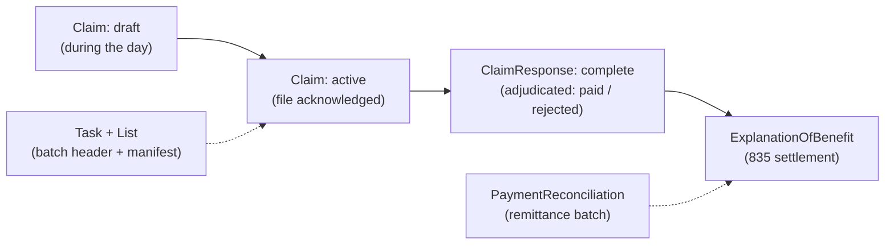

US pharmacy claims are an old world meeting a new one. The pharmacy benefit manager (PBM) wants a nightly batch file in the NCPDP format, fixed-width and positional. Your platform stores everything as HL7 FHIR resources behind a REST API. Payment arrives even later, as an X12 835 remittance.

This post describes how we modelled that lifecycle natively in FHIR, and the operational store underneath that makes it safe to retry. Most of the lessons apply to any batch integration with a partner that correlates on your identifiers.

## The lifecycle

## FHIR has no batch resource, so compose one

A nightly submission is modelled by composing standard resources, each with a single responsibility:

| Concern | Resource | Role |
|---|---|---|
| Batch workflow and the PBM's receipt ID | `Task` | Orchestration, poll and adjudication status |
| Batch membership | `List` (snapshot mode, sharded) | Immutable record of which claims were in the file |
| Per-claim submission | `Claim` | `draft` → `active` on acknowledgement |
| Per-claim adjudication | `ClaimResponse` | `queued` → `complete` |
| Per-claim settlement | `ExplanationOfBenefit` | Payment detail from the 835 |
| Inbound remittance | `PaymentReconciliation` | Payment header linking to the EOBs |
| File audit | `DocumentReference` | The submitted and received files |

One trap to avoid: **don't use `Bundle` of type `batch` as the batch tracker.** That type exists for batching REST requests to a FHIR server, not for domain batches sent to a partner. A `collection` bundle is fine as an optional audit snapshot of the payload.

## Don't inline the manifest

The first draft put every claim reference on the batch `Task` or in one `List`. That breaks at scale:

- DynamoDB items max out at **400 KB**, which is roughly 2,000–4,000 embedded references.
- Large FHIR `List` payloads hit practical server limits well before that.
- Deriving a count by loading and counting every entry is slow and fragile.

Instead:

- In the operational store, the batch header holds **scalars only** (claim count, receipt ID, status, file name, timestamps), with **one child item per claim** under the same partition, listed through an index.
- In FHIR, use **sharded `List` pages** and/or an **inverse link**: an extension on each `Claim` pointing to its batch `Task`, so "claims in batch X" is a search.
- Persist the claim count as a scalar at acknowledgement time.
- Remember that DynamoDB transactions accept at most **25 actions**, so post-acknowledgement writes for large batches become idempotent chunks: header first, then membership rows and status flips in pages.

## The transaction reference is your idempotency key

Each claim in an NCPDP file carries a numeric **transaction reference** (7–12 digits) that *you* generate and the PBM echoes back in the adjudication response. It's your correlation ID and your deduplication key, so three rules apply:

1. **Allocate it when the claim is created (as a draft), not at batch time.** If you mint it at batch time and the batch fails before acknowledgement, a retry mints a *new* reference and breaks deduplication on the partner's side.
2. **Never change it.** The same value goes on every resubmission of that claim.
3. **Use a central, monotonic numeric allocator**, such as an atomic counter or a database sequence. Don't use random numbers, and don't derive it from a resource ID.

## At-least-once delivery, then state change

The nightly job runs in a deliberate order:

1. **Extract** draft pharmacy claims through an index.
2. **Translate** them into the fixed-width layout: product to NDC code, identifier to transaction reference, and so on.
3. **Transmit** the file to the partner's gateway.
4. **Only after the partner acknowledges receipt**, write state: create the batch `Task` (receipt ID, claim count), the `List` pages and the inverse links, flip each `Claim` from `draft` to `active`, and create a queued `ClaimResponse` per claim linked back to the claim and the batch.

If the network drops mid-flight, nothing local has changed. The retry sends the same claims with the same references, and the partner deduplicates. That's **at-least-once delivery with idempotent receipt**, which is the only honest guarantee across a file-transfer boundary.

## Matching responses

When the adjudication file arrives, the batch `Task` moves to `adjudicating`. Run **integrity checks before processing any records**. The key one is that the number of adjudication records **must equal the claim count persisted at submission**. If they differ, process nothing and investigate. Only when the counts match does each row get matched to its claim by transaction reference (through an index keyed on the reference), completing the `ClaimResponse` with the partner's disposition and any structured NCPDP reject codes (such as "product not covered").

Settlement arrives later as an 835. A `PaymentReconciliation` is created for the remittance, keyed on the payment trace number, with one `ExplanationOfBenefit` per claim pointing back to the `Claim` and its `ClaimResponse`. The batch `Task` reaches `reconciled` when every claim in it has settled.

Because everything is standard FHIR, operational dashboards are plain searches: in-flight claims (`ClaimResponse?outcome=queued`), an ageing report of adjudicated claims with no payout yet, and tracing the claims behind a given payment.

## Two stores, clear roles

The **operational store** (single-table DynamoDB) handles the hot path: reference allocation, claim lifecycle, batch membership and response matching, with indexes for "claim by reference", "claims in batch" and "drafts to extract". The **FHIR store** is the **canonical API and audit view**, synchronised at defined lifecycle boundaries. Keeping the two roles explicit avoids the temptation to run a nightly batch job through a REST API one resource at a time.

## The general lessons

1. **Compose standard resources** before inventing custom ones, and give each a single job.
2. **Never inline unbounded lists** in a header item or resource. Use child rows and inverse links.
3. **Generate partner correlation IDs early and make them immutable.** They're your retry safety.
4. **Transmit first, then change state**, and let the partner's deduplication absorb retries.
