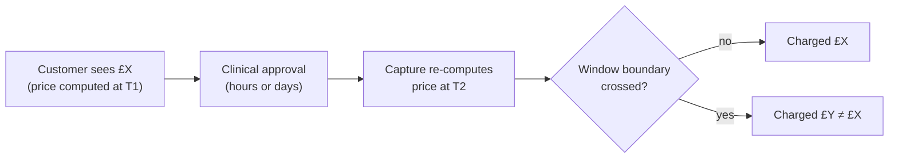
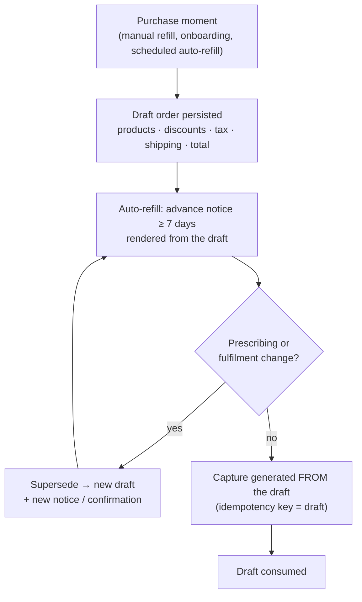

Most subscription systems I've worked on share a quiet assumption: the price is a *function*. Give it a customer, a product and a plan, and it tells you what to charge. You call it when you render the checkout, and you call it again when you capture payment. Same inputs, same answer.

That assumption holds right up until you introduce anything that depends on time: a commitment discount that applies for twelve months, a promotion that starts on the first of the month, an introductory price for the first two refills. The moment the price depends on *when* you ask, "call the function twice" becomes "ask two different questions and hope the answers match".

This post is about the design we landed on to make **shown = charged** an invariant rather than a hope.

## The gap between purchase and capture

In a healthcare subscription (and in plenty of non-healthcare ones) there's a natural delay between the moment a customer commits to an order and the moment you take their money. For prescription medication, payment is captured after a clinician approves the prescription, which can be hours or days later. Auto-refills are worse: the customer may never see a screen at all.

If nothing from the purchase moment is persisted, capture has to re-derive *everything* (products, quantities, plan, discounts, tax, shipping) at its own "now". A commitment window opening or closing inside that gap changes the answer. So does a promotion ending, or a coupon reaching its usage limit.

This isn't a rounding bug. In the UK, charging an amount the customer was never shown falls under the hidden-fee and drip-pricing provisions of the [Digital Markets, Competition and Consumers Act 2024](https://www.legislation.gov.uk/ukpga/2024/13/contents) and the [Consumer Protection from Unfair Trading Regulations 2008](https://www.legislation.gov.uk/uksi/2008/1276/contents). In the US, [section 5 of the FTC Act](https://www.ftc.gov/legal-library/browse/statutes/federal-trade-commission-act) and state UDAP laws cover similar ground. (Your legal team decides what applies to you. I'm an engineer, and this is risk context, not advice.)

## There are only two coherent positions

Once you see the gap, you have to pick one of these:

1. **Don't support time-based pricing.** Every price is stable until the customer takes an action. That's simple, but it rules out the commitment and promotional plans the business is asking for.
2. **Support it properly.** Persist what the customer was shown at the purchase moment, and generate the capture from that record.

Any middle ground is a race condition with a marketing budget.

## The design: a persisted draft order

The core idea is to **snapshot the outcome, not the inputs**.

At the purchase moment, the server computes the full customer-facing order and **persists it as a draft** before returning it: products, quantities, line amounts, discounts, tax, shipping, currency and total. The confirmation screen (or the advance notice, for auto-refills) renders *that* object. The draft ID and version travel with the response, so you can prove the thing you rendered is the thing you charged.

At capture, nothing is re-computed. Payment is generated **from the draft and nothing else**.

A few rules make it robust.

**The purchase moment is defined precisely.** It's the moment the customer commits to products and a total: a manual refill, an onboarding purchase, or the *scheduled submission* of an auto-refill. Accepting a commitment plan creates pricing context, not an order. The next order-bearing action creates the draft.

**Auto-refill customers get the price in advance.** They never see a checkout, so the advance notice is their only chance to learn what they'll pay. The draft is created at least seven days before capture, the notice is rendered from it, and **capture is blocked until the notice has been delivered and the cancellation window has passed**. If delivery fails, the system retries. It never captures.

**Changes supersede the draft; they never mutate it.** If a clinician changes the dose, or fulfilment changes the shipping, a replacement draft is created before capture. A higher total needs the customer's affirmative confirmation. A lower or equal total needs an updated notice.

**The lifecycle is explicit.** A draft is `created`, `superseded`, `consumed` or `expired`, and only one unconsumed draft may be active per order. Drafts expire after 30 days, and an expired draft **never** falls back to capture-time computation: it needs a new purchase moment.

**Capture is idempotent on the draft.** Capture atomically claims the draft using the payment provider's idempotency key. If the provider succeeds but the local write fails, reconciliation retries with *the same key* and records the existing result. It never starts a second payment.

With those rules in place, time-based behaviour becomes safe instead of forbidden. A commitment ending or a promotion starting takes effect at the customer's *next* purchase moment, where it's shown and captured into the draft. It never happens silently at capture.

## Alternatives we rejected

- **Keep capture-time computation and patch the edge cases.** The price is still a function of execution time, so shown ≠ charged is still possible whenever there's a gap.
- **Snapshot only the pricing-plan ID.** This pins one *input* while products, quantities, coupons and discounts are still re-evaluated at charge time. It was an earlier revision of the design, and it didn't close the gap.
- **Make plans "sticky" so prices never change without customer action.** This narrows the race but doesn't close it: non-plan discounts can still diverge. Whether plans renew or lapse is a separate subscription-policy question, and this design works either way.
- **Create the draft at charge time for auto-refills.** This reintroduces "pay a price you were never told" for exactly the customers who never see a screen.

## Rolling it out without a big bang

The good news is that this is mostly **persisting the output of a computation you already have** and moving *when* it runs. No new service is needed.

1. **Shadow mode.** Create and persist drafts at purchase moments while capture continues to compute as before. Compare the two and log every mismatch (plan, discount, product, tax, shipping, rounding) without rejecting anything.
2. **Flip capture per order.** Behind a flag, capture consumes the persisted draft. This is per-order by construction: orders with a draft use it, and only in-flight legacy orders use the old path. No backfill is needed.
3. **Delete capture-time pricing.** Once the flag is stable, remove the old path entirely.

Measure the **invariant**, not the adoption:

- 100% of captures on the new path consume one active, unexpired draft that was rendered or delivered to the customer.
- Two consecutive weeks of representative volume where every draft/capture mismatch is classified, with none unexplained.
- Price-mismatch refunds and related support contacts trend to zero, with no duplicate charges.

## The general lesson

Whenever there's a delay between *promise* and *fulfilment*, and anything in your pricing depends on the clock, the promise has to be a **record**, not a recomputation. Checkout isn't a view over your pricing engine. It's the moment you make a commitment to a customer, and commitments should be written down.
