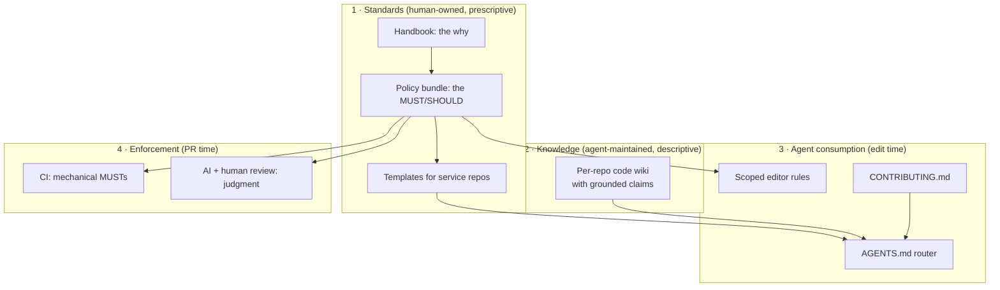

Once AI agents write a meaningful share of your pull requests, two jobs that used to be informal become urgent:

| Job | What success looks like |
|---|---|
| **Instruct agents** | An agent working in any repository knows how to slice work, ship safely and follow house conventions *without reading the whole handbook* |
| **Catch non-adherent PRs** | Changes that break checkable standards are blocked or flagged before merge, whether a human or an agent wrote them |

The tempting solution is one big generated document: an `AGENTS.md` stuffed with every standard, also fed to a review bot. It fails both jobs. It's too long to fit usefully in an agent's context, and too vague to enforce mechanically. **These are different jobs, and they need different tools.**

## Four layers, one direction of flow



In one sentence: **the handbook explains *why*, policies state *what we require*, the code wiki documents *what the code does*, `AGENTS.md` routes agents to the right context, and CI enforces the mechanical MUSTs while review covers judgment.**

### Layer 1: standards, written by humans

- **The handbook** is narrative documentation for people: onboarding, principles, trunk-based development, deployment. It's optimised for reading, *not* for loading into an agent session.
- **The policy bundle** holds machine-oriented standards, one small Markdown file per policy with YAML front matter (type, title, description, tags, status and a link back to the handbook section it derives from). We use the open [OKF](https://github.com/GoogleCloudPlatform/knowledge-catalog) format so policies are structured, diffable and tool-agnostic. Examples: *incomplete behaviour on main must be behind a flag that defaults off*; *no personal or health data in logs or AI prompts*; *approved AI tools only*; plus naming, API versioning, configuration, secrets, tracing and probes. **Policies are hand-authored and reviewed; they are never generated from code.**
- **Templates** are copyable, harness-agnostic assets (an `AGENTS.md` router, the policy bundle) that teams vendor into service repositories with one command.

### Layer 2: knowledge, maintained by agents

Standards say what you *require*. Agents also need to know what a service *does*: its structure, invariants and gotchas. That's descriptive knowledge, and it goes stale quickly, so let tooling maintain it:

- A per-repository code wiki generated and refreshed from source and tests (we piloted [OpenWiki](https://github.com/langchain-ai/openwiki)).
- **Grounded claims**: each fact links to a file and line range, and is flagged stale when that evidence changes.
- A scheduled CI job opens a docs PR when code and claims drift apart.
- A short, human-written brief tells the generator what matters. It links to policies rather than restating them.

Where precision matters more than automation (a regulated integration domain, say), keep hand-curated knowledge bundles. Just don't run two competing bundles in one repo.

### Layer 3: agent consumption, by progressive disclosure

At edit time an agent shouldn't load a wiki or a handbook. It should read a **router**:

```text
AGENTS.md
├── code-wiki block      → route to the relevant concepts
├── shipping block       → trunk-based strategy (from template)
└── repo-specific notes  → team conventions
CONTRIBUTING.md          → implementation rules for this repo
editor rules             → scoped rules generated from policies
```

The pattern is **orient → route → read one concept**: read the index, pick the relevant area for the task, and load only that. Agents read routers, not encyclopaedias.

### Layer 4: enforcement at PR time

- **CI enforces mechanical MUSTs**: anything a linter, schema check, test or script can decide. That's cheap, fast and unarguable.
- **AI review covers judgment**: is the PR scoped sensibly, is the slice releasable, is the flag defaulting off? The review prompt is **generated from the same policy bundle**, so it can't drift from the standard.
- **Humans review the rest.** An AI reviewer doesn't replace linters, and it doesn't replace people.

## Who owns what

| Tool | Use for | Don't use for |
|---|---|---|
| Handbook | Human onboarding, narrative | Dumping context into agents |
| Policy bundle | Org-wide MUST/SHOULD, checkable standards | Describing service internals |
| Code wiki | Per-repo code truth, drift detection | Authoring policy |
| `AGENTS.md` template | Shipping strategy, routing | Repo-specific API rules |
| `CONTRIBUTING.md` | Repo implementation standards | Org-wide policy |
| CI | Mechanical MUSTs | Judgment calls |
| AI PR review | Scope, slicing, flag usage | Replacing linters |

## Decision rules

1. **The handbook explains why.** It isn't loaded into every agent session.
2. **One interchange format** for both policies and code knowledge.
3. **Tooling owns code truth; humans own policy truth.**
4. **Agents read routers, not encyclopaedias.**
5. **Enforce mechanically first**, and use AI review only for judgment.
6. **Everything lives in Git**: diffable and reviewable. A wiki page in a collaboration tool isn't a source of truth for agents.

## How we rolled it out

We started small: a trunk-based-development page, a first policy bundle, a service template, and per-repo contributing guides and editor rules. Next came security, AI-usage, commit and backend observability policies, with a sync script so every repository vendors the same bundle. Then a generator that turns policies into editor rules, a PR-review prompt and an install script. The code-wiki pilot and AI PR review come last, on a single service first.

## The general lesson

AI agents don't lower the bar for engineering standards; they raise the cost of *vague* ones. Separate the **why** (for people), the **what** (checkable policy) and the **how it works** (code knowledge), and generate each consumer's view from a single source. Then the same rules apply to every PR, whoever wrote it.

*The same thinking runs through [ACCORD](https://github.com/cshirley/accord), my open-source delivery harness: contracts over conversations, and structural checks before human attention.*
