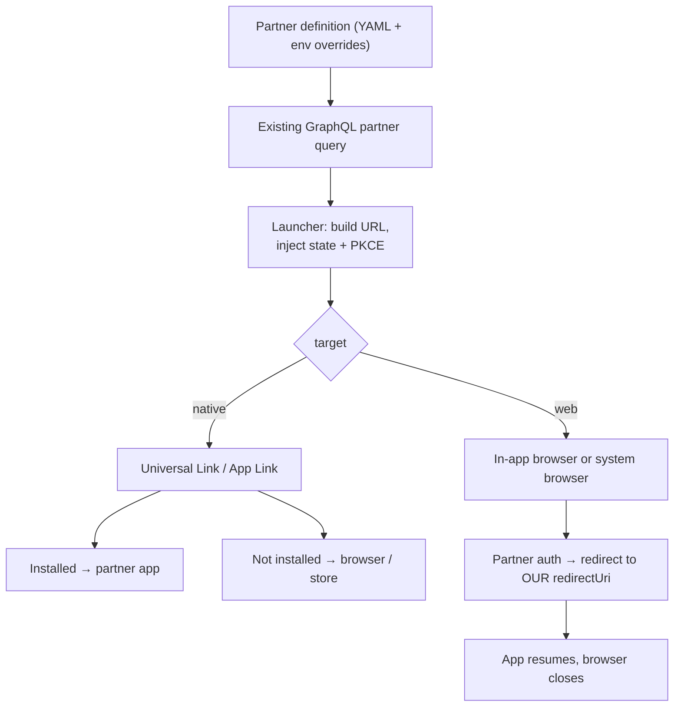

B2B2C products accumulate partners, and partners have apps. An employer's wellbeing provider, an insurer's health-coaching service: your members expect to tap a tile in *your* app and land, signed in, in *theirs*.

Built naively, every integration becomes bespoke client code: a hard-coded URL, a protocol-specific flow, and a mobile release whenever the vendor changes a domain or parameter. This post describes the generic pattern we designed instead, and why we drew a firm line at *handoff*.

## The challenges

- **Decoupled maintenance.** Vendor auth paths, domains and parameters change. Those changes should ship as configuration, not as an app-store release.
- **Graceful handoff.** Open the partner's native app via Universal Links (iOS) or App Links (Android) if it's installed; fall back to the browser or the app store if not.
- **One client contract across different protocols.** Partners use OAuth 2.0 / OIDC with PKCE, SAML 2.0 or custom SSO gateways.
- **Per-partner cardinality.** A partner may expose zero, one or several third-party apps.
- **Mixed targets.** Some integrations have no native app at all, just SSO into a partner-hosted web app.

## The pattern: destinations are data

The rule is that **destination logic lives in partner configuration, not in the client**. Each partner definition can carry an optional list of third-party apps, authored in the same version-controlled definitions repository as everything else about the partner, validated by schema, and served to the app through the *existing* GraphQL partner query. No new service or endpoint is needed.

```yaml
thirdPartyApps:
  - id: coaching
    name: "Partner Coaching"
    target: native               # native | web
    protocol: saml               # saml | oauth2_pkce | custom_sso
    baseUrl: "https://sso.partner.example/saml/redirect"
    queryParams: { relayState: "dashboard" }
    iosScheme: "partnercoaching://"
    androidPackage: "com.partner.coaching"
    storeFallbackUrl: "https://apps.apple.com/app/id000000000"
  - id: wellbeing
    name: "Partner Wellbeing"
    target: web                  # no native app
    presentation: in_app_browser # in_app_browser | system_browser
    protocol: oauth2_pkce
    baseUrl: "https://wellbeing.partner.example/sso/authorize"
    queryParams: { client_id: "…", response_type: "code", scope: "openid profile" }
    redirectUri: "ourapp://thirdparty/wellbeing/callback"   # OUR scheme, never theirs
```

A single client component, the **launcher**, reads the entry, builds the URL, injects per-launch security values, and hands off:



Environment-specific values (sandbox versus production gateways) live in overrides, so **non-production builds can never hand off into production partner accounts**.

## Security rules that make it safe

- **Per-launch secrets come from the client, never the config.** For OAuth entries, the app generates `state` and the PKCE verifier and challenge on every launch, and keeps the verifier in memory only for the lifetime of the handoff. Configuration holds only static, non-sensitive template parameters.
- **SAML stays vendor-side.** Relay state and entity IDs are static and non-sensitive; the assertion exchange happens between the identity provider and the partner.
- **The redirect URI is the trust boundary.** For web targets it must be **our** registered scheme or universal link, never the partner's domain, and an exact match on the partner's allow-list with no wildcards. A test on the definitions enforces this. A partner-domain redirect would let the callback leave our control.
- **Prefer the in-app browser** (SFSafariViewController / Chrome Custom Tabs) for PKCE flows. It isolates the session and keeps the user in the app's UX.
- **Declare what you query.** Every native scheme must be listed in the iOS `LSApplicationQueriesSchemes`, and every Android package needs a `<queries>` entry for Android 11+ package visibility. It's easy for config and manifests to drift, so it's worth checking them against each other in CI.

## The feature we deliberately didn't build

The obvious next step is to complete the flow: exchange the returned code for tokens server-side (with the GraphQL layer acting as a backend-for-frontend), so the app could call partner APIs too. We designed it, then **rejected it for current scope**:

- **A new class of secret.** The backend would have to hold and rotate a client secret per partner app. Today it holds *no* partner credentials.
- **A new attack surface.** A token-exchange endpoint, if compromised, yields live partner API access. The current pattern's worst case is disclosure of static configuration.
- **Server-side session state.** The backend would have to mint and validate its own nonces rather than pass through client state.
- **Refresh-token custody.** Keeping refresh tokens off the device makes the backend a long-lived per-user, per-partner token store, with retention and breach-impact implications.
- **No uniform contract.** SAML partners need an extra assertion-grant hop to get any token at all, and custom SSO gateways may have no token endpoint.
- **Nobody needed it.** The objective was *handoff*. No partner API call was required.

If a genuine requirement appears, it gets its own spec, scoped per partner, and it should prefer **proxying the API calls server-side** so the device never sees a partner token.

## Choosing OIDC where you can

Where a partner offered both, we preferred OIDC over SAML. It keeps native app-to-app handoff open (SAML's browser-POST binding is awkward on mobile), it has PKCE for public clients, and it composes with the same launcher contract.

## The general lesson

When integrations multiply, **move the variability into data** and keep one small, well-tested client path. Be just as deliberate about the boundary: an SSO *handoff* and a *token-custody service* have very different risk profiles, and scope creep between them is how credential stores appear by accident.
