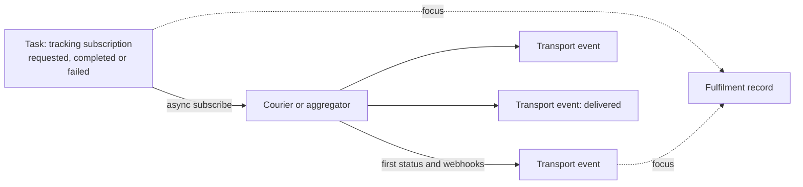

When you add parcel tracking to a clinical platform, the first modelling question is deceptively simple: **what is the thing you create when someone registers a tracking number?**

The tempting answer is a delivery record with a status. But at registration time you do not know the parcel's real status. Different fulfilment flows register at different points in the lifecycle, and the only authority on where the parcel is the courier. Anything you write at registration is a guess.

I reviewed a design for delivery tracking on a FHIR-based platform. One of its choices was a `Task` alongside `Transport` resources. This post covers why that choice is defensible and what must be true for it to stay consistent.

## Work and fact are different things

The design splits two ideas that look similar:

- **Work.** "Subscribe to updates for this tracking number." That is a request with a lifecycle: requested, in progress, completed or failed. FHIR's `Task` is exactly this: a unit of asynchronous, retryable work you can monitor.
- **Facts.** "The courier says the parcel is out for delivery at 10:42." That is an observation, and `Transport` records the physical movement of an item. (It is an R5 resource, so on an R4 platform it is an application-specific pattern.)

Registration creates the `Task` and no delivery status. The first `Transport` appears when the courier first speaks, and each later one is an append-only audit event.

## What the split buys

- **No invented state.** A parent `Transport` created at registration would need a status such as `planned`. That is a product assumption, not carrier truth.
- **Failures read correctly.** If subscribing to the aggregator fails, a `Task` marked failed means the API call failed. A `Transport` marked aborted would read as if the *parcel* failed.
- **A health signal.** A `Task` stuck in `requested` is queryable. A fake "pending" delivery status hides a broken subscription.
- **A hard type boundary.** "The vendor is down" can never look like "the parcel is at the warehouse."

## But it is not the only valid model

Reviewing it honestly, I found the most defensible alternative is a **parent `Transport` with `partOf` children** and a profiled subscription state on the parent. If you do that properly, the `Task` is arguably extra abstraction.

The design as first written was the weakest option: a `Task` plus *flat* `Transport` events with no `partOf` or `history` links. That has two resource types and none of `Transport`'s native linking. So I recommended either using the native links or committing to the Task split for a clear reason. Reviewing a design is partly choosing the strongest version of the other side.

## Consistency when transactions are not atomic

FHIR `transaction` bundles on this platform are not ACID. A partial failure leaves split states, so the design has to be safe without relying on them:

- **Immutable events.** `Transport` events are create-only in application code. Never patch an event body.
- **Mutable, but versioned, work.** The `Task` is an operational cursor, so it is fine to mutate, as long as updates use optimistic concurrency (`If-Match` or the version ID).
- **Derive current status.** The authoritative status is computed from the ordered events by carrier timestamp. A cached status on the `Task` is rebuildable.
- **Single-resource writes** wherever possible, and ordered side effects, with a reconciliation job that finds drift.
- **Idempotent creates.** Do not rely on `If-None-Exist` alone. It is race-sensitive across instances. Use a uniqueness key on every idempotent create and recover from the `412` it returns. I wrote about [the same race in another context](/architecture/2026/07/08/search-then-create-is-a-race.html).

Two smaller rules were also worth keeping. Registration returns a conflict if a shipment is already bound to a different fulfilment, rather than silently reassigning it. And any field used in a composite key or search is constrained to a safe character set first.

## The general lesson

Model **requested work and observed fact as different resources**, make the facts immutable, and derive state from them. Then a failed integration, a late webhook or a half-applied write is a visible, recoverable condition instead of a wrong answer stored as truth.
